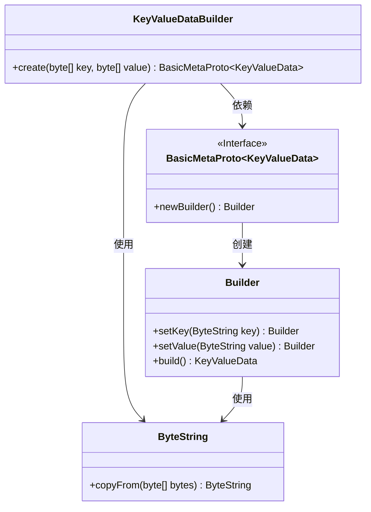
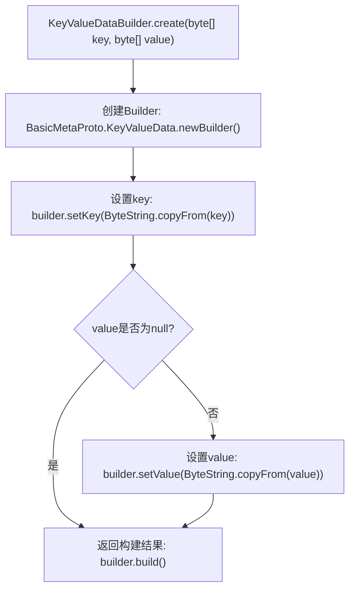

# 基础信息

|      |      |
|------|------|
| 名称 | KeyValueDataBuilder |
| 编码语言 | .java |
| 代码路径 | WeFe/gateway/src/main/java/com/welab/wefe/gateway/common/KeyValueDataBuilder.java |
| 包名 | com.welab.wefe.gateway.common |
| 依赖项 | ['com.google.protobuf.ByteString', 'com.welab.wefe.gateway.api.meta.basic.BasicMetaProto'] |
| 概述说明 | KeyValueDataBuilder类提供静态方法create，通过key和value字节数组构建KeyValueData对象，value可为空。 |

# 说明

KeyValueDataBuilder类提供了一个静态方法create，用于构建KeyValueData对象。该方法接收两个字节数组参数key和value，通过KeyValueData.Builder设置键值数据。key参数必填，会转换为ByteString类型；value参数可选，非空时同样转为ByteString。最终返回构建完成的KeyValueData实例。

# 类列表 Class Summary

| 名称   | 类型  | 说明 |
|-------|------|-------------|
| KeyValueDataBuilder | class | KeyValueDataBuilder类提供静态方法create，通过传入key和value字节数组构建KeyValueData对象，value可为空。 |

## 类 KeyValueDataBuilder

|      |      |
|------|------|
| 访问范围 | public |
| 类型 | class |
| 名称 | KeyValueDataBuilder |
| 说明 | KeyValueDataBuilder类提供静态方法create，通过传入key和value字节数组构建KeyValueData对象，value可为空。 |

### UML类图

这段代码展示了一个KeyValueDataBuilder类，它通过静态方法create构建BasicMetaProto.KeyValueData对象。流程涉及ByteString处理字节数组，Builder模式设置键值对，最终返回构建好的数据对象。类图清晰地反映了各组件间的依赖关系，包括接口定义、构建器模式和工具类的协作。

### 内部方法调用关系图

该流程图描述了KeyValueDataBuilder类中create方法的执行逻辑。方法首先创建Builder对象，然后强制设置key字段，接着检查value是否为null。若非null则设置value字段，最后构建并返回KeyValueData对象。流程清晰展现了条件分支和必要字段的设置过程，适用于处理键值对数据的协议缓冲区构建场景。

### 字段列表 Field List

| 名称  | 类型  | 说明 |
|-------|-------|------|

### 方法列表

| 名称  | 类型  | 说明 |
|-------|-------|------|
| create | BasicMetaProto.KeyValueData | 静态方法创建键值数据对象，设置键和可选值，返回构建结果。 |

