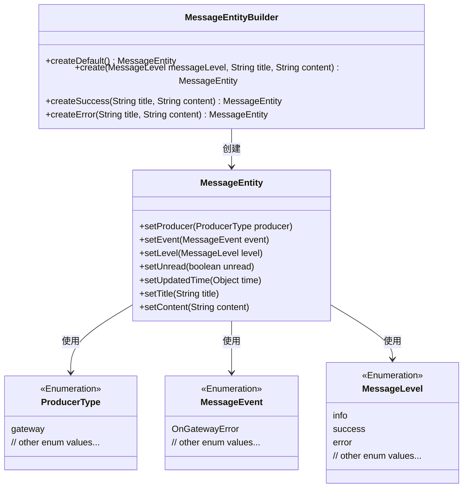
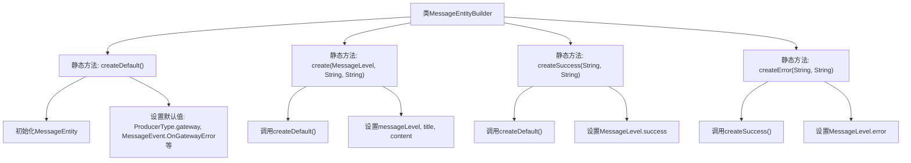

# 基础信息

|      |      |
|------|------|
| 名称 | MessageEntityBuilder |
| 编码语言 | .java |
| 代码路径 | WeFe/gateway/src/main/java/com/welab/wefe/gateway/common/MessageEntityBuilder.java |
| 包名 | com.welab.wefe.gateway.common |
| 依赖项 | ['com.welab.wefe.common.wefe.enums.MessageEvent', 'com.welab.wefe.common.wefe.enums.MessageLevel', 'com.welab.wefe.common.wefe.enums.ProducerType', 'com.welab.wefe.gateway.entity.MessageEntity'] |
| 概述说明 | MessageEntityBuilder类提供静态方法创建消息实体，默认设置生产者类型为gateway、事件为OnGatewayError、级别为info、未读状态和无更新时间。支持自定义级别、标题和内容，以及快速创建成功或错误消息。 |

# 说明

MessageEntityBuilder类提供了创建MessageEntity实例的静态方法。createDefault方法生成默认配置的实体，设置生产者类型为gateway，事件为OnGatewayError，消息级别为info，未读状态为true，更新时间为null。create方法允许自定义消息级别、标题和内容。createSuccess和createError方法分别创建成功和错误级别的消息实体，继承默认配置并设置相应级别。所有方法均保持未读状态和空更新时间。

# 类列表 Class Summary

| 名称   | 类型  | 说明 |
|-------|------|-------------|
| MessageEntityBuilder | class | MessageEntityBuilder类提供静态方法创建消息实体，支持默认配置、自定义级别、成功和错误消息，设置标题、内容、未读状态和空更新时间。 |

## 类 MessageEntityBuilder

|      |      |
|------|------|
| 访问范围 | public |
| 类型 | class |
| 名称 | MessageEntityBuilder |
| 说明 | MessageEntityBuilder类提供静态方法创建消息实体，支持默认配置、自定义级别、成功和错误消息，设置标题、内容、未读状态和空更新时间。 |

### UML类图

这段代码展示了一个MessageEntityBuilder类，它提供了多种静态工厂方法来创建和配置MessageEntity对象。MessageEntity类包含多个属性设置方法，涉及三个枚举类型：ProducerType（生产者类型）、MessageEvent（消息事件）和MessageLevel（消息级别）。Builder模式通过createDefault()方法提供默认配置，并通过create(), createSuccess(), createError()等方法支持不同级别的消息创建，其中createError()复用createSuccess()的逻辑并修改消息级别。所有方法都返回配置好的MessageEntity实例，体现了工厂方法的封装性和灵活性。

### 内部方法调用关系图

该流程图展示了MessageEntityBuilder类的结构及其静态方法的调用关系。createDefault()方法初始化实体并设置默认值，其他创建方法（create、createSuccess、createError）均基于createDefault()构建，通过链式调用实现不同级别的消息创建。createError()复用createSuccess()逻辑后仅修改级别，体现了代码复用设计。所有方法最终返回配置好的MessageEntity实例。

### 字段列表 Field List

| 名称  | 类型  | 说明 |
|-------|-------|------|

### 方法列表

| 名称  | 类型  | 说明 |
|-------|-------|------|
| create | MessageEntity | 创建消息实体方法：设置消息级别、标题、内容，标记未读并清空更新时间。 |
| createDefault | MessageEntity | 创建一个默认消息实体，设置生产者为网关，事件为网关错误，级别为信息，未读状态，更新时间为空。 |
| createSuccess | MessageEntity | 创建成功消息实体方法：设置标题、内容、成功级别、未读状态，清空更新时间并返回实体。 |
| createError | MessageEntity | 静态方法创建错误消息实体，设置标题和内容后标记为错误级别并返回。 |

