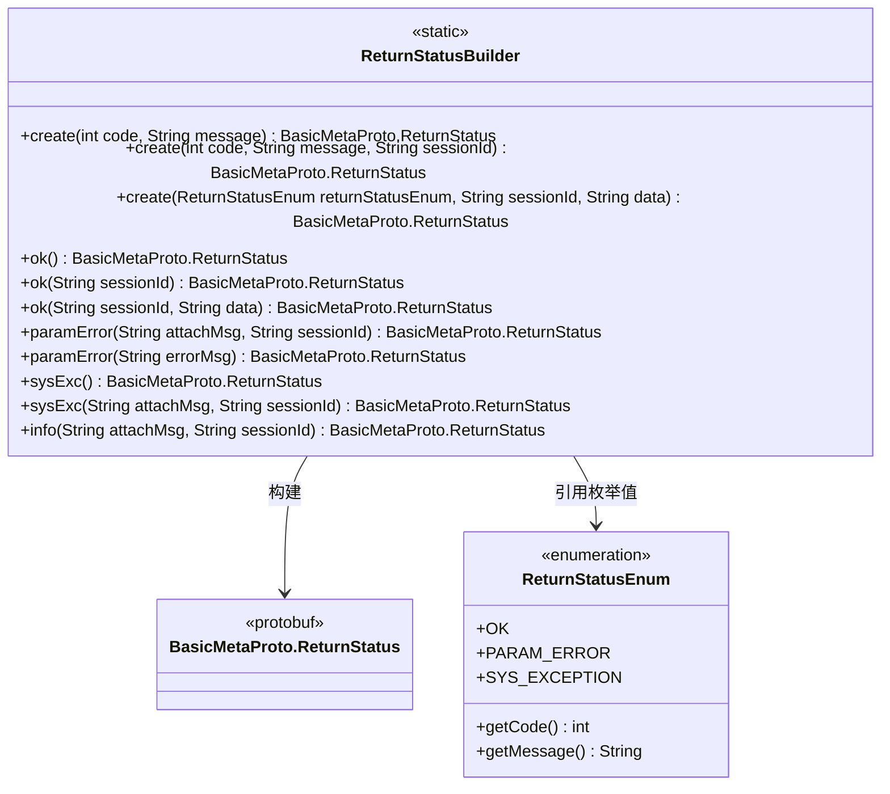
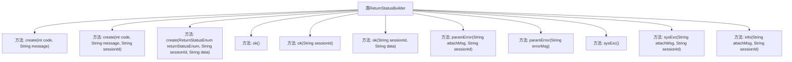

# 基础信息

|      |      |
|------|------|
| 名称 | ReturnStatusBuilder |
| 编码语言 | .java |
| 代码路径 | WeFe/gateway/src/main/java/com/welab/wefe/gateway/common/ReturnStatusBuilder.java |
| 包名 | com.welab.wefe.gateway.common |
| 依赖项 | ['com.welab.wefe.gateway.api.meta.basic.BasicMetaProto'] |
| 概述说明 | ReturnStatusBuilder类提供多个静态方法创建BasicMetaProto.ReturnStatus对象，支持设置状态码、消息、会话ID和数据，包含成功、参数错误和系统异常等常见状态。 |

# 说明

ReturnStatusBuilder类提供了多种静态方法用于构建BasicMetaProto.ReturnStatus对象。主要功能包括：通过code和message创建基础状态；支持添加sessionId和data字段；预定义了OK、PARAM_ERROR、SYS_EXCEPTION等常见状态的快捷创建方法；部分方法允许附加额外信息到message中。所有方法均通过Builder模式构造返回状态对象，支持不同参数组合的灵活构建。

# 类列表 Class Summary

| 名称   | 类型  | 说明 |
|-------|------|-------------|
| ReturnStatusBuilder | class | ReturnStatusBuilder类提供静态方法创建BasicMetaProto.ReturnStatus对象，支持设置状态码、消息、会话ID和数据，包含成功、参数错误和系统异常等常用状态。 |

## 类 ReturnStatusBuilder

|      |      |
|------|------|
| 访问范围 | public |
| 类型 | class |
| 名称 | ReturnStatusBuilder |
| 说明 | ReturnStatusBuilder类提供静态方法创建BasicMetaProto.ReturnStatus对象，支持设置状态码、消息、会话ID和数据，包含成功、参数错误和系统异常等常用状态。 |

### UML类图

这段代码展示了一个静态工具类`ReturnStatusBuilder`，专门用于构建不同场景下的`BasicMetaProto.ReturnStatus`响应对象。类通过9个静态工厂方法，支持创建包含状态码、消息、会话ID和附加数据的标准化返回状态。其中核心逻辑是通过Protobuf的Builder模式构造对象，并支持从`ReturnStatusEnum`枚举获取预定义状态码和消息模板。设计特点包括：支持基础状态构造、成功/参数错误/系统异常等场景的快捷方法，以及消息拼接和会话跟踪能力，体现了响应对象的标准化和可扩展性设计。

### 内部方法调用关系图

这段代码定义了一个名为ReturnStatusBuilder的工具类，主要用于构建BasicMetaProto.ReturnStatus对象。类中提供了多个静态工厂方法，用于创建不同状态和参数的返回状态对象。方法分为三类：基础创建方法（create系列）、成功状态方法（ok系列）和错误状态方法（paramError/sysExc系列）。所有方法都遵循Builder模式，通过链式调用设置code、message、sessionId和data等属性，最终调用build()方法生成不可变对象。

### 字段列表 Field List

| 名称  | 类型  | 说明 |
|-------|-------|------|

### 方法列表

| 名称  | 类型  | 说明 |
|-------|-------|------|
| create | BasicMetaProto.ReturnStatus | 静态方法创建返回状态对象，包含代码和消息字段。 |
| create | BasicMetaProto.ReturnStatus | 静态方法创建ReturnStatus对象，设置code、message和sessionId字段。 |
| paramError | BasicMetaProto.ReturnStatus | 静态方法paramError生成参数错误状态对象，包含错误码、附加消息和会话ID。 |
| ok | BasicMetaProto.ReturnStatus | 静态方法返回OK状态，包含状态码和信息。 |
| sysExc | BasicMetaProto.ReturnStatus | 该方法返回系统异常状态，包含预设的错误代码和消息。 |
| ok | BasicMetaProto.ReturnStatus | 静态方法ok返回成功状态，包含会话ID和数据，使用OK枚举设置状态码和消息。 |
| paramError | BasicMetaProto.ReturnStatus | 静态方法paramError返回参数错误状态，包含错误码和消息。 |
| create | BasicMetaProto.ReturnStatus | 静态方法创建ReturnStatus对象，设置状态码、消息、会话ID和数据字段，返回构建结果。 |
| ok | BasicMetaProto.ReturnStatus | 静态方法返回成功状态，包含OK状态码、消息及会话ID。 |
| sysExc | BasicMetaProto.ReturnStatus | 静态方法sysExc返回系统异常状态，包含错误码、附加消息和会话ID。 |
| info | BasicMetaProto.ReturnStatus | 静态方法`info`返回`BasicMetaProto.ReturnStatus`对象，设置状态码为OK，附加消息和会话ID，用于表示操作成功。 |

