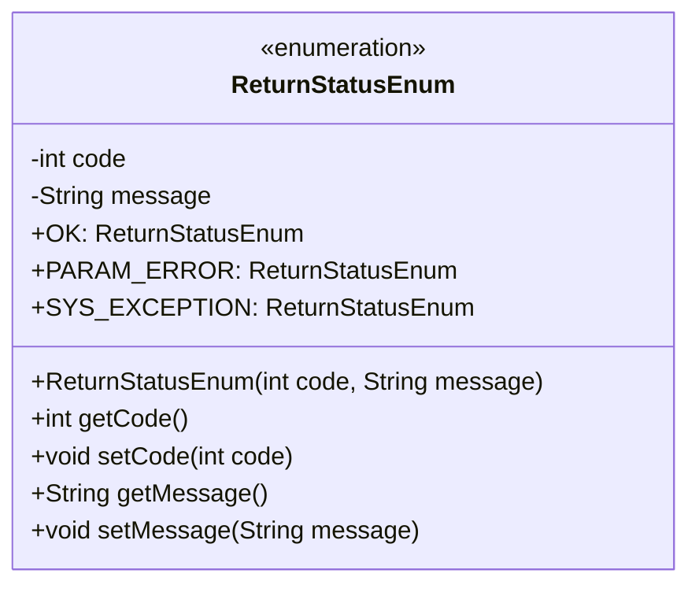
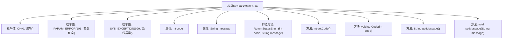

# 基础信息

|      |      |
|------|------|
| 名称 | ReturnStatusEnum |
| 编码语言 | .java |
| 代码路径 | WeFe/gateway/src/main/java/com/welab/wefe/gateway/common/ReturnStatusEnum.java |
| 包名 | com.welab.wefe.gateway.common |
| 依赖项 | [] |
| 概述说明 | 枚举类ReturnStatusEnum定义了三种状态：成功(0)、参数错误(101)、系统异常(999)，包含状态码和描述信息，提供getter和setter方法。 |

# 说明

这是一个名为ReturnStatusEnum的枚举类，定义了三种返回状态：OK表示成功，状态码为0；PARAM_ERROR表示参数错误，状态码为101；SYS_EXCEPTION表示系统异常，状态码为999。每个枚举项包含一个整型的状态码和一个字符串类型的描述信息。类中提供了构造方法初始化这两个字段，并为它们生成了getter和setter方法，以便外部访问和修改。

# 类列表 Class Summary

| 名称   | 类型  | 说明 |
|-------|------|-------------|
| ReturnStatusEnum | enum | 枚举ReturnStatusEnum定义了三种状态：成功(0)、参数错误(101)和系统异常(999)，包含状态码和描述信息。 |

## 类 ReturnStatusEnum

|      |      |
|------|------|
| 访问范围 | public |
| 类型 | enum |
| 名称 | ReturnStatusEnum |
| 说明 | 枚举ReturnStatusEnum定义了三种状态：成功(0)、参数错误(101)和系统异常(999)，包含状态码和描述信息。 |

### UML类图

该代码定义了一个枚举类ReturnStatusEnum，用于表示不同的返回状态。枚举包含三个实例：OK（成功）、PARAM_ERROR（参数有误）和SYS_EXCEPTION（系统异常）。每个实例都有对应的状态码和描述信息，通过构造函数初始化，并提供了getter和setter方法。枚举类常用于定义一组固定的常量，适用于状态码、错误类型等场景。

### 内部方法调用关系图

该流程图展示了ReturnStatusEnum枚举的结构，包含三个枚举值（OK、PARAM_ERROR、SYS_EXCEPTION）、两个属性（code和message）、一个构造方法以及四个访问方法（getCode、setCode、getMessage、setMessage）。枚举通过构造方法初始化状态码和描述信息，并提供getter/setter方法进行访问和修改，适用于系统状态码的标准化管理。

### 字段列表 Field List

| 名称  | 类型  | 说明 |
|-------|-------|------|

### 方法列表

| 名称  | 类型  | 说明 |
|-------|-------|------|

