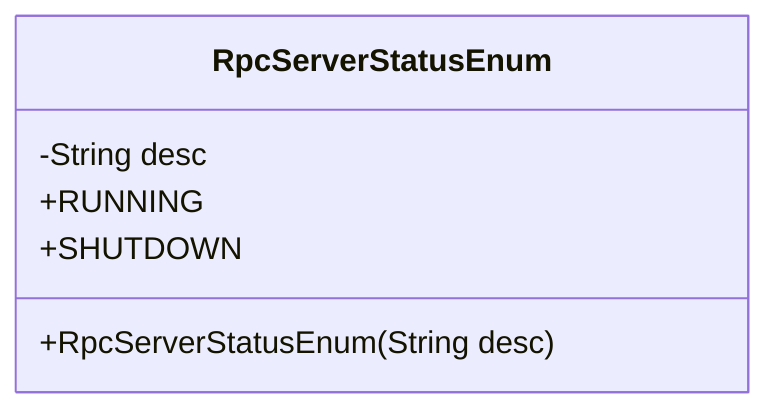
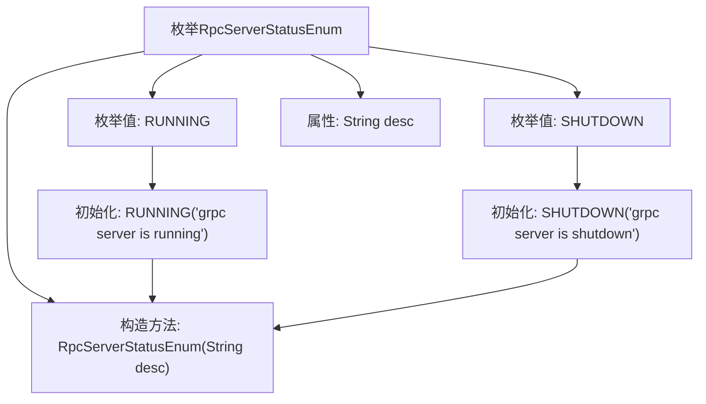

# 基础信息

|      |      |
|------|------|
| 名称 | RpcServerStatusEnum |
| 编码语言 | .java |
| 代码路径 | WeFe/gateway/src/main/java/com/welab/wefe/gateway/common/RpcServerStatusEnum.java |
| 包名 | com.welab.wefe.gateway.common |
| 依赖项 | [] |
| 概述说明 | 枚举RpcServerStatusEnum定义gRPC服务器状态：RUNNING表示运行中，SHUTDOWN表示已关闭，包含描述字段desc。 |

# 说明

该枚举类定义了gRPC服务器的两种状态：运行中（RUNNING）和已关闭（SHUTDOWN）。每种状态都包含对应的描述信息，通过构造函数初始化。枚举项RUNNING的描述为"grpc server is running"，SHUTDOWN的描述为"grpc server is shutdown"。该设计用于清晰标识和管理gRPC服务器的运行状态。

# 类列表 Class Summary

| 名称   | 类型  | 说明 |
|-------|------|-------------|
| RpcServerStatusEnum | enum | 枚举RpcServerStatusEnum定义gRPC服务器状态：RUNNING表示运行中，SHUTDOWN表示已关闭，含描述字段desc。 |

## 类 RpcServerStatusEnum

|      |      |
|------|------|
| 访问范围 | public |
| 类型 | enum |
| 名称 | RpcServerStatusEnum |
| 说明 | 枚举RpcServerStatusEnum定义gRPC服务器状态：RUNNING表示运行中，SHUTDOWN表示已关闭，含描述字段desc。 |

### UML类图

这段代码定义了一个枚举类`RpcServerStatusEnum`，用于表示gRPC服务器的运行状态。枚举包含两个常量：`RUNNING`表示服务器正在运行，`SHUTDOWN`表示服务器已关闭。每个枚举常量都有一个描述字段`desc`，通过构造函数初始化。该枚举类简洁地封装了服务器状态信息，便于在代码中明确区分不同状态。

### 内部方法调用关系图

这段代码定义了一个枚举类型`RpcServerStatusEnum`，包含两个枚举值`RUNNING`和`SHUTDOWN`，分别表示gRPC服务器的运行状态。每个枚举值通过构造方法初始化了一个描述字段`desc`，用于存储状态的具体说明。流程图展示了枚举类的结构、属性、构造方法以及枚举值的初始化过程，清晰地反映了代码的组织关系和数据流向。

### 字段列表 Field List

| 名称  | 类型  | 说明 |
|-------|-------|------|

### 方法列表

| 名称  | 类型  | 说明 |
|-------|-------|------|

