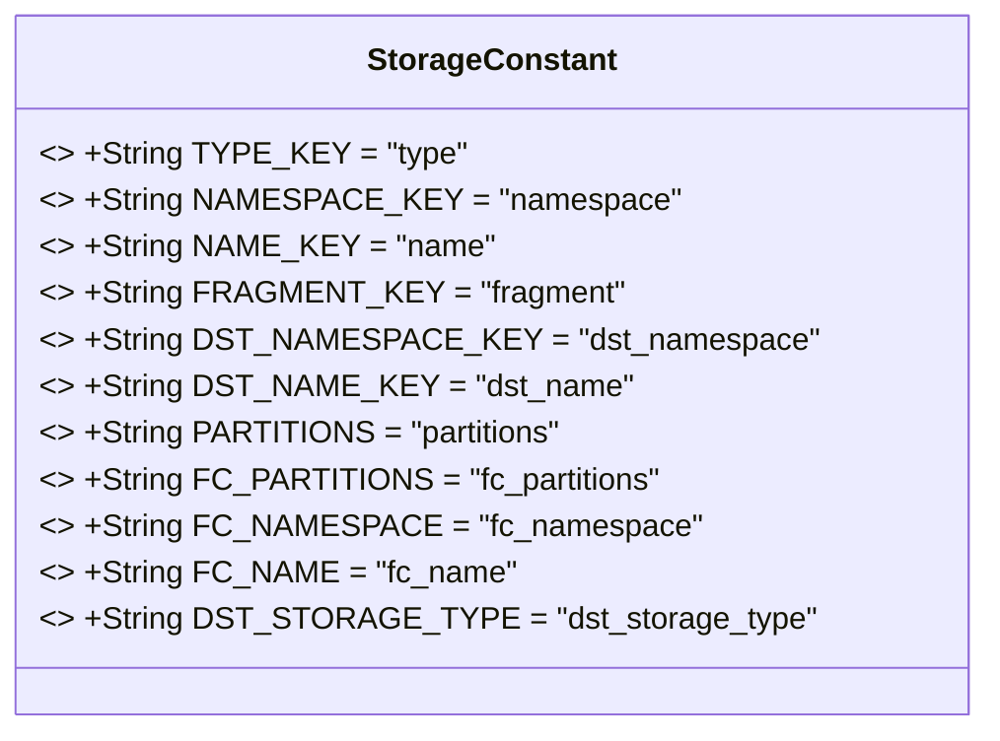
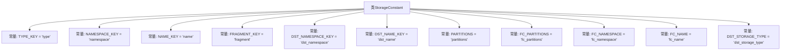

# 基础信息

|      |      |
|------|------|
| 名称 | StorageConstant |
| 编码语言 | .java |
| 代码路径 | WeFe/gateway/src/main/java/com/welab/wefe/gateway/common/StorageConstant.java |
| 包名 | com.welab.wefe.gateway.common |
| 依赖项 | [] |
| 概述说明 | StorageConstant类定义了存储相关的常量键名，包括类型、命名空间、名称、片段、目标命名空间、目标名称、分区等字段。 |

# 说明

这是一个名为StorageConstant的Java公共类，定义了多个静态常量字符串字段，用于表示存储相关的键名。包含类型键、命名空间键、名称键、片段键、目标命名空间键、目标名称键、分区键、FC分区键、FC命名空间键、FC名称键以及目标存储类型键。这些常量可能用于配置或操作存储系统时的参数标识。

# 类列表 Class Summary

| 名称   | 类型  | 说明 |
|-------|------|-------------|
| StorageConstant | class | 存储常量类定义键名常量，包括类型、命名空间、名称、片段、目标命名空间、目标名称、分区、FC分区、FC命名空间、FC名称及目标存储类型。 |

## 类 StorageConstant

|      |      |
|------|------|
| 访问范围 | public |
| 类型 | class |
| 名称 | StorageConstant |
| 说明 | 存储常量类定义键名常量，包括类型、命名空间、名称、片段、目标命名空间、目标名称、分区、FC分区、FC命名空间、FC名称及目标存储类型。 |

### UML类图

该类图展示了一个名为StorageConstant的工具类，该类仅包含12个公开静态常量字符串字段，用于存储与存储系统相关的各种键名。这些常量字段均被标记为final，表明其值在编译期确定且不可修改。该类设计为不可实例化的常量容器，为应用程序提供统一的存储相关配置键名引用，避免硬编码字符串分散在代码各处。常量命名采用全大写和下划线分隔的规范，清晰表达了各个键的用途。

### 内部方法调用关系图

这段代码定义了一个名为StorageConstant的类，其中包含了12个静态常量字符串字段，这些字段都是public static final修饰的，表示它们是公共的、不可变的类级别常量。这些常量主要用于存储系统中各种键的名称，如类型(type)、命名空间(namespace)、名称(name)等，以及一些特定用途的键如目标存储类型(dst_storage_type)和分区相关键(partitions, fc_partitions)。这些常量可能在系统的其他部分被引用，用于统一管理存储相关的键名，避免硬编码字符串分散在代码各处。

### 字段列表 Field List

| 名称  | 类型  | 说明 |
|-------|-------|------|
| PARTITIONS = "partitions" | String | 定义静态常量PARTITIONS，值为字符串"partitions"。 |
| DST_NAME_KEY = "dst_name" | String | 定义常量DST_NAME_KEY，值为字符串"dst_name"。 |
| FC_NAME = "fc_name" | String | 定义了一个公共静态常量字符串FC_NAME，值为"fc_name"。 |
| DST_STORAGE_TYPE = "dst_storage_type" | String | 定义了一个公共静态常量字符串DST_STORAGE_TYPE，值为"dst_storage_type"。 |
| NAMESPACE_KEY = "namespace" | String | 定义静态常量NAMESPACE_KEY，值为"namespace"。 |
| NAME_KEY = "name" | String | 定义静态常量字符串NAME_KEY，值为"name"。 |
| TYPE_KEY = "type" | String | 定义静态常量字符串TYPE_KEY，值为"type"。 |
| FC_NAMESPACE = "fc_namespace" | String | 定义静态常量字符串FC_NAMESPACE，值为"fc_namespace"。 |
| DST_NAMESPACE_KEY = "dst_namespace" | String | 定义静态常量字符串DST_NAMESPACE_KEY，值为"dst_namespace"。 |
| FC_PARTITIONS = "fc_partitions" | String | 定义静态常量字符串FC_PARTITIONS，值为"fc_partitions"。 |
| FRAGMENT_KEY = "fragment" | String | 定义静态常量字符串FRAGMENT_KEY，值为"fragment"。 |

### 方法列表

| 名称  | 类型  | 说明 |
|-------|-------|------|

