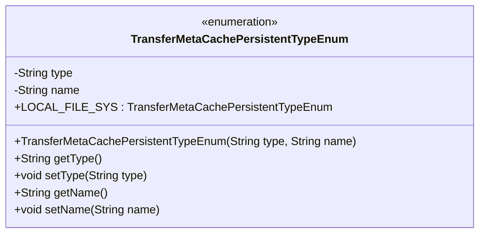
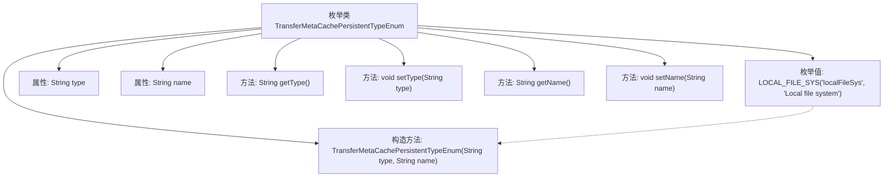

# 基础信息

|      |      |
|------|------|
| 名称 | TransferMetaCachePersistentTypeEnum |
| 编码语言 | .java |
| 代码路径 | WeFe/gateway/src/main/java/com/welab/wefe/gateway/common/TransferMetaCachePersistentTypeEnum.java |
| 包名 | com.welab.wefe.gateway.common |
| 依赖项 | [] |
| 概述说明 | 枚举类定义传输元数据缓存持久化类型，包含本地文件系统类型和名称属性，提供构造方法和访问器。 |

# 说明

该代码定义了一个枚举类TransferMetaCachePersistentTypeEnum，用于表示传输元数据缓存的持久化类型。目前仅包含一个枚举值LOCAL_FILE_SYS，表示使用本地文件系统进行持久化。枚举类包含两个私有属性type和name，分别表示类型和描述信息，并通过构造函数初始化。提供了getter和setter方法来访问和修改这两个属性。该枚举类可用于管理和标识不同的持久化存储方式。

# 类列表 Class Summary

| 名称   | 类型  | 说明 |
|-------|------|-------------|
| TransferMetaCachePersistentTypeEnum | enum | 枚举类定义传输元数据缓存持久化类型，包含本地文件系统类型，含type和name属性及对应getter/setter方法。 |

## 类 TransferMetaCachePersistentTypeEnum

|      |      |
|------|------|
| 访问范围 | public |
| 类型 | enum |
| 名称 | TransferMetaCachePersistentTypeEnum |
| 说明 | 枚举类定义传输元数据缓存持久化类型，包含本地文件系统类型，含type和name属性及对应getter/setter方法。 |

### UML类图

该枚举类定义了传输元数据缓存持久化类型，包含LOCAL_FILE_SYS枚举值，表示本地文件系统类型。类中包含type和name两个私有属性，分别表示类型和描述名称，并提供对应的getter和setter方法。枚举构造函数用于初始化这两个属性，整体结构清晰展示了枚举常量和其相关属性的封装关系。

### 内部方法调用关系图

该流程图展示了枚举类TransferMetaCachePersistentTypeEnum的结构，包含一个枚举值LOCAL_FILE_SYS、两个私有属性type和name、构造方法以及四个访问器方法。枚举值通过构造方法初始化属性，类提供了对属性的getter和setter方法。这种设计模式常用于定义具有固定选项和附加属性的枚举类型，适用于需要类型安全配置的场景。

### 字段列表 Field List

| 名称  | 类型  | 说明 |
|-------|-------|------|

### 方法列表

| 名称  | 类型  | 说明 |
|-------|-------|------|

