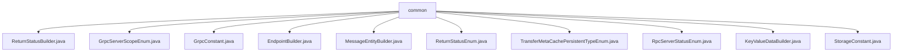

# 基础信息

|      |      |
|------|------|
| 名称 | common |
| 编码语言 | .java |
| 代码路径 | WeFe/gateway/src/main/java/com/welab/wefe/gateway/common |
| 包名 | docs.gateway.src.main.java.com.welab.wefe.gateway.common |
| 概述说明 | ReturnStatusBuilder类提供构建返回状态的方法。GrpcServerScopeEnum定义gRPC服务范围枚举。GrpcConstant包含gRPC通信常量。EndpointBuilder处理网络端点创建转换。MessageEntityBuilder创建消息实体。ReturnStatusEnum定义返回状态枚举。TransferMetaCachePersistentTypeEnum表示持久化类型。RpcServerStatusEnum标识gRPC服务器状态。KeyValueDataBuilder构建键值数据。StorageConstant定义存储相关常量。 |

# 说明

## 概述  
该模块是网关系统的核心工具集，主要负责gRPC通信状态管理、端点转换和消息实体构建。通过Builder模式统一封装返回状态构造（例如OK/PARAM_ERROR等枚举），支持自定义消息级别和键值数据。定义gRPC服务范围（INTERNAL/EXTERNAL/BOTH）和运行状态（RUNNING/SHUTDOWN）枚举，类似服务治理的元数据标识。  

关键数据结构包括BasicMetaProto.ReturnStatus、MessageEntity和KeyValueData，使用ByteString处理二进制数据。外部依赖仅涉及Protocol Buffers序列化。例如TransferMetaCachePersistentTypeEnum定义LOCAL_FILE_SYS持久化方式，StorageConstant则提供存储系统参数标识。  

## 主要业务场景  
模块支撑网关的通信全流程：通过GrpcConstant管理签名验证、时间戳校验等安全规则（例如允许300秒时差），EndpointBuilder转换"IP:端口"格式的端点URI。当发生异常时，MessageEntityBuilder快速生成错误消息（例如OnGatewayError事件），而ReturnStatusBuilder组合状态码与会话ID返回。  

典型应用包括：内外部服务路由（依赖GrpcServerScopeEnum）、传输元数据缓存（通过TransferMetaCachePersistentTypeEnum指定存储方式）、键值数据封装（如KeyValueDataBuilder处理字节数组）。所有API均采用静态方法设计，类似工具类聚合模式，支持网关的消息传递、状态反馈和端点管理三大核心功能。

### 包内部结构视图

该流程图展示了WeFe网关项目中common目录下的文件结构关系。所有Java类文件都直接隶属于common目录，包括ReturnStatusBuilder、GrpcServerScopeEnum等11个枚举类、常量类和构建器类文件。这些文件共同构成了网关项目的通用工具和常量定义模块。

# 文件列表

| 名称   | 类型  | 说明 |
|-------|------|-------------|
| [ReturnStatusBuilder.java](ReturnStatusBuilder.md) | file | ReturnStatusBuilder类提供多个静态方法创建BasicMetaProto.ReturnStatus对象，支持设置状态码、消息、会话ID和数据，包含成功、参数错误和系统异常等常见状态。 |
| [GrpcServerScopeEnum.java](GrpcServerScopeEnum.md) | file | GrpcServerScopeEnum定义了gRPC服务范围：INTERNAL仅内网调用，EXTERNAL供公网调用，BOTH支持内外网调用。 |
| [GrpcConstant.java](GrpcConstant.md) | file | GrpcConstant类定义了gRPC请求头常量、异常关键字和签名JSON结构键，包括签名验证、系统时间戳、请求数据哈希等头信息，以及最大时间差限制和各类权限异常提示。 |
| [EndpointBuilder.java](EndpointBuilder.md) | file | EndpointBuilder类提供静态方法创建和转换Endpoint对象，支持IP端口组合或URI字符串输入，并能将Endpoint对象转为URI格式。 |
| [MessageEntityBuilder.java](MessageEntityBuilder.md) | file | MessageEntityBuilder类提供静态方法创建消息实体，默认设置生产者类型为gateway、事件为OnGatewayError、级别为info、未读状态和无更新时间。支持自定义级别、标题和内容，以及快速创建成功或错误消息。 |
| [ReturnStatusEnum.java](ReturnStatusEnum.md) | file | 枚举类ReturnStatusEnum定义了三种状态：成功(0)、参数错误(101)、系统异常(999)，包含状态码和描述信息，提供getter和setter方法。 |
| [TransferMetaCachePersistentTypeEnum.java](TransferMetaCachePersistentTypeEnum.md) | file | 枚举类定义传输元数据缓存持久化类型，包含本地文件系统类型和名称属性，提供构造方法和访问器。 |
| [RpcServerStatusEnum.java](RpcServerStatusEnum.md) | file | 枚举RpcServerStatusEnum定义gRPC服务器状态：RUNNING表示运行中，SHUTDOWN表示已关闭，包含描述字段desc。 |
| [KeyValueDataBuilder.java](KeyValueDataBuilder.md) | file | KeyValueDataBuilder类提供静态方法create，通过key和value字节数组构建KeyValueData对象，value可为空。 |
| [StorageConstant.java](StorageConstant.md) | file | StorageConstant类定义了存储相关的常量键名，包括类型、命名空间、名称、片段、目标命名空间、目标名称、分区等字段。 |

