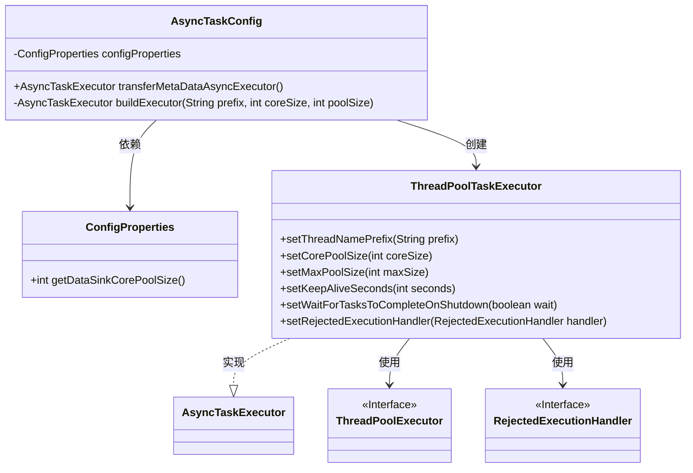
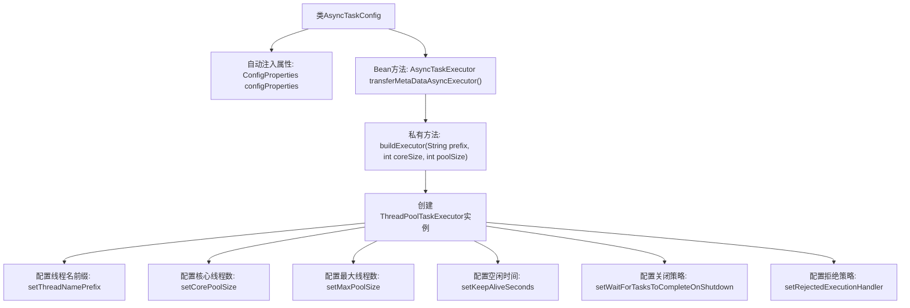

# 基础信息

|      |      |
|------|------|
| 名称 | AsyncTaskConfig |
| 编码语言 | .java |
| 代码路径 | WeFe/gateway/src/main/java/com/welab/wefe/gateway/config/AsyncTaskConfig.java |
| 包名 | com.welab.wefe.gateway.config |
| 依赖项 | ['org.springframework.beans.factory.annotation.Autowired', 'org.springframework.context.annotation.Bean', 'org.springframework.context.annotation.Configuration', 'org.springframework.core.task.AsyncTaskExecutor', 'org.springframework.scheduling.concurrent.ThreadPoolTaskExecutor', 'java.util.concurrent.ThreadPoolExecutor'] |
| 概述说明 | 配置类AsyncTaskConfig定义异步任务执行器，核心线程数取自配置，最大线程数为核心数乘100，线程名前缀为transferMetaDataAsyncExecutor-Thread-，关闭时等待任务完成，拒绝策略为调用者运行。 |

# 说明

该配置类定义了一个异步任务执行器，用于处理数据传输任务。通过注入的配置属性动态设置线程池参数，包括核心线程数和最大线程数。执行器使用自定义线程名前缀，设置120秒空闲线程存活时间，并确保关闭时等待任务完成。当任务被拒绝时采用调用者运行策略。该执行器专为元数据传输任务优化，核心线程数由配置决定，最大线程数为核心线程数的100倍。

# 类列表 Class Summary

| 名称   | 类型  | 说明 |
|-------|------|-------------|
| AsyncTaskConfig | class | 配置类AsyncTaskConfig定义了一个异步任务执行器transferMetaDataAsyncExecutor，核心线程数和最大线程数由配置属性决定，线程名前缀为transferMetaDataAsyncExecutor-Thread-，关闭时等待任务完成，拒绝策略为调用者运行。 |

## 类 AsyncTaskConfig

|      |      |
|------|------|
| 访问范围 | @Configuration;public |
| 类型 | class |
| 名称 | AsyncTaskConfig |
| 说明 | 配置类AsyncTaskConfig定义了一个异步任务执行器transferMetaDataAsyncExecutor，核心线程数和最大线程数由配置属性决定，线程名前缀为transferMetaDataAsyncExecutor-Thread-，关闭时等待任务完成，拒绝策略为调用者运行。 |

### UML类图

这段代码展示了Spring配置类AsyncTaskConfig如何创建线程池执行器。该类通过@Autowired注入ConfigProperties配置，使用buildExecutor方法构建ThreadPoolTaskExecutor实例，设置线程名前缀、核心/最大线程数等参数，并指定拒绝策略为CallerRunsPolicy。类图清晰地呈现了配置类与线程池组件之间的依赖关系，以及接口实现关系。

### 内部方法调用关系图

这段代码是Spring配置类AsyncTaskConfig的实现，主要功能是创建并配置一个异步任务执行器。通过自动注入的ConfigProperties获取线程池参数，调用buildExecutor方法构建ThreadPoolTaskExecutor实例，设置线程名前缀、核心/最大线程数、空闲存活时间、关闭等待策略和拒绝策略等参数。该配置类提供了可定制化的线程池配置方案，适用于需要异步处理任务的场景。

### 字段列表 Field List

| 名称  | 类型  | 说明 |
|-------|-------|------|
| configProperties | ConfigProperties | 代码片段使用@Autowired自动注入ConfigProperties配置类实例。 |

### 方法列表

| 名称  | 类型  | 说明 |
|-------|-------|------|
| transferMetaDataAsyncExecutor | AsyncTaskExecutor | 创建异步任务执行器transferMetaDataAsyncExecutor，核心线程数为配置的dataSinkCorePoolSize，最大队列容量为核心线程数的100倍。 |
| buildExecutor | AsyncTaskExecutor | 创建线程池执行器，设置线程名前缀、核心和最大线程数、保活时间、关闭等待任务完成及拒绝策略。 |

