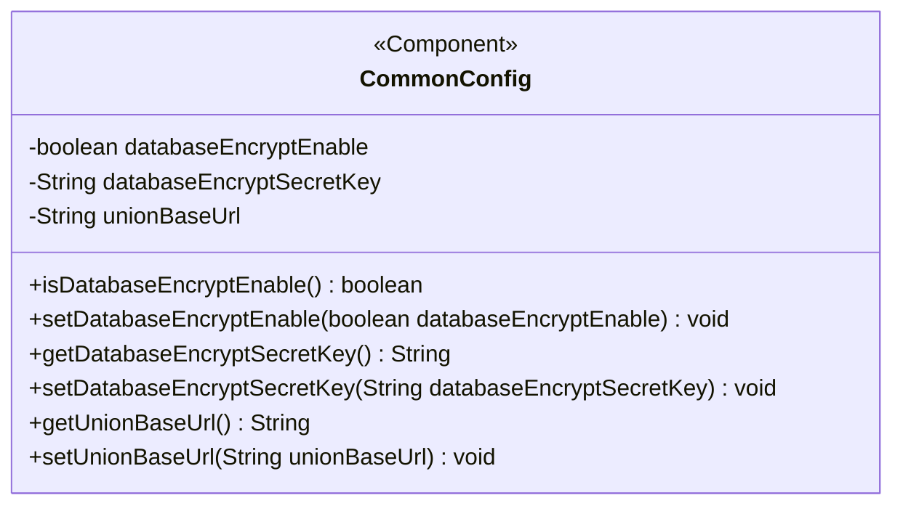
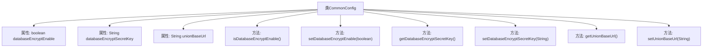

# 基础信息

|      |      |
|------|------|
| 名称 | CommonConfig |
| 编码语言 | .java |
| 代码路径 | WeFe/gateway/src/main/java/com/welab/wefe/gateway/config/CommonConfig.java |
| 包名 | com.welab.wefe.gateway.config |
| 依赖项 | ['org.springframework.beans.factory.annotation.Value', 'org.springframework.boot.context.properties.ConfigurationProperties', 'org.springframework.context.annotation.PropertySource', 'org.springframework.stereotype.Component'] |
| 概述说明 | CommonConfig类包含数据库加密开关、密钥及联盟基础URL配置项，提供对应getter/setter方法。 |

# 说明

这是一个名为CommonConfig的Spring组件类，用于管理通用配置。它包含三个主要配置项：databaseEncryptEnable控制数据库加密功能开关，默认关闭；databaseEncryptSecretKey存储数据库加密密钥；unionBaseUrl保存wefe联盟基础URL。类中为每个配置项提供了getter和setter方法，支持外部访问和修改这些配置参数。所有配置都通过@Value注解从外部属性文件注入，并设置了默认值。

# 类列表 Class Summary

| 名称   | 类型  | 说明 |
|-------|------|-------------|
| CommonConfig | class | CommonConfig类包含数据库加密开关、密钥及基础URL配置项，提供对应getter/setter方法。 |

## 类 CommonConfig

|      |      |
|------|------|
| 访问范围 | @Component("commonConfig");public |
| 类型 | class |
| 名称 | CommonConfig |
| 说明 | CommonConfig类包含数据库加密开关、密钥及基础URL配置项，提供对应getter/setter方法。 |

### UML类图

这段代码展示了一个Spring组件类`CommonConfig`，用于管理应用程序的通用配置项。该类包含三个私有字段：`databaseEncryptEnable`表示数据库加密是否启用，`databaseEncryptSecretKey`存储加密密钥，`unionBaseUrl`保存联盟基础URL。通过getter和setter方法提供对这些配置项的访问和修改能力。类上标注了`@Component("commonConfig")`注解，表明这是一个Spring管理的组件，可通过指定名称"commonConfig"进行依赖注入。这个配置类主要用于集中管理应用中与隐私保护和第三方服务相关的重要配置参数。

### 内部方法调用关系图

这段代码展示了一个Spring组件类CommonConfig，主要用于管理应用程序的配置参数。类中包含三个通过@Value注解注入的配置属性：数据库加密开关(databaseEncryptEnable)、数据库加密密钥(databaseEncryptSecretKey)和联盟基础URL(unionBaseUrl)，每个属性都配有对应的getter和setter方法。这些配置项可以从外部配置文件动态加载，默认值分别为false、空字符串和空字符串。该设计实现了配置的集中管理和灵活修改，符合Spring的依赖注入原则。

### 字段列表 Field List

| 名称  | 类型  | 说明 |
|-------|-------|------|
| unionBaseUrl | String | 代码片段定义了一个私有字符串变量unionBaseUrl，通过@Value注解从配置项wefe.union.base-url注入值，默认值为空。 |
| databaseEncryptSecretKey | String | 代码定义了一个私有字符串变量databaseEncryptSecretKey，用于存储数据库加密密钥，默认值为空。 |
| databaseEncryptEnable | boolean | 配置项控制数据库加密功能是否启用，默认值为false。 |

### 方法列表

| 名称  | 类型  | 说明 |
|-------|-------|------|
| isDatabaseEncryptEnable | boolean | 检查数据库加密是否启用，返回布尔值。 |
| setDatabaseEncryptEnable | void | 设置数据库加密功能的开关状态。 |
| getUnionBaseUrl | String | 方法返回unionBaseUrl字符串值。 |
| setDatabaseEncryptSecretKey | void | 设置数据库加密密钥的方法，参数为密钥字符串。 |
| setUnionBaseUrl | void | 设置联合基础URL的方法，将参数unionBaseUrl赋值给类成员变量unionBaseUrl。 |
| getDatabaseEncryptSecretKey | String | 获取数据库加密密钥的方法，返回值为字符串类型的密钥值。 |

