# 基础信息

|      |      |
|------|------|
| 名称 | ConfigProperties |
| 编码语言 | .java |
| 代码路径 | WeFe/gateway/src/main/java/com/welab/wefe/gateway/config/ConfigProperties.java |
| 包名 | com.welab.wefe.gateway.config |
| 依赖项 | ['org.springframework.beans.factory.annotation.Value', 'org.springframework.boot.context.properties.ConfigurationProperties', 'org.springframework.context.annotation.PropertySource', 'org.springframework.stereotype.Component'] |
| 概述说明 | 配置类，定义gRPC端口、消息持久化类型及目录、数据写入线程池大小和批量插入数据块大小等参数。 |

# 说明

这是一个名为ConfigProperties的Java配置类，用于管理应用程序的各种配置参数。该类继承自CommonConfig，并标注为Spring组件和配置属性类。它从外部属性文件加载配置，支持UTF-8编码。主要配置包括：gRPC服务的内部和外部端口号；消息持久化类型（默认为本地文件系统）及其对应的临时目录路径；大数据处理时的核心线程池大小（默认30）；数据块片段大小（默认5M）。类中为每个配置字段提供了getter和setter方法，支持运行时修改。

# 类列表 Class Summary

| 名称   | 类型  | 说明 |
|-------|------|-------------|
| ConfigProperties | class | 配置类ConfigProperties继承CommonConfig，定义gRPC端口、消息持久化类型及目录、数据写入线程池大小和批量插入数据块大小等属性。 |


## 类 ConfigProperties

|      |      |
|------|------|
| 访问范围 | @Component;@PropertySource(value = {"file:${config.path}"}, encoding = "utf-8");@ConfigurationProperties;public |
| 类型 | class |
| 名称 | ConfigProperties |
| 说明 | 配置类ConfigProperties继承CommonConfig，定义gRPC端口、消息持久化类型及目录、数据写入线程池大小和批量插入数据块大小等属性。 |


### UML类图

```mermaid
classDiagram
    class CommonConfig {
        <<abstract>>
    }

    class ConfigProperties {
        -Integer grpcServerInternalPort
        -Integer grpcServerExternalPort
        -String sendTransferMetaPersistentType
        -String sendTransferMetaPersistentTempDir
        -String recvTransferMetaPersistentType
        -String recvTransferMetaPersistentTempDir
        -int dataSinkCorePoolSize
        -double persistentStorageBatchInsertSize
        
        +String getSendTransferMetaPersistentTempDir()
        +void setSendTransferMetaPersistentTempDir(String)
        +String getSendTransferMetaPersistentType()
        +void setSendTransferMetaPersistentType(String)
        +String getRecvTransferMetaPersistentType()
        +void setRecvTransferMetaPersistentType(String)
        +String getRecvTransferMetaPersistentTempDir()
        +void setRecvTransferMetaPersistentTempDir(String)
        +int getDataSinkCorePoolSize()
        +void setDataSinkCorePoolSize(int)
        +double getPersistentStorageBatchInsertSize()
        +void setPersistentStorageBatchInsertSize(double)
        +Integer getGrpcServerInternalPort()
        +void setGrpcServerInternalPort(Integer)
        +Integer getGrpcServerExternalPort()
        +void setGrpcServerExternalPort(Integer)
    }

    CommonConfig <|-- ConfigProperties
    ConfigProperties --> "@Component" : 标记为Spring组件
    ConfigProperties --> "@PropertySource" : 指定配置文件
    ConfigProperties --> "@ConfigurationProperties" : 绑定配置属性
```

该代码是一个Spring Boot配置属性类，继承自抽象类CommonConfig，用于集中管理gRPC服务端口、消息持久化类型/目录、数据写入线程池等配置参数。通过@Value注解从外部配置文件注入属性值，提供完整的getter/setter方法，支持动态配置更新。类图展示了其继承关系、私有字段、公有方法以及与Spring注解的关联关系。


### 内部方法调用关系图

```mermaid
graph TD
    A["类ConfigProperties"]
    B["注解: @Component"]
    C["注解: @PropertySource"]
    D["注解: @ConfigurationProperties"]
    E["继承: CommonConfig"]
    F["属性: grpcServerInternalPort"]
    G["属性: grpcServerExternalPort"]
    H["属性: sendTransferMetaPersistentType"]
    I["属性: sendTransferMetaPersistentTempDir"]
    J["属性: recvTransferMetaPersistentType"]
    K["属性: recvTransferMetaPersistentTempDir"]
    L["属性: dataSinkCorePoolSize"]
    M["属性: persistentStorageBatchInsertSize"]
    N["Getter/Setter方法组"]

    A --> B
    A --> C
    A --> D
    A --> E
    A --> F
    A --> G
    A --> H
    A --> I
    A --> J
    A --> K
    A --> L
    A --> M
    A --> N
```



该流程图展示了ConfigProperties类的完整结构，这是一个Spring配置类，通过注解加载外部属性文件并映射到类属性。类继承自CommonConfig，包含7个主要配置属性（如gRPC端口、持久化类型等），每个属性都有对应的@Value注解实现外部配置注入。所有属性均通过标准的Getter/Setter方法提供访问接口，符合JavaBean规范。注解体系实现了配置的模块化和外部化管理。

### 字段列表 Field List

| 名称  | 类型  | 说明 |
|-------|-------|------|
| recvTransferMetaPersistentType | String | 配置项recvTransferMetaPersistentType默认值为localFileSys，用于设置接收传输元数据的持久化类型。 |
| sendTransferMetaPersistentTempDir | String | 配置项：发送传输元数据临时存储目录，通过@Value注入路径字符串。 |
| grpcServerInternalPort | Integer | 配置项：gRPC服务内部端口，通过@Value注入，默认值为空，类型为Integer。 |
| grpcServerExternalPort | Integer | 配置项grpcServerExternalPort，通过@Value注入外部gRPC服务端口号，默认值为空。 |
| persistentStorageBatchInsertSize | double | 配置项persistentStorageBatchInsertSize默认值为5，用于批量插入操作。 |
| dataSinkCorePoolSize | int | 配置项data.sink.core.pool.size默认值30，定义线程池核心大小。 |
| recvTransferMetaPersistentTempDir | String | 配置项：接收传输元数据临时存储目录，通过@Value注解注入路径字符串。 |
| sendTransferMetaPersistentType | String | 配置项send.transfer.meta.persistent.type默认值为localFileSys，用于设置发送传输元数据的持久化类型。 |

### 方法列表

| 名称  | 类型  | 说明 |
|-------|-------|------|
| getDataSinkCorePoolSize | int | 获取数据池核心线程数的方法，返回dataSinkCorePoolSize的值。 |
| setSendTransferMetaPersistentTempDir | void | 设置发送传输元数据持久化临时目录的方法。 |
| setSendTransferMetaPersistentType | void | 设置发送传输元数据的持久化类型方法，参数为字符串类型。 |
| setRecvTransferMetaPersistentTempDir | void | 设置接收传输元数据持久化临时目录的方法。 |
| setPersistentStorageBatchInsertSize | void | 设置持久存储批量插入大小的方法。 |
| getRecvTransferMetaPersistentType | String | 获取接收传输元数据的持久化类型方法，返回字符串类型值。 |
| getSendTransferMetaPersistentType | String | 该方法返回发送传输元数据的持久化类型字符串。 |
| getRecvTransferMetaPersistentTempDir | String | 获取接收传输元数据的持久化临时目录路径。 |
| setDataSinkCorePoolSize | void | 设置数据池核心线程数的方法，参数为dataSinkCorePoolSize。 |
| getPersistentStorageBatchInsertSize | double | 获取持久化存储批量插入大小的公共方法，返回double类型值。 |
| getSendTransferMetaPersistentTempDir | String | 获取发送传输元数据的持久化临时目录路径。 |
| setRecvTransferMetaPersistentType | void | 设置接收传输元数据持久化类型的方法。 |
| getGrpcServerInternalPort | Integer | 获取gRPC服务器内部端口的方法，返回整型端口号。 |
| setGrpcServerInternalPort | void | 设置gRPC服务内部端口的方法。 |
| getGrpcServerExternalPort | Integer | 获取gRPC服务器外部端口的方法。 |
| setGrpcServerExternalPort | void | 设置gRPC服务外部端口的方法。 |


