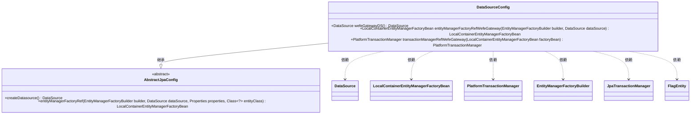

# 基础信息

|      |      |
|------|------|
| 名称 | DataSourceConfig |
| 编码语言 | .java |
| 代码路径 | WeFe/gateway/src/main/java/com/welab/wefe/gateway/config/DataSourceConfig.java |
| 包名 | com.welab.wefe.gateway.config |
| 依赖项 | ['com.welab.wefe.common.data.mysql.config.AbstractJpaConfig', 'com.welab.wefe.gateway.GatewayServer', 'com.welab.wefe.gateway.entity.FlagEntity', 'org.springframework.beans.factory.annotation.Qualifier', 'org.springframework.boot.autoconfigure.domain.EntityScan', 'org.springframework.boot.context.properties.ConfigurationProperties', 'org.springframework.boot.orm.jpa.EntityManagerFactoryBuilder', 'org.springframework.context.annotation.Bean', 'org.springframework.context.annotation.Configuration', 'org.springframework.context.annotation.Primary', 'org.springframework.data.jpa.repository.config.EnableJpaRepositories', 'org.springframework.orm.jpa.JpaTransactionManager', 'org.springframework.orm.jpa.LocalContainerEntityManagerFactoryBean', 'org.springframework.transaction.PlatformTransactionManager', 'javax.sql.DataSource'] |
| 概述说明 | Java配置类DataSourceConfig，定义主数据源wefeGatewayDS，配置JPA实体扫描、仓库启用及事务管理，继承AbstractJpaConfig实现数据库相关Bean创建。 |

# 说明

这是一个Java Spring Boot配置类，用于设置数据源和JPA相关配置。类名为DataSourceConfig，继承自AbstractJpaConfig。通过@EntityScan注解扫描com.welab.gateway包下的实体类。使用@EnableJpaRepositories启用JPA仓库，指定了基础包、实体管理器工厂和事务管理器的引用名称。配置了主数据源wefeGatewayDS，使用db.mysql前缀的属性配置。定义了主实体管理器工厂bean和主事务管理器bean，分别用于管理实体和事务。整个配置针对GatewayServer应用，使用FlagEntity类作为实体类。

# 类列表 Class Summary

| 名称   | 类型  | 说明 |
|-------|------|-------------|
| DataSourceConfig | class | Java配置类DataSourceConfig，定义主数据源wefeGatewayDS，配置JPA实体扫描、仓库启用及事务管理，继承AbstractJpaConfig实现数据库相关Bean创建。 |

## 类 DataSourceConfig

|      |      |
|------|------|
| 访问范围 | @Configuration;@EntityScan("com.welab.gateway");@EnableJpaRepositories(basePackageClasses = GatewayServer.class,;        entityManagerFactoryRef = "entityManagerFactoryRefWefeGateway",;        transactionManagerRef = "transactionManagerRefWefeGateway");public |
| 类型 | class |
| 名称 | DataSourceConfig |
| 说明 | Java配置类DataSourceConfig，定义主数据源wefeGatewayDS，配置JPA实体扫描、仓库启用及事务管理，继承AbstractJpaConfig实现数据库相关Bean创建。 |

### UML类图

这段代码是一个Spring Boot的配置类，主要用于配置JPA数据源、实体管理器和事务管理器。DataSourceConfig继承自AbstractJpaConfig，提供了三个主要的Bean定义方法：wefeGatewayDS用于创建数据源，entityManagerFactoryRefWefeGateway用于创建实体管理器工厂，transactionManagerRefWefeGateway用于创建事务管理器。这些配置通过注解与Spring框架集成，支持JPA和数据库事务管理。

### 内部方法调用关系图

这段代码是一个Spring Boot的配置类，用于配置数据源、JPA实体管理和事务管理。它通过`@Configuration`标记为配置类，使用`@EntityScan`指定实体扫描路径，并通过`@EnableJpaRepositories`启用JPA仓库。类中定义了三个主要方法：`wefeGatewayDS()`创建主数据源，`entityManagerFactoryRefWefeGateway()`配置实体管理器工厂，`transactionManagerRefWefeGateway()`创建事务管理器。这些方法协同工作，为应用提供完整的数据访问和事务管理能力。

### 字段列表 Field List

| 名称  | 类型  | 说明 |
|-------|-------|------|

### 方法列表

| 名称  | 类型  | 说明 |
|-------|-------|------|
| entityManagerFactoryRefWefeGateway | LocalContainerEntityManagerFactoryBean | 定义主实体管理器工厂Bean，使用指定数据源和实体类配置。 |
| wefeGatewayDS | DataSource | Spring配置类中定义主数据源，使用db.mysql前缀配置属性，返回通过createDatasource方法创建的DataSource实例。 |
| transactionManagerRefWefeGateway | PlatformTransactionManager | 定义主事务管理器，使用指定实体管理器工厂创建JPA事务管理器。 |

