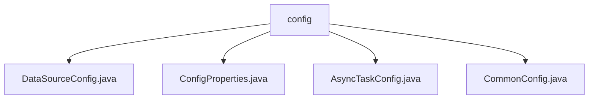

# 基础信息

|      |      |
|------|------|
| 名称 | config |
| 编码语言 | .java |
| 代码路径 | WeFe/gateway/src/main/java/com/welab/wefe/gateway/config |
| 包名 | docs.gateway.src.main.java.com.welab.wefe.gateway.config |
| 概述说明 | Java Spring Boot配置类集合：DataSourceConfig配置数据源和JPA；ConfigProperties管理应用参数；AsyncTaskConfig定义异步任务执行器；CommonConfig处理通用设置。 |

# 说明

## 概述  
该模块是GatewayServer的核心配置系统，采用Java Spring Boot框架实现，负责数据源管理、异步任务调度和全局参数配置。通过分层设计（如AbstractJpaConfig继承体系）实现配置复用，类似模块化电源管理。关键数据结构包括FlagEntity实体类、线程池参数对象和加密密钥字段。外部依赖涉及MySQL数据库、gRPC服务和本地文件系统。例如通过DataSourceConfig配置JPA实体扫描范围，AsyncTaskConfig动态调整线程池规模。

## 主要业务场景  
模块支撑网关服务的三大场景：1)数据库操作，如通过主数据源wefeGatewayDS处理实体持久化；2)异步任务处理，例如元数据传输任务使用定制线程池；3)运行时配置热更新，如ConfigProperties动态调整gRPC端口。采用集中式配置管理模式，类似Kubernetes ConfigMap，整合了JPA事务管理、线程池优化和加密开关等功能。典型应用包括：基于数据库加密开关实现敏感数据保护，通过线程池配置应对突发流量。

### 包内部结构视图

该流程图展示了WeFe网关项目中config目录下的四个配置类文件。所有文件都直接隶属于config节点，没有更深层级的嵌套关系。这些配置类分别处理数据源配置、属性配置、异步任务配置和通用配置功能，共同构成网关项目的核心配置模块。

# 文件列表

| 名称   | 类型  | 说明 |
|-------|------|-------------|
| [DataSourceConfig.java](DataSourceConfig.md) | file | Java配置类DataSourceConfig，定义主数据源wefeGatewayDS，配置JPA实体扫描、仓库启用及事务管理，继承AbstractJpaConfig实现数据库相关Bean创建。 |
| [ConfigProperties.java](ConfigProperties.md) | file | 配置类，定义gRPC端口、消息持久化类型及目录、数据写入线程池大小和批量插入数据块大小等参数。 |
| [AsyncTaskConfig.java](AsyncTaskConfig.md) | file | 配置类AsyncTaskConfig定义异步任务执行器，核心线程数取自配置，最大线程数为核心数乘100，线程名前缀为transferMetaDataAsyncExecutor-Thread-，关闭时等待任务完成，拒绝策略为调用者运行。 |
| [CommonConfig.java](CommonConfig.md) | file | CommonConfig类包含数据库加密开关、密钥及联盟基础URL配置项，提供对应getter/setter方法。 |

