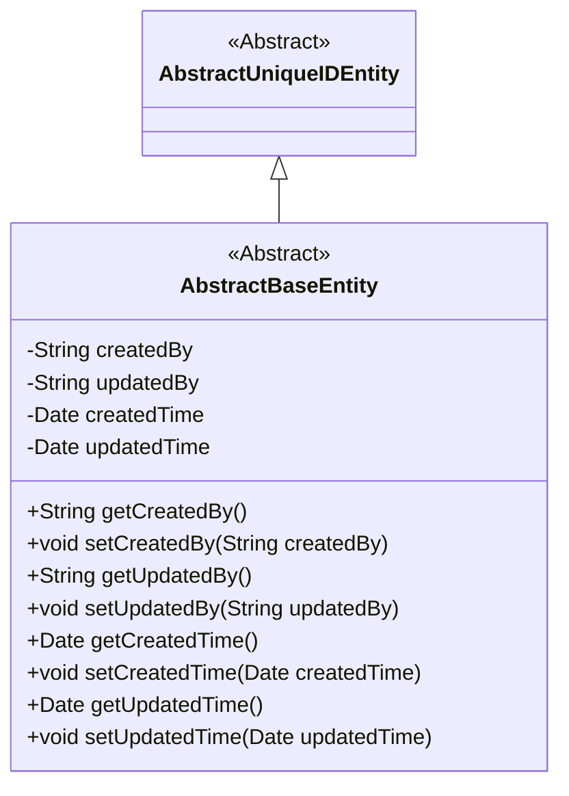

# 基础信息

|      |      |
|------|------|
| 名称 | AbstractBaseEntity |
| 编码语言 | .java |
| 代码路径 | WeFe/gateway/src/main/java/com/welab/wefe/gateway/entity/AbstractBaseEntity.java |
| 包名 | com.welab.wefe.gateway.entity |
| 依赖项 | ['com.welab.wefe.common.data.mysql.entity.AbstractUniqueIDEntity', 'java.util.Date'] |
| 概述说明 | 抽象类AbstractBaseEntity继承AbstractUniqueIDEntity，包含创建/更新用户和时间字段及其getter/setter方法。 |

# 说明

这是一个抽象基类AbstractBaseEntity，继承自AbstractUniqueIDEntity。它定义了四个核心属性：createdBy表示创建用户，updatedBy表示最后更新用户，createdTime表示创建时间（默认值为当前时间），updatedTime表示最后更新时间。类中为每个属性提供了标准的getter和setter方法，其中createdTime和updatedTime的方法被标记为@Override，表明它们重写了父类的方法。这个类主要用于记录实体的创建和更新信息。

# 类列表 Class Summary

| 名称   | 类型  | 说明 |
|-------|------|-------------|
| AbstractBaseEntity | class | 抽象类AbstractBaseEntity继承AbstractUniqueIDEntity，包含创建/更新用户和时间字段及对应getter/setter方法。 |

## 类 AbstractBaseEntity

|      |      |
|------|------|
| 访问范围 | public abstract |
| 类型 | class |
| 名称 | AbstractBaseEntity |
| 说明 | 抽象类AbstractBaseEntity继承AbstractUniqueIDEntity，包含创建/更新用户和时间字段及对应getter/setter方法。 |

### UML类图

这段类图展示了一个继承关系，其中抽象类AbstractBaseEntity继承自AbstractUniqueIDEntity。AbstractBaseEntity包含四个私有字段（createdBy、updatedBy、createdTime、updatedTime）及其对应的getter和setter方法，用于跟踪实体的创建和更新信息。createdTime字段在初始化时被设置为当前日期，体现了实体创建时间的默认值设定。

### 内部方法调用关系图

```mermaid
graph TD
    A["抽象类AbstractBaseEntity"]
    B["继承自: AbstractUniqueIDEntity"]
    C["属性: String createdBy"]
    D["属性: String updatedBy"]
    E["属性: Date createdTime = new Date()"]
    F["属性: Date updatedTime"]
    G["方法: String getCreatedBy()"]
    H["方法: void setCreatedBy(String)"]
    I["方法: String getUpdatedBy()"]
    J["方法: void setUpdatedBy(String)"]
    K["重写方法: Date getCreatedTime()"]
    L["重写方法: void setCreatedTime(Date)"]
    M["重写方法: Date getUpdatedTime()"]
    N["重写方法: void setUpdatedTime(Date)"]

    A --> B
    A --> C
    A --> D
    A --> E
    A --> F
    A --> G
    A --> H
    A --> I
    A --> J
    A --> K
    A --> L
    A --> M
    A --> N
```

这段代码定义了一个抽象类`AbstractBaseEntity`，继承自`AbstractUniqueIDEntity`，主要用于管理实体的创建和更新信息。类中包含四个核心属性：`createdBy`（创建人）、`updatedBy`（更新人）、`createdTime`（创建时间，默认当前时间）和`updatedTime`（更新时间），并提供了对应的getter和setter方法。其中`createdTime`和`updatedTime`的方法重写了父类的实现，体现了时间戳管理的功能扩展。

### 字段列表 Field List

| 名称  | 类型  | 说明 |
|-------|-------|------|
| updatedBy | String | 私有字符串变量，记录更新者信息。 |
| updatedTime | Date | 更新时间的日期类型变量。 |
| createdTime = new Date() | Date | 声明一个私有Date类型变量createdTime，初始化为当前系统时间。 |
| createdBy | String | 私有字符串类型变量，记录创建者信息。 |

### 方法列表

| 名称  | 类型  | 说明 |
|-------|-------|------|
| setCreatedBy | void | 这是一个Java方法，用于设置对象的创建者属性。方法接受一个字符串参数createdBy，并将其赋值给类的成员变量this.createdBy。 |
| getCreatedBy | String | 获取创建者信息的方法，返回createdBy字段值。 |
| getCreatedTime | Date | 这是一个Java方法，重写getCreatedTime()以返回createdTime日期对象。 |
| setUpdatedBy | void | 设置更新者字段的方法，参数为updatedBy字符串。 |
| getUpdatedBy | String | 这是一个Java方法，返回updatedBy字段的值。 |
| setCreatedTime | void | 重写setCreatedTime方法，将传入的Date类型参数赋值给类的createdTime属性。 |
| getUpdatedTime | Date | 方法getUpdatedTime返回updatedTime日期对象。 |
| setUpdatedTime | void | 重写setUpdatedTime方法，用于设置updatedTime属性值。 |

