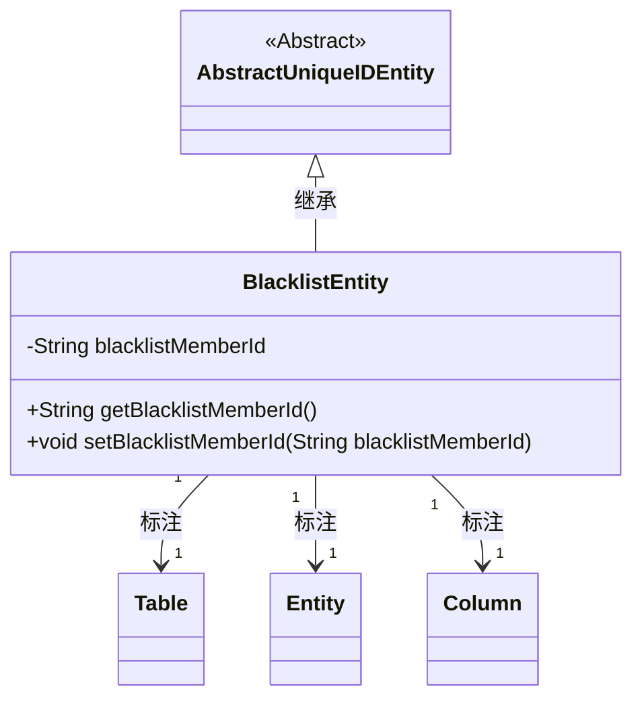
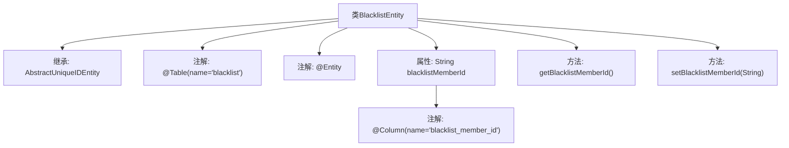

# 基础信息

|      |      |
|------|------|
| 名称 | BlacklistEntity |
| 编码语言 | .java |
| 代码路径 | WeFe/gateway/src/main/java/com/welab/wefe/gateway/entity/BlacklistEntity.java |
| 包名 | com.welab.wefe.gateway.entity |
| 依赖项 | ['com.welab.wefe.common.data.mysql.entity.AbstractUniqueIDEntity', 'javax.persistence.Column', 'javax.persistence.Entity', 'javax.persistence.Table'] |
| 概述说明 | 黑名单实体类，包含成员ID字段及getter/setter方法。 |

# 说明

该内容描述了一个名为BlacklistEntity的Java实体类，映射到数据库表blacklist。该类继承自AbstractUniqueIDEntity，包含一个私有字符串属性blacklistMemberId，表示被列入黑名单的成员ID。该属性通过@Column注解映射到表字段blacklist_member_id，并提供了对应的getter和setter方法用于访问和修改该属性值。

# 类列表 Class Summary

| 名称   | 类型  | 说明 |
|-------|------|-------------|
| BlacklistEntity | class | 黑名单实体类，包含成员ID字段及getter/setter方法。 |

## 类 BlacklistEntity

|      |      |
|------|------|
| 访问范围 | @Table(name = "blacklist");@Entity;public |
| 类型 | class |
| 名称 | BlacklistEntity |
| 说明 | 黑名单实体类，包含成员ID字段及getter/setter方法。 |

### UML类图

这段代码展示了一个JPA实体类`BlacklistEntity`，它继承自抽象基类`AbstractUniqueIDEntity`，用于表示黑名单数据。类通过`@Entity`标注为持久化实体，`@Table`指定数据库表名，`@Column`映射字段到表列。核心属性`blacklistMemberId`存储被拉黑成员ID，通过getter/setter方法访问。该设计体现了JPA实体继承和注解配置的典型用法，适用于需要唯一标识和数据库映射的场景。

### 内部方法调用关系图

这段代码展示了一个JPA实体类BlacklistEntity的类结构图，该类继承自AbstractUniqueIDEntity并标注了@Entity和@Table注解。核心属性blacklistMemberId通过@Column映射到数据库字段，同时提供了标准的getter/setter方法。该流程图清晰地呈现了实体类的继承关系、注解配置和成员方法，适用于分析JPA实体类的数据持久化结构。

### 字段列表 Field List

| 名称  | 类型  | 说明 |
|-------|-------|------|
| blacklistMemberId | String | 数据库字段映射：blacklistMemberId对应表列blacklist_member_id。 |

### 方法列表

| 名称  | 类型  | 说明 |
|-------|-------|------|
| getBlacklistMemberId | String | 获取黑名单成员ID的方法，返回字符串类型的成员ID。 |
| setBlacklistMemberId | void | 设置黑名单成员ID的方法，将参数值赋给类变量blacklistMemberId。 |

