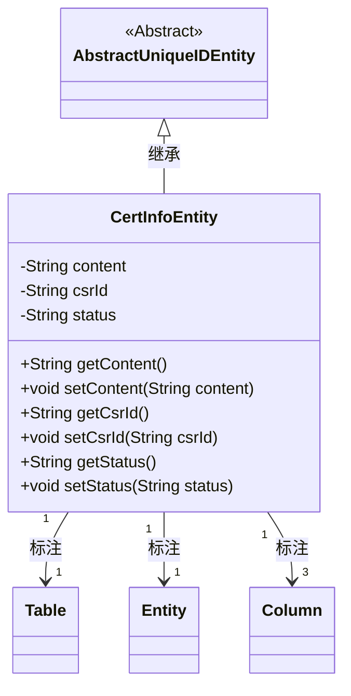
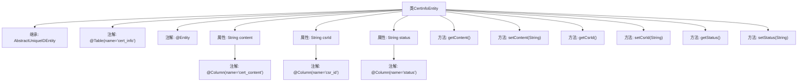

# 基础信息

|      |      |
|------|------|
| 名称 | CertInfoEntity |
| 编码语言 | .java |
| 代码路径 | WeFe/gateway/src/main/java/com/welab/wefe/gateway/entity/CertInfoEntity.java |
| 包名 | com.welab.wefe.gateway.entity |
| 依赖项 | ['com.welab.wefe.common.data.mysql.entity.AbstractUniqueIDEntity', 'javax.persistence.Column', 'javax.persistence.Entity', 'javax.persistence.Table'] |
| 概述说明 | CertInfoEntity类映射cert_info表，包含content、csrId、status字段及对应getter/setter方法。 |

# 说明

这是一个名为CertInfoEntity的Java实体类，映射到数据库表cert_info。它继承自AbstractUniqueIDEntity，包含三个字段：content存储证书内容，csrId关联证书签名请求ID，status记录证书状态。每个字段都有对应的getter和setter方法，并通过@Column注解与数据库表的列名进行映射。

# 类列表 Class Summary

| 名称   | 类型  | 说明 |
|-------|------|-------------|
| CertInfoEntity | class | CertInfoEntity实体类，映射cert_info表，包含content、csrId和status字段及其getter/setter方法。 |

## 类 CertInfoEntity

|      |      |
|------|------|
| 访问范围 | @Table(name = "cert_info");@Entity;public |
| 类型 | class |
| 名称 | CertInfoEntity |
| 说明 | CertInfoEntity实体类，映射cert_info表，包含content、csrId和status字段及其getter/setter方法。 |

### UML类图

这段代码定义了一个名为CertInfoEntity的JPA实体类，继承自AbstractUniqueIDEntity抽象类。该类使用@Entity和@Table注解标识为数据库实体，包含三个私有字段(content、csrId、status)及其对应的getter/setter方法。每个字段都通过@Column注解映射到数据库表的特定列，分别存储证书内容、CSR请求ID和状态信息。类图清晰地展示了继承关系和JPA注解的标注情况。

### 内部方法调用关系图

这段代码定义了一个名为CertInfoEntity的JPA实体类，继承自AbstractUniqueIDEntity，用于映射数据库中的cert_info表。类中包含三个属性：content（证书内容）、csrId（关联的CSR ID）和status（状态），每个属性都有对应的getter和setter方法，并通过@Column注解与数据库表的列进行映射。@Table和@Entity注解表明这是一个JPA实体类，对应数据库中的cert_info表。

### 字段列表 Field List

| 名称  | 类型  | 说明 |
|-------|-------|------|
| status | String | 数据库字段映射：status属性对应表中的status列。 |
| csrId | String | 数据库字段映射：csrId对应表列csr_id。 |
| content | String | 数据库字段cert_content映射到字符串类型变量content。 |

### 方法列表

| 名称  | 类型  | 说明 |
|-------|-------|------|
| setStatus | void | 这是一个Java方法，用于设置对象的status属性值。 |
| setContent | void | 设置内容方法，将输入字符串赋值给类的content变量。 |
| getStatus | String | 获取当前状态的方法，返回字符串类型的状态值。 |
| setCsrId | void | 设置CSR ID的方法，将输入参数赋值给成员变量csrId。 |
| getCsrId | String | 获取csrId的公共方法，返回字符串类型。 |
| getContent | String | 这是一个Java方法，返回字符串类型的content变量值。 |

