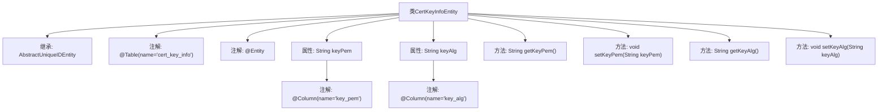

# 基础信息

|      |      |
|------|------|
| 名称 | CertKeyInfoEntity |
| 编码语言 | .java |
| 代码路径 | WeFe/gateway/src/main/java/com/welab/wefe/gateway/entity/CertKeyInfoEntity.java |
| 包名 | com.welab.wefe.gateway.entity |
| 依赖项 | ['com.welab.wefe.common.data.mysql.entity.AbstractUniqueIDEntity', 'javax.persistence.Column', 'javax.persistence.Entity', 'javax.persistence.Table'] |
| 概述说明 | CertKeyInfoEntity实体类，映射cert_key_info表，包含keyPem和keyAlg字段及其getter/setter方法。 |

# 说明

这是一个名为CertKeyInfoEntity的JPA实体类，映射到数据库表cert_key_info。它继承自AbstractUniqueIDEntity，包含两个字段：keyPem存储密钥的PEM格式字符串，keyAlg存储密钥算法名称。两个字段均有对应的getter和setter方法，并通过@Column注解与表的列名明确映射。

# 类列表 Class Summary

| 名称   | 类型  | 说明 |
|-------|------|-------------|
| CertKeyInfoEntity | class | CertKeyInfoEntity类映射cert_key_info表，包含keyPem和keyAlg字段及其getter/setter方法。 |


## 类 CertKeyInfoEntity

|      |      |
|------|------|
| 访问范围 | @Table(name = "cert_key_info");@Entity;public |
| 类型 | class |
| 名称 | CertKeyInfoEntity |
| 说明 | CertKeyInfoEntity类映射cert_key_info表，包含keyPem和keyAlg字段及其getter/setter方法。 |


### UML类图

```mermaid
classDiagram
    class AbstractUniqueIDEntity {
        <<Abstract>>
    }
    
    class CertKeyInfoEntity {
        -String keyPem
        -String keyAlg
        +String getKeyPem()
        +void setKeyPem(String keyPem)
        +String getKeyAlg()
        +void setKeyAlg(String keyAlg)
    }
    
    CertKeyInfoEntity --|> AbstractUniqueIDEntity : 继承
    CertKeyInfoEntity ..> "@Entity" : 标注
    CertKeyInfoEntity ..> "@Table" : 标注
```

这段代码展示了一个JPA实体类`CertKeyInfoEntity`，它继承自抽象基类`AbstractUniqueIDEntity`。该类用于存储证书密钥信息，包含两个私有字段`keyPem`(密钥PEM格式)和`keyAlg`(密钥算法)，以及对应的getter/setter方法。通过`@Entity`和`@Table`注解表明这是一个持久化实体，映射到数据库表"cert_key_info"。类图清晰地展示了继承关系和JPA注解的标注方式，体现了ORM框架中实体类的基本结构。


### 内部方法调用关系图



这段代码定义了一个名为CertKeyInfoEntity的JPA实体类，继承自AbstractUniqueIDEntity。该类映射到数据库表cert_key_info，包含两个字段：keyPem（存储PEM格式的密钥）和keyAlg（存储密钥算法），分别通过@Column注解映射到表的key_pem和key_alg列。类提供了标准的getter和setter方法用于属性访问和修改，体现了JPA实体类的基本结构和数据持久化特性。

### 字段列表 Field List

| 名称  | 类型  | 说明 |
|-------|-------|------|
| keyAlg | String | 数据库列名key_alg对应私有字符串变量keyAlg。 |
| keyPem | String | 数据库列名key_pem对应私有字符串变量keyPem。 |

### 方法列表

| 名称  | 类型  | 说明 |
|-------|-------|------|
| setKeyPem | void | 设置密钥PEM字符串。 |
| getKeyPem | String | 获取keyPem字符串的方法。 |
| getKeyAlg | String | 获取密钥算法的字符串方法，返回keyAlg变量值。 |
| setKeyAlg | void | 定义方法setKeyAlg，用于设置keyAlg属性值。 |


