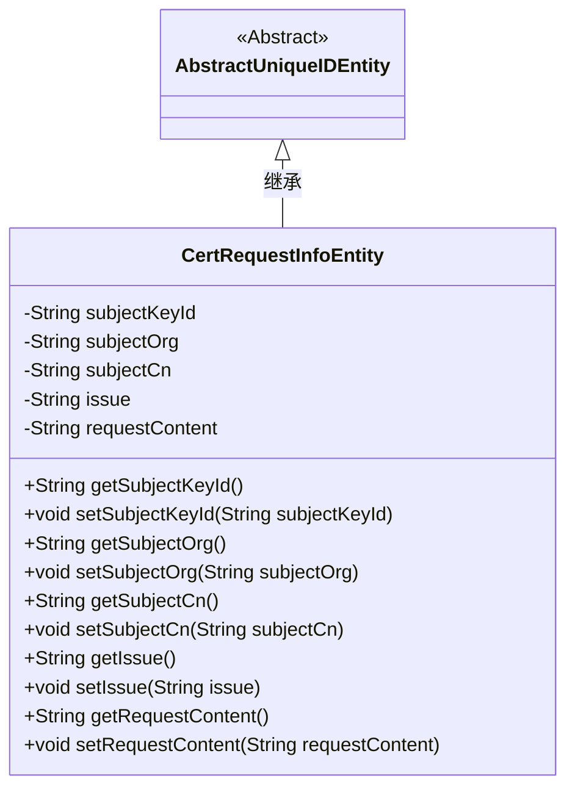

# 基础信息

|      |      |
|------|------|
| 名称 | CertRequestInfoEntity |
| 编码语言 | .java |
| 代码路径 | WeFe/gateway/src/main/java/com/welab/wefe/gateway/entity/CertRequestInfoEntity.java |
| 包名 | com.welab.wefe.gateway.entity |
| 依赖项 | ['com.welab.wefe.common.data.mysql.entity.AbstractUniqueIDEntity', 'javax.persistence.Column', 'javax.persistence.Entity', 'javax.persistence.Table'] |
| 概述说明 | 这是一个名为CertRequestInfoEntity的JPA实体类，映射数据库表cert_request_info，包含subjectKeyId、subjectOrg、subjectCn、issue和requestContent字段及其getter/setter方法。 |

# 说明

该内容描述了一个名为CertRequestInfoEntity的Java实体类，映射到数据库表cert_request_info。该类继承自AbstractUniqueIDEntity，包含五个字段：subjectKeyId（主题密钥ID）、subjectOrg（主题组织）、subjectCn（主题通用名称）、issue（颁发者）和requestContent（证书请求内容）。每个字段都有对应的getter和setter方法，用于访问和修改字段值。这些字段通过@Column注解与数据库表的列进行映射。

# 类列表 Class Summary

| 名称   | 类型  | 说明 |
|-------|------|-------------|
| CertRequestInfoEntity | class | 这是一个JPA实体类CertRequestInfoEntity，映射数据库表cert_request_info，包含主题密钥ID、组织、通用名、签发信息和证书请求内容等字段及其getter/setter方法。 |

## 类 CertRequestInfoEntity

|      |      |
|------|------|
| 访问范围 | @Table(name = "cert_request_info");@Entity;public |
| 类型 | class |
| 名称 | CertRequestInfoEntity |
| 说明 | 这是一个JPA实体类CertRequestInfoEntity，映射数据库表cert_request_info，包含主题密钥ID、组织、通用名、签发信息和证书请求内容等字段及其getter/setter方法。 |

### UML类图

类图描述：CertRequestInfoEntity类继承自AbstractUniqueIDEntity抽象类，表示证书请求信息实体。包含subjectKeyId、subjectOrg等私有字段及对应的getter/setter方法，用于存储和操作证书请求相关数据。通过@Entity和@Table注解表明这是一个JPA实体类，映射到数据库中的cert_request_info表。

### 内部方法调用关系图

```mermaid
graph TD
    A["类CertRequestInfoEntity"]
    B["继承: AbstractUniqueIDEntity"]
    C["注解: @Table(name='cert_request_info')"]
    D["注解: @Entity"]
    E["属性: String subjectKeyId"]
    F["注解: @Column(name='subject_key_id')"]
    G["属性: String subjectOrg"]
    H["注解: @Column(name='subject_org')"]
    I["属性: String subjectCn"]
    J["注解: @Column(name='subject_cn')"]
    K["属性: String issue"]
    L["注解: @Column(name='issue')"]
    M["属性: String requestContent"]
    N["注解: @Column(name='cert_request_content')"]
    O["方法: getSubjectKeyId()"]
    P["方法: setSubjectKeyId(String)"]
    Q["方法: getSubjectOrg()"]
    R["方法: setSubjectOrg(String)"]
    S["方法: getSubjectCn()"]
    T["方法: setSubjectCn(String)"]
    U["方法: getIssue()"]
    V["方法: setIssue(String)"]
    W["方法: getRequestContent()"]
    X["方法: setRequestContent(String)"]

    A --> B
    A --> C
    A --> D
    A --> E
    E --> F
    A --> G
    G --> H
    A --> I
    I --> J
    A --> K
    K --> L
    A --> M
    M --> N
    A --> O
    A --> P
    A --> Q
    A --> R
    A --> S
    A --> T
    A --> U
    A --> V
    A --> W
    A --> X
```

这段代码定义了一个名为CertRequestInfoEntity的JPA实体类，继承自AbstractUniqueIDEntity。该类映射到数据库表cert_request_info，包含5个字段：subjectKeyId、subjectOrg、subjectCn、issue和requestContent，每个字段都有对应的@Column注解指定数据库列名。类中为每个属性提供了getter和setter方法，用于访问和修改这些字段的值。这是一个典型的JPA实体类实现，用于表示证书请求信息。

### 字段列表 Field List

| 名称  | 类型  | 说明 |
|-------|-------|------|
| subjectOrg | String | 数据库字段subject_org映射到私有字符串变量subjectOrg。 |
| subjectKeyId | String | 数据库字段映射：subjectKeyId对应表列subject_key_id，类型为字符串。 |
| subjectCn | String | 数据库表字段映射：subjectCn对应列名subject_cn，类型为字符串。 |
| issue | String | 数据库表字段映射：issue对应私有字符串变量issue。 |
| requestContent | String | 数据库字段映射：cert_request_content对应requestContent字符串。 |

### 方法列表

| 名称  | 类型  | 说明 |
|-------|-------|------|
| setSubjectKeyId | void | 方法setSubjectKeyId用于设置subjectKeyId字段的值，参数为字符串类型。 |
| getSubjectCn | String | 获取中文主题的方法，返回subjectCn变量值。 |
| getSubjectOrg | String | 获取subjectOrg字符串的方法。 |
| setIssue | void | 这是一个Java方法，用于设置类中的issue属性值。方法接收一个字符串参数issue，并将其赋值给类的成员变量this.issue。 |
| getSubjectKeyId | String | 获取subjectKeyId的字符串值方法。 |
| setSubjectOrg | void | 这是一个Java方法，用于设置对象中的subjectOrg属性值。方法接收一个字符串参数subjectOrg，并将其赋值给当前对象的同名属性。 |
| setSubjectCn | void | 这是一个Java方法，用于设置中文主题名称。方法名为setSubjectCn，接受一个字符串参数subjectCn，并将其赋值给类的成员变量subjectCn。 |
| getIssue | String | 获取issue值的公共方法。 |
| getRequestContent | String | 方法返回请求内容字符串。 |
| setRequestContent | void | 这是一个Java方法，用于设置类的requestContent属性值。方法接收一个字符串参数，并将其赋值给类的成员变量requestContent。 |

