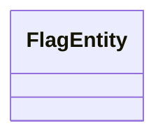
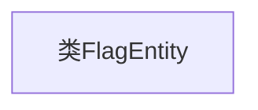

# 基础信息

|      |      |
|------|------|
| 名称 | FlagEntity |
| 编码语言 | .java |
| 代码路径 | WeFe/gateway/src/main/java/com/welab/wefe/gateway/entity/FlagEntity.java |
| 包名 | com.welab.wefe.gateway.entity |
| 依赖项 | [] |
| 概述说明 | 类FlagEntity定义了一个空实体类。 |

# 说明

FlagEntity是一个空的公共类，目前未定义任何属性或方法。它作为基础类结构存在，可能用于后续扩展或作为其他类的父类。该类的设计意图尚不明确，需结合上下文进一步分析其用途。

# 类列表 Class Summary

| 名称   | 类型  | 说明 |
|-------|------|-------------|
| FlagEntity | class | FlagEntity是一个空的公共类。 |

## 类 FlagEntity

|      |      |
|------|------|
| 访问范围 | public |
| 类型 | class |
| 名称 | FlagEntity |
| 说明 | FlagEntity是一个空的公共类。 |

### UML类图

这段类图描述了一个名为FlagEntity的空类，该类目前没有定义任何属性或方法。FlagEntity可能作为基础实体类存在，后续可通过继承或组合扩展功能。这种简单结构常见于DDD设计中的标记接口或未来扩展预留的基类。当前类图仅展示类名，表明这是一个待实现的简单实体结构。

### 内部方法调用关系图

这段流程图描述了一个名为FlagEntity的空类结构。图中仅包含一个节点表示类名，没有属性、方法或构造方法的定义。该图清晰地展示了这个类目前是一个没有任何成员的空壳结构，可以作为后续扩展的基础框架。由于类体为空，流程图仅需展示类名这一基本信息，符合代码当前的最小化实现状态。

### 字段列表 Field List

| 名称  | 类型  | 说明 |
|-------|-------|------|

### 方法列表

| 名称  | 类型  | 说明 |
|-------|-------|------|

