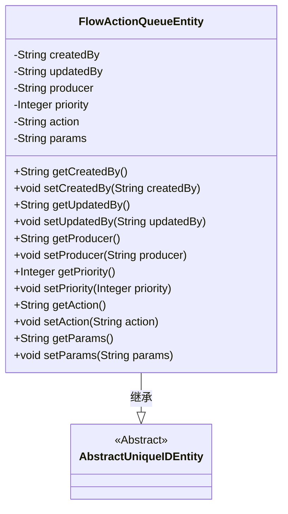

# 基础信息

|      |      |
|------|------|
| 名称 | FlowActionQueueEntity |
| 编码语言 | .java |
| 代码路径 | WeFe/gateway/src/main/java/com/welab/wefe/gateway/entity/FlowActionQueueEntity.java |
| 包名 | com.welab.wefe.gateway.entity |
| 依赖项 | ['com.welab.wefe.common.data.mysql.entity.AbstractUniqueIDEntity', 'javax.persistence.Column', 'javax.persistence.Entity', 'javax.persistence.Table'] |
| 概述说明 | FlowActionQueueEntity实体类，包含创建者、更新者、生产者、优先级、动作和参数字段，用于流程动作队列管理。 |

# 说明

该代码定义了一个名为FlowActionQueueEntity的JPA实体类，映射到数据库表flow_action_queue。它继承自AbstractUniqueIDEntity，包含创建者、更新者、消息生产者、优先级、动作类型和动作参数等字段。各字段均有对应的getter和setter方法，用于数据访问和修改。优先级默认为0，数值越高表示优先级越高。

# 类列表 Class Summary

| 名称   | 类型  | 说明 |
|-------|------|-------------|
| FlowActionQueueEntity | class | FlowActionQueueEntity是JPA实体类，包含创建者、更新者、生产者、优先级、动作和参数等字段，用于管理流程动作队列。 |

## 类 FlowActionQueueEntity

|      |      |
|------|------|
| 访问范围 | @Table(name = "flow_action_queue");@Entity;public |
| 类型 | class |
| 名称 | FlowActionQueueEntity |
| 说明 | FlowActionQueueEntity是JPA实体类，包含创建者、更新者、生产者、优先级、动作和参数等字段，用于管理流程动作队列。 |

### UML类图

这段代码定义了一个名为FlowActionQueueEntity的JPA实体类，继承自AbstractUniqueIDEntity抽象类。该类用于表示流程动作队列，包含创建者、更新者、生产者、优先级、动作类型和参数等字段，所有字段都有对应的getter和setter方法。通过@Entity和@Table注解表明这是一个数据库实体，@Column注解用于映射数据库字段。该类主要用于持久化流程动作相关的数据，优先级字段默认为0，表示高优先级的动作会被优先消费。

### 内部方法调用关系图

```mermaid
graph TD
    A["类FlowActionQueueEntity"]
    B["继承: AbstractUniqueIDEntity"]
    C["属性: String createdBy"]
    D["属性: String updatedBy"]
    E["属性: String producer"]
    F["属性: Integer priority"]
    G["属性: String action"]
    H["属性: String params"]
    I["方法: getCreatedBy/setCreatedBy"]
    J["方法: getUpdatedBy/setUpdatedBy"]
    K["方法: getProducer/setProducer"]
    L["方法: getPriority/setPriority"]
    M["方法: getAction/setAction"]
    N["方法: getParams/setParams"]

    A --> B
    A --> C
    A --> D
    A --> E
    A --> F
    A --> G
    A --> H
    A --> I
    A --> J
    A --> K
    A --> L
    A --> M
    A --> N
```

这段代码定义了一个名为FlowActionQueueEntity的JPA实体类，继承自AbstractUniqueIDEntity。该类包含7个主要属性（createdBy、updatedBy、producer、priority、action、params）及其对应的getter/setter方法，用于表示流程动作队列的数据结构。每个属性都通过@Column注解映射到数据库表的对应字段，其中priority字段表示消费优先级，action表示动作类型，params存储动作参数。

### 字段列表 Field List

| 名称  | 类型  | 说明 |
|-------|-------|------|
| producer | String | 数据库字段映射：producer列对应String类型producer变量。 |
| createdBy | String | 数据库字段映射：createdBy对应列名created_by，类型为String。 |
| priority | Integer | 数据库字段映射，名为priority，类型为Integer。 |
| updatedBy | String | 数据库字段updatedBy映射到列名updated_by，类型为字符串。 |
| params | String | 数据库字段映射，params对应表列params，类型为String。 |
| action | String | 数据库字段映射：action列对应字符串类型变量action。 |

### 方法列表

| 名称  | 类型  | 说明 |
|-------|-------|------|
| getCreatedBy | String | 获取创建者信息的方法，返回字符串类型变量createdBy。 |
| getProducer | String | 获取生产者名称的方法。 |
| getUpdatedBy | String | 这是一个Java方法，返回字符串类型的updatedBy变量值。 |
| setProducer | void | Java方法：设置生产者名称，参数为字符串producer，赋值给类成员变量this.producer。 |
| setCreatedBy | void | 这是一个Java方法，用于设置对象的创建者属性。方法接受一个字符串参数createdBy，并将其赋值给类的成员变量this.createdBy。 |
| getPriority | Integer | 获取优先级数值的方法，返回整数类型的优先级值。 |
| setPriority | void | 设置对象优先级的方法，参数为整型priority，直接赋值给成员变量priority。 |
| setUpdatedBy | void | 方法setUpdatedBy用于设置updatedBy字段的值。 |
| getAction | String | 方法返回字符串类型的action变量值。 |
| setAction | void | 设置action属性的方法，将传入的字符串赋值给类的action成员变量。 |
| getParams | String | 该方法返回字符串类型的params变量值。 |
| setParams | void | 设置字符串参数的方法，将输入参数赋值给类成员变量params。 |

