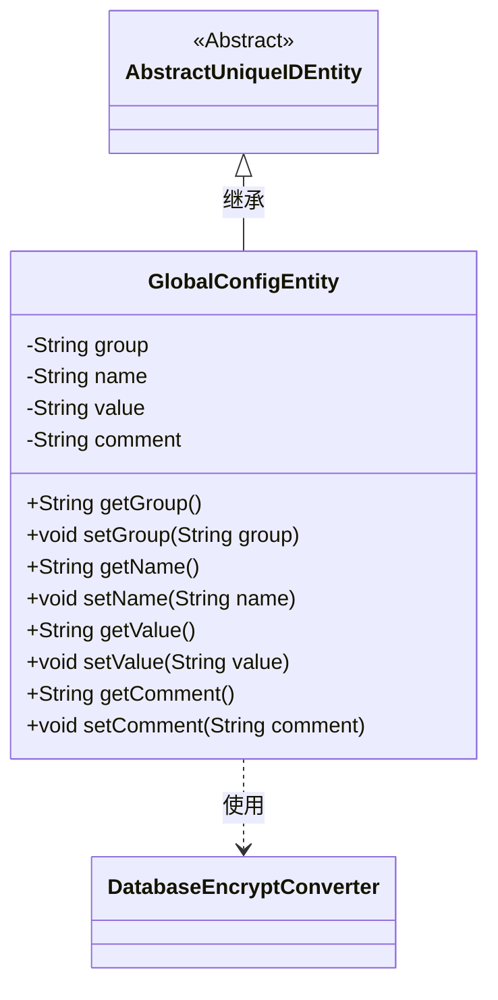
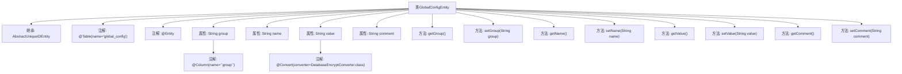

# 基础信息

|      |      |
|------|------|
| 名称 | GlobalConfigEntity |
| 编码语言 | .java |
| 代码路径 | WeFe/gateway/src/main/java/com/welab/wefe/gateway/entity/GlobalConfigEntity.java |
| 包名 | com.welab.wefe.gateway.entity |
| 依赖项 | ['com.welab.wefe.common.data.mysql.entity.AbstractUniqueIDEntity', 'com.welab.wefe.gateway.util.DatabaseEncryptConverter', 'javax.persistence.Column', 'javax.persistence.Convert', 'javax.persistence.Entity', 'javax.persistence.Table'] |
| 概述说明 | GlobalConfigEntity类表示全局配置项，包含组名、配置名、加密值和说明，继承自AbstractUniqueIDEntity。 |

# 说明

这是一个名为GlobalConfigEntity的JPA实体类，映射到数据库表global_config。它继承自AbstractUniqueIDEntity，包含四个字段：group表示配置项所属分组，name表示配置项名称，value存储配置值并使用DatabaseEncryptConverter进行加密转换，comment是配置项说明。每个字段都有对应的getter和setter方法。

# 类列表 Class Summary

| 名称   | 类型  | 说明 |
|-------|------|-------------|
| GlobalConfigEntity | class | GlobalConfigEntity类表示全局配置项，包含组名、配置名、加密值和说明字段，提供getter/setter方法。 |

## 类 GlobalConfigEntity

|      |      |
|------|------|
| 访问范围 | @Table(name = "global_config");@Entity;public |
| 类型 | class |
| 名称 | GlobalConfigEntity |
| 说明 | GlobalConfigEntity类表示全局配置项，包含组名、配置名、加密值和说明字段，提供getter/setter方法。 |

### UML类图

这段代码定义了一个名为`GlobalConfigEntity`的JPA实体类，继承自抽象基类`AbstractUniqueIDEntity`。该类用于存储全局配置项，包含四个核心字段：配置组(group)、配置名(name)、加密存储的值(value)和说明(comment)。通过`@Convert`注解实现了值字段的数据库加密转换，依赖`DatabaseEncryptConverter`转换器。所有字段均提供标准的getter/setter方法，符合JavaBean规范，整体结构体现了ORM框架中典型的数据实体设计模式。

### 内部方法调用关系图

这段代码定义了一个名为GlobalConfigEntity的JPA实体类，继承自AbstractUniqueIDEntity。该类映射到数据库表"global_config"，包含四个主要属性：group（带特殊列名注解）、name、value（使用数据库加密转换器）和comment。每个属性都有对应的getter和setter方法。流程图清晰地展示了类继承关系、属性注解配置和方法结构，特别突出了value字段的加密转换特性，体现了该实体类用于存储需要加密的全局配置项的设计意图。

### 字段列表 Field List

| 名称  | 类型  | 说明 |
|-------|-------|------|
| group | String | 数据库字段映射：group对应表列group，类型为字符串。 |
| value | String | 字段value使用DatabaseEncryptConverter类进行加密转换。 |
| name | String | 私有字符串变量name。 |
| comment | String | 私有字符串类型变量comment。 |

### 方法列表

| 名称  | 类型  | 说明 |
|-------|-------|------|
| setComment | void | 这是一个Java方法，用于设置对象的comment属性值。方法接收一个字符串参数comment，并将其赋值给当前对象的comment字段。 |
| setName | void | 设置对象名称的方法，将输入参数name赋值给对象的name属性。 |
| getGroup | String | 获取group字符串的方法。 |
| getValue | String | 这是一个Java方法，返回字符串类型的成员变量value的值。 |
| getName | String | 获取名称的方法，返回字符串类型的name变量值。 |
| setGroup | void | 设置对象的分组属性。 |
| setValue | void | 这是一个Java方法，用于设置类成员变量value的值。方法接受一个字符串参数value，并将其赋值给当前对象的value属性。 |
| getComment | String | 获取comment字符串的方法。 |

