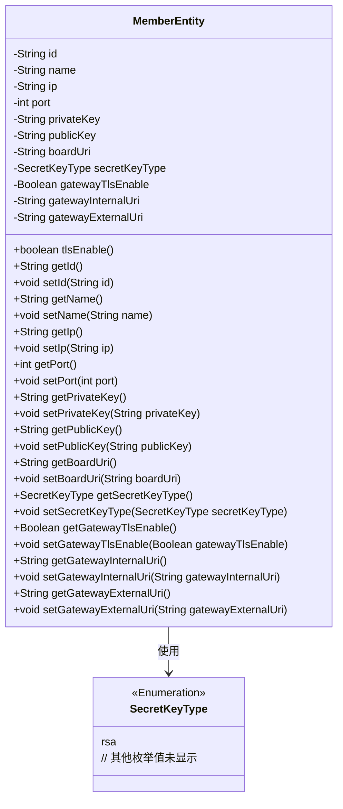

# 基础信息

|      |      |
|------|------|
| 名称 | MemberEntity |
| 编码语言 | .java |
| 代码路径 | WeFe/gateway/src/main/java/com/welab/wefe/gateway/entity/MemberEntity.java |
| 包名 | com.welab.wefe.gateway.entity |
| 依赖项 | ['com.welab.wefe.common.constant.SecretKeyType', 'java.io.Serializable'] |
| 概述说明 | MemberEntity类包含成员ID、名称、IP、端口、公私钥、密钥类型、网关内外网地址及TLS启用状态等属性。 |

# 说明

MemberEntity类是一个可序列化的Java类，用于表示成员信息。包含成员ID、名称、IP地址、端口、私钥、公钥、面板服务基础地址等属性。密钥类型默认为rsa，网关TLS功能默认关闭。提供网关内外网地址字段及对应的getter/setter方法。包含一个检查TLS是否启用的方法tlsEnable。所有属性均支持读写操作，结构完整覆盖成员基础信息与网络配置需求。

# 类列表 Class Summary

| 名称   | 类型  | 说明 |
|-------|------|-------------|
| MemberEntity | class | MemberEntity类包含成员ID、名称、IP、端口、公私钥、板服务地址、密钥类型、网关TLS开关及内外网地址等属性。 |

## 类 MemberEntity

|      |      |
|------|------|
| 访问范围 | public |
| 类型 | class |
| 名称 | MemberEntity |
| 说明 | MemberEntity类包含成员ID、名称、IP、端口、公私钥、板服务地址、密钥类型、网关TLS开关及内外网地址等属性。 |

### UML类图

这段代码定义了一个`MemberEntity`类，实现了`Serializable`接口，用于表示成员实体信息。该类包含成员ID、名称、IP地址、端口、公私钥、看板服务地址等属性，以及TLS相关配置和网关地址信息。其中`secretKeyType`字段使用了`SecretKeyType`枚举类型（简化为只显示rsa值）。类提供了所有属性的getter/setter方法，以及一个检查TLS是否启用的`tlsEnable()`方法。这是一个典型的数据传输对象(DTO)设计，用于在网络通信中序列化传输成员信息。

### 内部方法调用关系图

这段代码定义了一个名为MemberEntity的类，实现了Serializable接口，主要用于表示成员实体信息。类中包含多个私有属性，如id、name、ip、port等，以及对应的getter和setter方法。此外，还有一个tlsEnable()方法用于检查网关TLS是否启用。该类可能用于分布式系统中成员信息的存储和传输，通过序列化实现网络传输或持久化存储。

### 字段列表 Field List

| 名称  | 类型  | 说明 |
|-------|-------|------|
| name | String | 私有字符串变量name |
| publicKey | String | 私有字符串变量publicKey，用于存储公钥。 |
| id | String | 私有字符串类型变量id |
| gatewayExternalUri | String | 外部网关URI字符串变量 |
| gatewayTlsEnable = false | Boolean | 私有布尔变量gatewayTlsEnable默认设为false，表示网关TLS功能默认禁用。 |
| gatewayInternalUri | String | 私有字符串变量gatewayInternalUri，用于存储网关内部URI。 |
| privateKey | String | 私有字符串变量privateKey，用于存储私钥。 |
| secretKeyType = SecretKeyType.rsa | SecretKeyType | 密钥类型设置为RSA。 |
| port | int | 私有整型变量port，用于存储端口号。 |
| ip | String | 声明一个私有字符串变量ip。 |
| boardUri | String | 私有字符串变量boardUri |

### 方法列表

| 名称  | 类型  | 说明 |
|-------|-------|------|
| getBoardUri | String | 方法getBoardUri返回字符串类型的boardUri值。 |
| getId | String | 获取对象ID的方法，返回字符串类型的id值。 |
| setPrivateKey | void | 设置私有密钥的方法，将输入字符串赋值给类的私有密钥变量。 |
| getPort | int | 方法返回端口号。 |
| getIp | String | 获取IP地址的方法，返回字符串类型的ip变量。 |
| getSecretKeyType | SecretKeyType | 获取密钥类型的方法，返回secretKeyType。 |
| setPort | void | 这是一个Java方法，用于设置端口号，将传入的port参数赋值给类的成员变量port。 |
| getName | String | 这是一个Java方法，返回字符串类型的name变量值。 |
| getPublicKey | String | 获取公钥的方法，返回publicKey字符串。 |
| getPrivateKey | String | 获取私钥的方法，返回privateKey变量值。 |
| setId | void | 设置对象ID的方法，将参数id赋值给当前对象的id属性。 |
| setBoardUri | void | 设置boardUri的方法，将参数boardUri赋值给当前对象的boardUri属性。 |
| tlsEnable | boolean | 方法tlsEnable检查gatewayTlsEnable是否为TRUE，返回布尔值。 |
| setIp | void | 设置IP地址的方法，将参数ip赋值给类的成员变量ip。 |
| setGatewayTlsEnable | void | 设置网关TLS启用状态的公共方法，参数为布尔值gatewayTlsEnable。 |
| getGatewayInternalUri | String | 获取内部网关URI的公共方法，返回字符串类型变量gatewayInternalUri。 |
| setGatewayInternalUri | void | 设置网关内部URI的方法，将参数值赋给类成员变量gatewayInternalUri。 |
| getGatewayExternalUri | String | 获取网关外部URI的方法，返回gatewayExternalUri字符串。 |
| setGatewayExternalUri | void | 设置网关外部URI的方法，将输入参数赋值给类成员变量gatewayExternalUri。 |
| getGatewayTlsEnable | Boolean | 获取网关TLS启用状态的布尔值方法。 |
| setName | void | 设置对象名称的方法，将参数name赋值给对象的name属性。 |
| setPublicKey | void | 设置公钥的方法，将输入字符串赋值给类的publicKey成员变量。 |
| setSecretKeyType | void | 设置密钥类型的方法，将参数secretKeyType赋值给类的同名属性。 |

