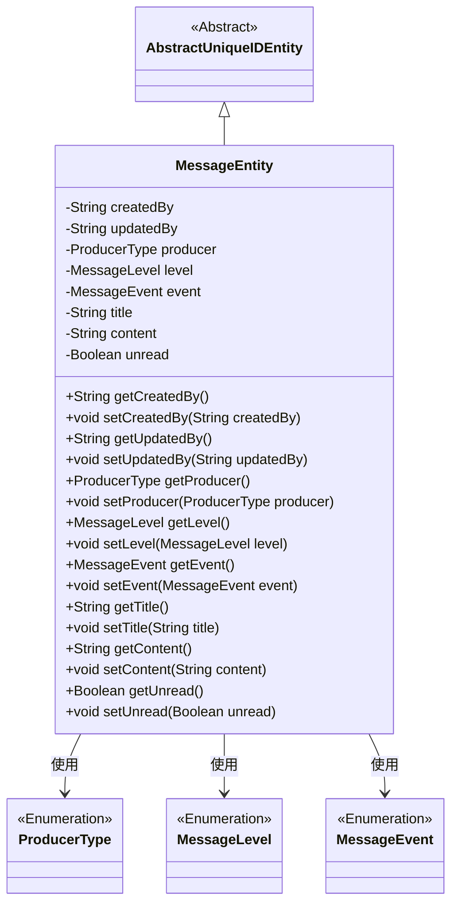
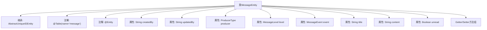

# 基础信息

|      |      |
|------|------|
| 名称 | MessageEntity |
| 编码语言 | .java |
| 代码路径 | WeFe/gateway/src/main/java/com/welab/wefe/gateway/entity/MessageEntity.java |
| 包名 | com.welab.wefe.gateway.entity |
| 依赖项 | ['com.welab.wefe.common.data.mysql.entity.AbstractUniqueIDEntity', 'com.welab.wefe.common.wefe.enums.MessageEvent', 'com.welab.wefe.common.wefe.enums.MessageLevel', 'com.welab.wefe.common.wefe.enums.ProducerType', 'javax.persistence'] |
| 概述说明 | 消息实体类，包含创建者、更新者、生产者类型、消息级别、关联事件、标题、内容及未读状态等字段。 |

# 说明

这是一个名为MessageEntity的JPA实体类，映射到数据库表message。它继承自AbstractUniqueIDEntity，包含创建者、更新者、消息生产者类型、消息级别、关联事件、标题、内容和未读状态等字段。所有枚举类型使用字符串存储，字段均有对应的getter和setter方法。

# 类列表 Class Summary

| 名称   | 类型  | 说明 |
|-------|------|-------------|
| MessageEntity | class | 消息实体类，包含创建者、更新者、生产者类型、消息级别、事件、标题、内容及未读状态等字段，继承自抽象唯一ID实体类。 |

## 类 MessageEntity

|      |      |
|------|------|
| 访问范围 | @Table(name = "message");@Entity;public |
| 类型 | class |
| 名称 | MessageEntity |
| 说明 | 消息实体类，包含创建者、更新者、生产者类型、消息级别、事件、标题、内容及未读状态等字段，继承自抽象唯一ID实体类。 |

### UML类图

这段代码定义了一个消息实体类MessageEntity，继承自抽象基类AbstractUniqueIDEntity，包含创建者、更新者、消息生产者类型、消息级别、关联事件、标题、内容和未读状态等属性。该类通过JPA注解映射到数据库表"message"，并使用枚举类型ProducerType、MessageLevel和MessageEvent来限定特定字段的取值范围。所有字段都提供了标准的getter和setter方法，实现了对实体属性的封装和访问控制。

### 内部方法调用关系图

该流程图展示了MessageEntity类的完整结构，包括其继承关系、类注解、所有属性和方法组。作为JPA实体类，它通过@Table和@Entity注解实现ORM映射，包含8个核心属性（含3个枚举类型字段）和对应的Getter/Setter方法。所有属性均通过@Column或@Enumerated注解进行数据库字段配置，其中producer/level/event三个枚举字段采用字符串存储策略。

### 字段列表 Field List

| 名称  | 类型  | 说明 |
|-------|-------|------|
| createdBy | String | 数据库字段映射：createdBy对应表列created_by，类型为String。 |
| unread | Boolean | 数据库字段映射：unread（布尔类型，表示未读状态） |
| content | String | 数据库字段映射：content对应String类型的content属性。 |
| title | String | 数据库字段映射：title列对应String类型的title变量。 |
| event | MessageEvent | 枚举类型字段event，使用字符串形式存储。 |
| level | MessageLevel | 实体类字段level，使用枚举类型MessageLevel，数据库列名为level，存储枚举字符串值。 |
| producer | ProducerType | 数据库字段producer存储枚举类型ProducerType，使用字符串形式。 |
| updatedBy | String | 数据库字段updatedBy映射为updated_by，类型为String。 |

### 方法列表

| 名称  | 类型  | 说明 |
|-------|-------|------|
| getProducer | ProducerType | 获取生产者类型的方法，返回producer对象。 |
| setLevel | void | 设置消息等级的方法，将输入参数level赋值给当前对象的level属性。 |
| getTitle | String | 获取标题方法，返回字符串类型的title变量值。 |
| getUpdatedBy | String | 这是一个Java方法，返回字符串类型的updatedBy变量值。 |
| getCreatedBy | String | 获取创建者信息的方法，返回字符串类型变量createdBy。 |
| setTitle | void | 这是一个Java方法，用于设置对象的标题属性。方法接受一个字符串参数title，并将其赋值给当前对象的title成员变量。 |
| getContent | String | 获取内容字符串的方法。 |
| setContent | void | 设置内容属性的方法，将输入参数赋值给类的content成员变量。 |
| getUnread | Boolean | 方法返回布尔值unread，表示未读状态。 |
| setUnread | void | 设置未读状态的方法，参数为布尔值unread，用于更新当前对象的unread属性。 |
| setUpdatedBy | void | 设置更新者字段的方法，参数为字符串updatedBy。 |
| setProducer | void | 设置生产者对象的方法，将传入的producer参数赋值给当前对象的producer属性。 |
| getLevel | MessageLevel | 获取消息级别的方法，返回level属性值。 |
| setEvent | void | 设置事件方法，将传入的MessageEvent赋值给当前对象的event属性。 |
| setCreatedBy | void | 这是一个Java方法，用于设置对象的创建者属性。方法接受一个字符串参数createdBy，并将其赋值给类的成员变量this.createdBy。 |
| getEvent | MessageEvent | 获取事件对象的方法，返回MessageEvent类型实例。 |

