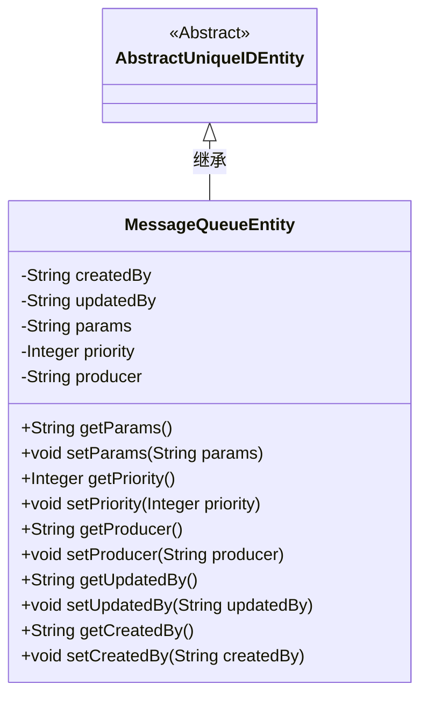

# 基础信息

|      |      |
|------|------|
| 名称 | MessageQueueEntity |
| 编码语言 | .java |
| 代码路径 | WeFe/gateway/src/main/java/com/welab/wefe/gateway/entity/MessageQueueEntity.java |
| 包名 | com.welab.wefe.gateway.entity |
| 依赖项 | ['com.welab.wefe.common.data.mysql.entity.AbstractUniqueIDEntity', 'javax.persistence.Column', 'javax.persistence.Entity', 'javax.persistence.Table'] |
| 概述说明 | 消息队列实体类，包含创建者、更新者、参数、优先级和生产者字段，提供各字段的getter和setter方法。 |

# 说明

这是一个名为MessageQueueEntity的JPA实体类，映射到数据库表message_queue。它继承自AbstractUniqueIDEntity，包含五个字段：createdBy记录创建者，updatedBy记录更新者，params存储参数，priority表示优先级，producer标识生产者。每个字段都有对应的getter和setter方法用于访问和修改属性值。该实体类主要用于消息队列的数据持久化存储。

# 类列表 Class Summary

| 名称   | 类型  | 说明 |
|-------|------|-------------|
| MessageQueueEntity | class | 消息队列实体类，包含创建者、更新者、参数、优先级和生产者字段，提供各属性的getter和setter方法。 |

## 类 MessageQueueEntity

|      |      |
|------|------|
| 访问范围 | @Table(name = "message_queue");@Entity;public |
| 类型 | class |
| 名称 | MessageQueueEntity |
| 说明 | 消息队列实体类，包含创建者、更新者、参数、优先级和生产者字段，提供各属性的getter和setter方法。 |

### UML类图

类图描述：
MessageQueueEntity类继承自AbstractUniqueIDEntity抽象类，是一个JPA实体类，映射到数据库中的message_queue表。包含5个私有字段：createdBy(创建者)、updatedBy(更新者)、params(参数)、priority(优先级)和producer(生产者)，每个字段都有对应的getter和setter方法。类通过@Entity注解标识为持久化实体，@Table和@Column注解用于定义数据库映射关系，体现了标准的JPA实体类设计模式。

### 内部方法调用关系图

```mermaid
graph TD
    A["类MessageQueueEntity"]
    B["继承: AbstractUniqueIDEntity"]
    C["注解: @Table(name='message_queue')"]
    D["注解: @Entity"]
    E["属性: String createdBy"]
    F["属性: String updatedBy"]
    G["属性: String params"]
    H["属性: Integer priority"]
    I["属性: String producer"]
    J["方法: getParams()"]
    K["方法: setParams(String params)"]
    L["方法: getPriority()"]
    M["方法: setPriority(Integer priority)"]
    N["方法: getProducer()"]
    O["方法: setProducer(String producer)"]
    P["方法: getUpdatedBy()"]
    Q["方法: setUpdatedBy(String updatedBy)"]
    R["方法: getCreatedBy()"]
    S["方法: setCreatedBy(String createdBy)"]

    A --> B
    A --> C
    A --> D
    A --> E
    A --> F
    A --> G
    A --> H
    A --> I
    A --> J
    A --> K
    A --> L
    A --> M
    A --> N
    A --> O
    A --> P
    A --> Q
    A --> R
    A --> S
```

这段代码定义了一个名为MessageQueueEntity的JPA实体类，继承自AbstractUniqueIDEntity，用于映射数据库中的message_queue表。类包含5个属性（createdBy、updatedBy、params、priority、producer）及其对应的getter和setter方法，每个属性都通过@Column注解与数据库表的列进行映射。该类还使用了@Entity和@Table注解来标识它是一个JPA实体并指定对应的数据库表名。

### 字段列表 Field List

| 名称  | 类型  | 说明 |
|-------|-------|------|
| priority | Integer | 数据库字段映射：priority对应私有整型变量priority。 |
| params | String | 数据库字段映射：params对应表列params，类型为String。 |
| updatedBy | String | 数据库字段映射：updatedBy对应表中的updated_by列，类型为字符串。 |
| createdBy | String | 数据库字段映射：createdBy对应表中的created_by列，类型为字符串。 |
| producer | String | 数据库表字段映射：producer列对应String类型的producer属性。 |

### 方法列表

| 名称  | 类型  | 说明 |
|-------|-------|------|
| setProducer | void | 设置生产者名称的方法。 |
| getProducer | String | 获取生产者名称的方法，返回字符串类型的生产者信息。 |
| setPriority | void | 设置优先级的方法，参数为整型priority，将其赋值给类的同名属性。 |
| setUpdatedBy | void | 设置更新者字段的方法，参数为updatedBy字符串。 |
| setParams | void | 这是一个Java方法，用于设置类成员变量params的值。方法接收一个字符串参数params，并将其赋值给当前对象的params属性。 |
| getCreatedBy | String | 获取创建者信息的字符串方法。 |
| getParams | String | 获取params参数的字符串值。 |
| getPriority | Integer | 获取优先级数值的方法，返回整数类型的优先级值。 |
| getUpdatedBy | String | 这是一个Java方法，返回字符串类型的updatedBy变量值。 |
| setCreatedBy | void | 这是一个Java方法，用于设置createdBy属性的值。方法接收一个字符串参数createdBy，并将其赋值给当前对象的同名属性。 |

