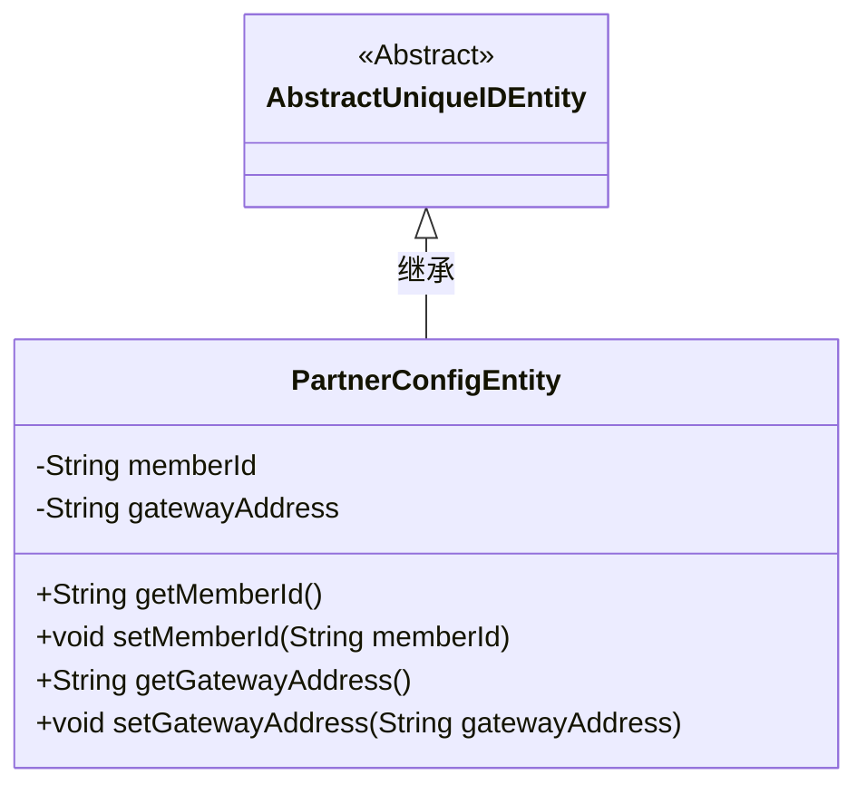
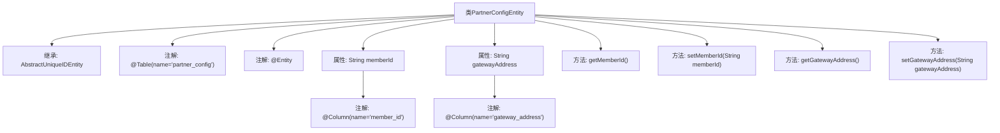

# 基础信息

|      |      |
|------|------|
| 名称 | PartnerConfigEntity |
| 编码语言 | .java |
| 代码路径 | WeFe/gateway/src/main/java/com/welab/wefe/gateway/entity/PartnerConfigEntity.java |
| 包名 | com.welab.wefe.gateway.entity |
| 依赖项 | ['com.welab.wefe.common.data.mysql.entity.AbstractUniqueIDEntity', 'javax.persistence.Column', 'javax.persistence.Entity', 'javax.persistence.Table'] |
| 概述说明 | PartnerConfigEntity类映射partner_config表，包含memberId和gatewayAddress字段及其getter/setter方法，继承自AbstractUniqueIDEntity。 |

# 说明

PartnerConfigEntity是一个JPA实体类，映射到数据库表partner_config。它继承自AbstractUniqueIDEntity，包含两个字段：memberId和gatewayAddress，分别对应表中的member_id和gateway_address列。该类提供了这两个字段的getter和setter方法，用于访问和修改字段值。

# 类列表 Class Summary

| 名称   | 类型  | 说明 |
|-------|------|-------------|
| PartnerConfigEntity | class | PartnerConfigEntity实体类，映射表partner_config，包含成员ID和网关地址字段，继承AbstractUniqueIDEntity。 |

## 类 PartnerConfigEntity

|      |      |
|------|------|
| 访问范围 | @Table(name = "partner_config");@Entity;public |
| 类型 | class |
| 名称 | PartnerConfigEntity |
| 说明 | PartnerConfigEntity实体类，映射表partner_config，包含成员ID和网关地址字段，继承AbstractUniqueIDEntity。 |

### UML类图

该代码定义了一个名为PartnerConfigEntity的实体类，继承自AbstractUniqueIDEntity抽象类。PartnerConfigEntity包含两个私有字段memberId和gatewayAddress，分别表示成员ID和网关地址，并提供了对应的getter和setter方法。该类使用了JPA注解@Entity和@Table，表明它是一个数据库实体，映射到名为"partner_config"的表。类图清晰地展示了继承关系和类成员结构。

### 内部方法调用关系图

这段代码定义了一个名为PartnerConfigEntity的JPA实体类，继承自AbstractUniqueIDEntity。类中包含两个主要属性：memberId和gatewayAddress，分别通过@Column注解映射到数据库表的列。类提供了标准的getter和setter方法用于属性访问和修改。该实体类通过@Entity和@Table注解标记为持久化对象，对应数据库中的partner_config表。

### 字段列表 Field List

| 名称  | 类型  | 说明 |
|-------|-------|------|
| gatewayAddress | String | 数据库字段映射：gatewayAddress对应表列gateway_address。 |
| memberId | String | 数据库表字段映射：成员ID，对应列名member_id，类型为字符串。 |

### 方法列表

| 名称  | 类型  | 说明 |
|-------|-------|------|
| getGatewayAddress | String | 获取网关地址的方法，返回gatewayAddress字符串。 |
| setMemberId | void | 设置成员ID的方法，将输入字符串赋值给成员变量memberId。 |
| getMemberId | String | 这是一个Java方法，返回成员ID字符串。 |
| setGatewayAddress | void | 设置网关地址的方法，将输入参数gatewayAddress赋值给类成员变量gatewayAddress。 |

