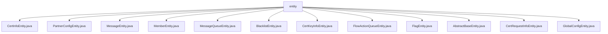

# 基础信息

|      |      |
|------|------|
| 名称 | entity |
| 编码语言 | .java |
| 代码路径 | WeFe/gateway/src/main/java/com/welab/wefe/gateway/entity |
| 包名 | docs.gateway.src.main.java.com.welab.wefe.gateway.entity |
| 概述说明 | CertInfoEntity存储证书内容、CSR ID和状态。PartnerConfigEntity记录成员ID和网关地址。MessageEntity管理消息生产者、级别、内容等。MemberEntity包含成员信息、网络配置和TLS状态。MessageQueueEntity处理消息队列数据。BlacklistEntity存储黑名单成员ID。CertKeyInfoEntity保存密钥PEM和算法。FlowActionQueueEntity管理动作队列。FlagEntity为空类。AbstractBaseEntity定义创建/更新信息。CertRequestInfoEntity存储证书请求详情。GlobalConfigEntity管理加密配置项。 |

# 说明

## 概述  
该模块为网关系统的数据持久化层，核心职责是管理成员信息、证书管理、消息队列和全局配置等实体数据。所有实体类均继承自AbstractUniqueIDEntity，采用JPA注解实现数据库表映射，类似ORM框架的标准实现模式。关键数据结构包括证书内容(CertInfoEntity)、密钥信息(CertKeyInfoEntity)、成员网络配置(MemberEntity)和加密的全局配置(GlobalConfigEntity)。外部依赖主要为JPA规范和数据库加密组件DatabaseEncryptConverter。例如CertKeyInfoEntity存储PEM格式密钥，GlobalConfigEntity使用加密转换器保护敏感配置。

## 主要业务场景  
模块支持多方协作场景下的证书签发流程，例如CertRequestInfoEntity记录CSR请求，CertInfoEntity存储签发结果。消息处理采用优先级队列机制，如MessageQueueEntity和FlowActionQueueEntity通过priority字段实现消息分级。成员管理场景覆盖TLS配置检查(MemberEntity.tlsEnable)和黑名单控制(BlacklistEntity)。全局配置采用分组加密存储，类似配置中心的实现模式。API类型集中为实体基础CRUD操作，集成案例包括证书链管理(CertInfoEntity与CertKeyInfoEntity关联)和跨节点消息路由(MessageEntity与MessageQueueEntity协作)。

### 包内部结构视图

该流程图展示了WeFe网关项目中entity目录下的所有实体类文件结构。根节点为entity文件夹，包含12个不同的实体类文件，这些文件都直接隶属于entity目录，没有更深层级的子目录结构。每个实体类文件都代表网关系统中的不同数据模型，如成员信息、证书信息、消息队列等核心业务实体。

# 文件列表

| 名称   | 类型  | 说明 |
|-------|------|-------------|
| [CertInfoEntity.java](CertInfoEntity.md) | file | CertInfoEntity类映射cert_info表，包含content、csrId、status字段及对应getter/setter方法。 |
| [PartnerConfigEntity.java](PartnerConfigEntity.md) | file | PartnerConfigEntity类映射partner_config表，包含memberId和gatewayAddress字段及其getter/setter方法，继承自AbstractUniqueIDEntity。 |
| [MessageEntity.java](MessageEntity.md) | file | 消息实体类，包含创建者、更新者、生产者类型、消息级别、关联事件、标题、内容及未读状态等字段。 |
| [MemberEntity.java](MemberEntity.md) | file | MemberEntity类包含成员ID、名称、IP、端口、公私钥、密钥类型、网关内外网地址及TLS启用状态等属性。 |
| [MessageQueueEntity.java](MessageQueueEntity.md) | file | 消息队列实体类，包含创建者、更新者、参数、优先级和生产者字段，提供各字段的getter和setter方法。 |
| [BlacklistEntity.java](BlacklistEntity.md) | file | 黑名单实体类，包含成员ID字段及getter/setter方法。 |
| [CertKeyInfoEntity.java](CertKeyInfoEntity.md) | file | CertKeyInfoEntity实体类，映射cert_key_info表，包含keyPem和keyAlg字段及其getter/setter方法。 |
| [FlowActionQueueEntity.java](FlowActionQueueEntity.md) | file | FlowActionQueueEntity实体类，包含创建者、更新者、生产者、优先级、动作和参数字段，用于流程动作队列管理。 |
| [FlagEntity.java](FlagEntity.md) | file | 类FlagEntity定义了一个空实体类。 |
| [AbstractBaseEntity.java](AbstractBaseEntity.md) | file | 抽象类AbstractBaseEntity继承AbstractUniqueIDEntity，包含创建/更新用户和时间字段及其getter/setter方法。 |
| [CertRequestInfoEntity.java](CertRequestInfoEntity.md) | file | 这是一个名为CertRequestInfoEntity的JPA实体类，映射数据库表cert_request_info，包含subjectKeyId、subjectOrg、subjectCn、issue和requestContent字段及其getter/setter方法。 |
| [GlobalConfigEntity.java](GlobalConfigEntity.md) | file | GlobalConfigEntity类表示全局配置项，包含组名、配置名、加密值和说明，继承自AbstractUniqueIDEntity。 |

