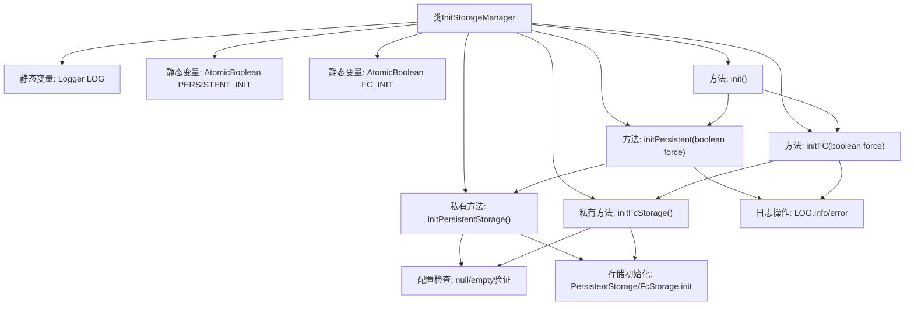

# 基础信息

|      |      |
|------|------|
| 名称 | InitStorageManager |
| 编码语言 | .java |
| 代码路径 | WeFe/gateway/src/main/java/com/welab/wefe/gateway/init/InitStorageManager.java |
| 包名 | com.welab.wefe.gateway.init |
| 依赖项 | ['com.welab.wefe.common.data.storage.service.fc.FcStorage', 'com.welab.wefe.common.data.storage.service.fc.aliyun.AliyunOssConfig', 'com.welab.wefe.common.data.storage.service.fc.tencent.TencentCosConfig', 'com.welab.wefe.common.data.storage.service.persistent.PersistentStorage', 'com.welab.wefe.common.util.StringUtil', 'com.welab.wefe.common.wefe.dto.global_config.calculation_engine.fc.AliyunFunctionComputeConfigModel', 'com.welab.wefe.common.wefe.dto.global_config.calculation_engine.fc.FunctionComputeBaseConfigModel', 'com.welab.wefe.common.wefe.dto.global_config.calculation_engine.fc.TencentServerlessCloudFunctionConfigModel', 'com.welab.wefe.common.wefe.dto.global_config.storage.ClickHouseStorageConfigModel', 'com.welab.wefe.common.wefe.dto.storage.ClickhouseConfig', 'com.welab.wefe.common.wefe.enums.FcCloudProvider', 'com.welab.wefe.gateway.GatewayServer', 'com.welab.wefe.gateway.service.GlobalConfigService', 'org.slf4j.Logger', 'org.slf4j.LoggerFactory', 'java.util.concurrent.atomic.AtomicBoolean'] |
| 概述说明 | InitStorageManager类用于初始化持久化存储和FC存储服务，包含强制重试和配置检查功能，支持阿里云和腾讯云配置。 |

# 说明

InitStorageManager类负责初始化持久化存储和函数计算存储服务。提供initPersistent和initFC方法，分别用于初始化两种存储服务，支持强制重新初始化。初始化过程会检查配置有效性，成功或失败时记录日志。持久化存储使用ClickHouse配置，函数计算支持阿里云和腾讯云两种配置。初始化状态通过AtomicBoolean变量维护，确保线程安全。

# 类列表 Class Summary

| 名称   | 类型  | 说明 |
|-------|------|-------------|
| InitStorageManager | class | InitStorageManager类提供持久化存储和FC存储的初始化功能，支持强制重新初始化，检查配置并记录成功或失败状态。 |

## 类 InitStorageManager

|      |      |
|------|------|
| 访问范围 | public |
| 类型 | class |
| 名称 | InitStorageManager |
| 说明 | InitStorageManager类提供持久化存储和FC存储的初始化功能，支持强制重新初始化，检查配置并记录成功或失败状态。 |

### UML类图

```mermaid
classDiagram
    class InitStorageManager {
        -static Logger LOG
        +static AtomicBoolean PERSISTENT_INIT
        +static AtomicBoolean FC_INIT
        +static void init()
        +static boolean initPersistent(boolean force)
        +static boolean initFC(boolean force)
        -static boolean initPersistentStorage()
        -static boolean initFcStorage()
    }

    class GlobalConfigService {
        <<Interface>>
        +getModel(Class~T~ modelClass) T
    }

    class ClickHouseStorageConfigModel {
        +String host
        +int http_port
        +String username
        +String password
    }

    class ClickhouseConfig {
        +ClickhouseConfig(String host, int port, String username, String password)
        +setRemoveAbandoned(boolean removeAbandoned)
    }

    class PersistentStorage {
        +static init(ClickhouseConfig config)
    }

    class FunctionComputeBaseConfigModel {
        +FcCloudProvider cloudProvider
    }

    class AliyunFunctionComputeConfigModel {
        +String accessKeyId
        +String accessKeySecret
        +String ossBucketName
        +String region
    }

    class AliyunOssConfig {
        +AliyunOssConfig(String accessKeyId, String accessKeySecret, String bucketName, String prefix, String region)
    }

    class FcStorage {
        +static initWithAliyun(AliyunOssConfig config)
        +static initWithTencent(TencentCosConfig config)
    }

    class TencentServerlessCloudFunctionConfigModel {
        +String accessKeyId
        +String accessKeySecret
        +String cosBucketName
        +String region
    }

    class TencentCosConfig {
        +TencentCosConfig(String accessKeyId, String accessKeySecret, String bucketName, String region)
    }

    InitStorageManager --> GlobalConfigService : 依赖
    InitStorageManager --> ClickHouseStorageConfigModel : 依赖
    InitStorageManager --> FunctionComputeBaseConfigModel : 依赖
    InitStorageManager --> AliyunFunctionComputeConfigModel : 依赖
    InitStorageManager --> TencentServerlessCloudFunctionConfigModel : 依赖
    InitStorageManager --> PersistentStorage : 调用
    InitStorageManager --> FcStorage : 调用
    ClickhouseConfig --> ClickHouseStorageConfigModel : 构造依赖
    AliyunOssConfig --> AliyunFunctionComputeConfigModel : 构造依赖
    TencentCosConfig --> TencentServerlessCloudFunctionConfigModel : 构造依赖
```

该图展示了InitStorageManager类及其相关依赖关系。InitStorageManager负责初始化持久化存储和函数计算存储，通过GlobalConfigService获取配置信息，并调用PersistentStorage和FcStorage进行初始化。包含多种配置模型类（如ClickHouseStorageConfigModel、AliyunFunctionComputeConfigModel等）和配置类（如ClickhouseConfig、AliyunOssConfig等），展示了完整的初始化流程和组件交互。

### 内部方法调用关系图

该流程图展示了InitStorageManager类的完整控制流程，包含两个核心初始化方法（持久化存储和FC存储）及其内部处理逻辑。类通过AtomicBoolean变量控制单次初始化，采用强制重试机制，包含详细的错误日志记录和配置验证环节。私有方法处理具体存储服务的初始化，涉及多云服务商（阿里云/腾讯云）的差异化配置加载，最终通过静态方法完成存储组件的全局初始化。

### 字段列表 Field List

| 名称  | 类型  | 说明 |
|-------|-------|------|
| LOG = LoggerFactory.getLogger(InitStorageManager.class) | Logger | 定义InitStorageManager类的私有静态日志对象LOG。 |
| PERSISTENT_INIT = new AtomicBoolean(false) | AtomicBoolean | 静态原子布尔变量PERSISTENT_INIT初始值为false，用于控制持久化初始化状态。 |
| FC_INIT = new AtomicBoolean(false) | AtomicBoolean | 静态原子布尔变量FC_INIT初始值为false，用于线程安全的状态标记。 |

### 方法列表

| 名称  | 类型  | 说明 |
|-------|-------|------|
| initPersistent | boolean | 方法initPersistent初始化持久化存储，参数force决定是否强制初始化。若初始化失败会报错，成功则记录日志并返回状态。 |
| init | void | 静态方法init调用initPersistent和initFC，参数均为false。 |
| initFC | boolean | 初始化FC存储方法，强制或未初始化时执行初始化，成功或失败记录日志并返回状态。 |
| initPersistentStorage | boolean | 初始化持久化存储方法：获取配置，创建ClickHouse连接配置，初始化存储，成功返回true，失败记录日志并返回false。 |
| initFcStorage | boolean | 初始化函数计算存储配置，支持阿里云和腾讯云，验证密钥和配置后初始化对应存储服务，失败返回false。 |

