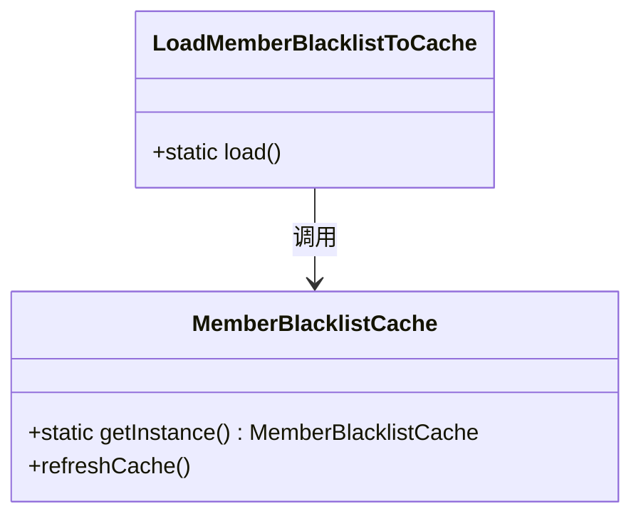
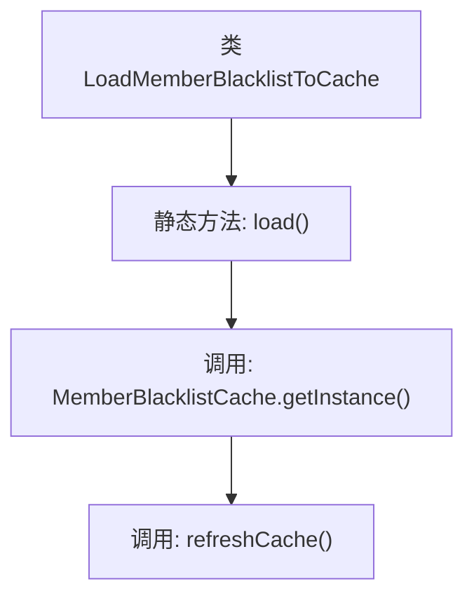

# 基础信息

|      |      |
|------|------|
| 名称 | LoadMemberBlacklistToCache |
| 编码语言 | .java |
| 代码路径 | WeFe/gateway/src/main/java/com/welab/wefe/gateway/init/LoadMemberBlacklistToCache.java |
| 包名 | com.welab.wefe.gateway.init |
| 依赖项 | ['com.welab.wefe.gateway.cache.MemberBlacklistCache'] |
| 概述说明 | 这是一个Java类，包含静态方法load，用于刷新成员黑名单缓存。方法调用MemberBlacklistCache的单例实例执行缓存刷新操作。 |

# 说明

该代码定义了一个名为LoadMemberBlacklistToCache的公共类，包含一个静态方法load。该方法通过调用MemberBlacklistCache类的getInstance方法获取实例，并执行refreshCache操作来刷新缓存。核心功能是实现会员黑名单数据加载到缓存中，适用于需要定期更新黑名单信息的场景。整个设计采用单例模式确保缓存实例唯一性，通过简洁的静态方法提供调用入口。

# 类列表 Class Summary

| 名称   | 类型  | 说明 |
|-------|------|-------------|
| LoadMemberBlacklistToCache | class | 这是一个Java类，包含静态方法load，用于刷新成员黑名单缓存。方法调用MemberBlacklistCache的单例实例执行缓存刷新操作。 |

## 类 LoadMemberBlacklistToCache

|      |      |
|------|------|
| 访问范围 | public |
| 类型 | class |
| 名称 | LoadMemberBlacklistToCache |
| 说明 | 这是一个Java类，包含静态方法load，用于刷新成员黑名单缓存。方法调用MemberBlacklistCache的单例实例执行缓存刷新操作。 |

### UML类图

这段类图展示了`LoadMemberBlacklistToCache`工具类与`MemberBlacklistCache`单例类之间的静态调用关系。`LoadMemberBlacklistToCache`仅包含一个静态方法`load()`，该方法通过`MemberBlacklistCache.getInstance()`获取缓存实例并触发`refreshCache()`操作。该设计实现了黑名单数据的热更新功能，通过集中式缓存管理确保数据一致性，符合单例模式的应用场景。

### 内部方法调用关系图

该流程图描述了`LoadMemberBlacklistToCache`类的静态方法`load()`的执行流程。首先调用`MemberBlacklistCache`的单例实例，随后触发`refreshCache()`方法更新缓存。整个过程简洁清晰，展示了从类方法调用到最终缓存刷新的完整链路，适用于黑名单数据的定时加载场景。

### 字段列表 Field List

| 名称  | 类型  | 说明 |
|-------|-------|------|

### 方法列表

| 名称  | 类型  | 说明 |
|-------|-------|------|
| load | void | 静态方法load调用MemberBlacklistCache单例的refreshCache方法刷新缓存。 |

