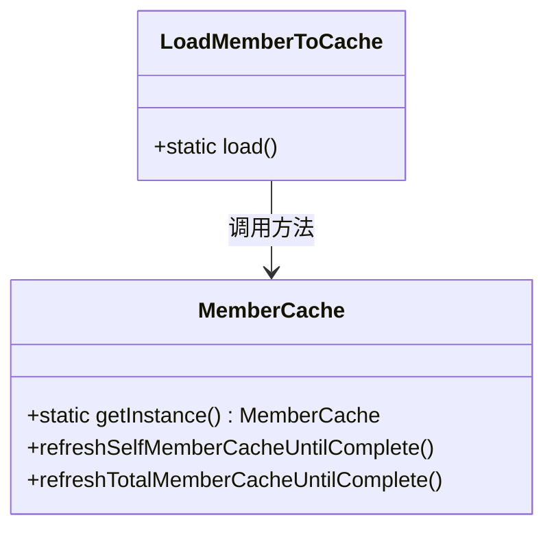
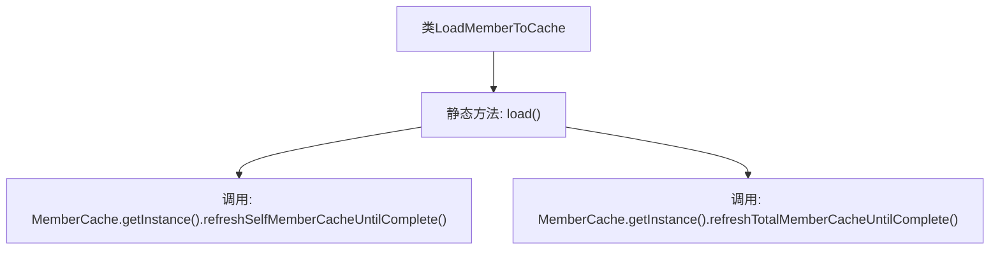

# 基础信息

|      |      |
|------|------|
| 名称 | LoadMemberToCache |
| 编码语言 | .java |
| 代码路径 | WeFe/gateway/src/main/java/com/welab/wefe/gateway/init/LoadMemberToCache.java |
| 包名 | com.welab.wefe.gateway.init |
| 依赖项 | ['com.welab.wefe.gateway.cache.MemberCache'] |
| 概述说明 | 类LoadMemberToCache提供静态方法load()，用于刷新自身及全部成员信息到缓存，直至完成。 |

# 说明

这是一个名为LoadMemberToCache的Java类，包含一个静态方法load。该方法执行两个主要操作：首先调用MemberCache实例的refreshSelfMemberCacheUntilComplete方法加载当前用户成员信息；随后调用同一实例的refreshTotalMemberCacheUntilComplete方法加载所有成员信息。这两个操作都会持续执行直到完成，确保成员数据完全更新至缓存中。

# 类列表 Class Summary

| 名称   | 类型  | 说明 |
|-------|------|-------------|
| LoadMemberToCache | class | 类LoadMemberToCache的load方法用于加载成员信息到缓存，包括自身成员和所有成员信息。 |

## 类 LoadMemberToCache

|      |      |
|------|------|
| 访问范围 | public |
| 类型 | class |
| 名称 | LoadMemberToCache |
| 说明 | 类LoadMemberToCache的load方法用于加载成员信息到缓存，包括自身成员和所有成员信息。 |

### UML类图

这段类图展示了LoadMemberToCache工具类与MemberCache单例类之间的调用关系。LoadMemberToCache仅包含一个静态方法load()，该方法通过MemberCache.getInstance()获取缓存实例，依次调用refreshSelfMemberCacheUntilComplete()和refreshTotalMemberCacheUntilComplete()两个关键方法，分别用于加载当前用户成员信息和全部成员信息到缓存中。整个设计体现了工具类对单例缓存服务的依赖调用模式，适用于需要预加载或刷新缓存数据的场景。

### 内部方法调用关系图

这段流程图描述了LoadMemberToCache类的静态方法load()的执行流程。该方法首先通过MemberCache单例实例调用refreshSelfMemberCacheUntilComplete()加载当前用户自身的成员信息，随后调用refreshTotalMemberCacheUntilComplete()加载所有成员信息。两个操作顺序执行，共同完成成员数据到缓存的加载过程，体现了缓存初始化时的关键步骤。

### 字段列表 Field List

| 名称  | 类型  | 说明 |
|-------|-------|------|

### 方法列表

| 名称  | 类型  | 说明 |
|-------|-------|------|
| load | void | 静态方法load()用于加载成员信息：先刷新当前成员缓存直至完成，再刷新全部成员缓存直至完成。 |

