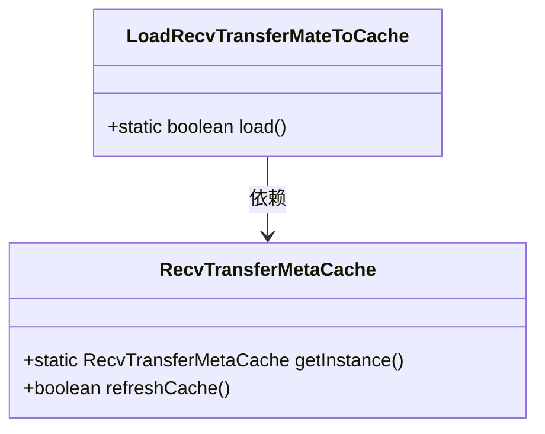
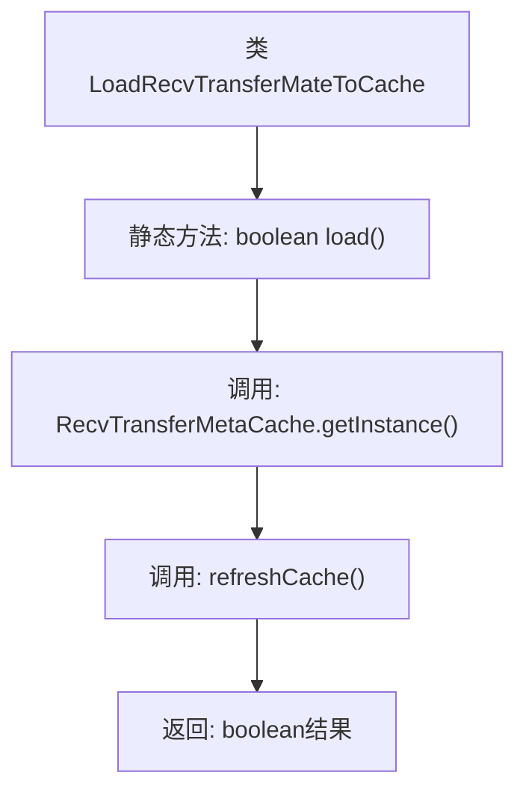

# 基础信息

|      |      |
|------|------|
| 名称 | LoadRecvTransferMateToCache |
| 编码语言 | .java |
| 代码路径 | WeFe/gateway/src/main/java/com/welab/wefe/gateway/init/LoadRecvTransferMateToCache.java |
| 包名 | com.welab.wefe.gateway.init |
| 依赖项 | ['com.welab.wefe.gateway.cache.RecvTransferMetaCache'] |
| 概述说明 | 这是一个Java类，包含静态方法load()，用于刷新接收传输元数据缓存，返回操作是否成功。 |

# 说明

这是一个名为LoadRecvTransferMateToCache的Java类，包含一个静态方法load。该方法通过调用RecvTransferMetaCache类的单例实例的refreshCache方法来刷新缓存，并返回一个布尔值表示操作是否成功。整个类功能单一，专注于缓存刷新操作。

# 类列表 Class Summary

| 名称   | 类型  | 说明 |
|-------|------|-------------|
| LoadRecvTransferMateToCache | class | 类LoadRecvTransferMateToCache提供静态方法load，调用RecvTransferMetaCache单例的refreshCache方法刷新缓存并返回结果。 |

## 类 LoadRecvTransferMateToCache

|      |      |
|------|------|
| 访问范围 | public |
| 类型 | class |
| 名称 | LoadRecvTransferMateToCache |
| 说明 | 类LoadRecvTransferMateToCache提供静态方法load，调用RecvTransferMetaCache单例的refreshCache方法刷新缓存并返回结果。 |

### UML类图

这段代码展示了一个简单的类图结构，其中LoadRecvTransferMateToCache类通过静态方法load()调用RecvTransferMetaCache类的单例实例来执行缓存刷新操作。RecvTransferMetaCache类提供了获取单例实例的getInstance()方法和刷新缓存的refreshCache()方法。两个类之间存在依赖关系，LoadRecvTransferMateToCache依赖于RecvTransferMetaCache来完成其核心功能。整个设计体现了单例模式的使用和简单的职责分离原则。

### 内部方法调用关系图

该流程图描述了`LoadRecvTransferMateToCache`类的核心逻辑。静态方法`load()`通过获取`RecvTransferMetaCache`的单例实例，调用其`refreshCache()`方法更新缓存，最终返回操作结果。整个过程简洁高效，体现了单例模式与缓存刷新的典型结合，箭头清晰展示了从方法调用到结果返回的完整链路。

### 字段列表 Field List

| 名称  | 类型  | 说明 |
|-------|-------|------|

### 方法列表

| 名称  | 类型  | 说明 |
|-------|-------|------|
| load | boolean | 该方法调用RecvTransferMetaCache实例的refreshCache方法刷新缓存，并返回操作结果。 |

