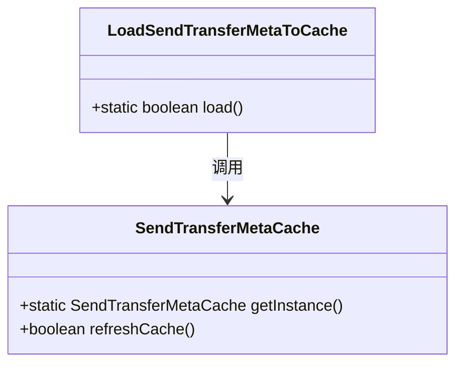
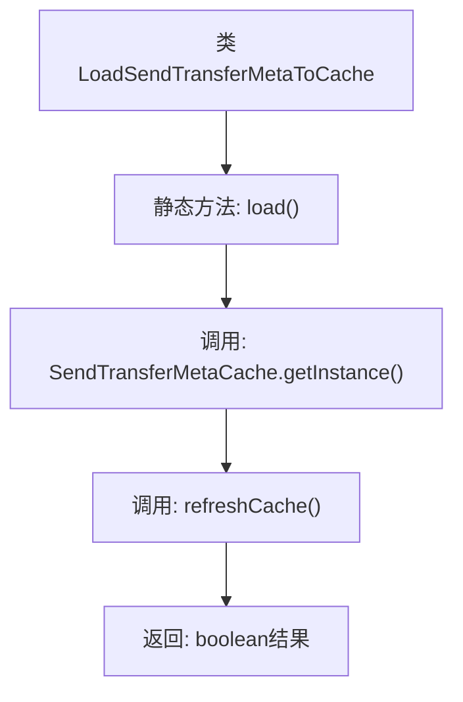

# 基础信息

|      |      |
|------|------|
| 名称 | LoadSendTransferMetaToCache |
| 编码语言 | .java |
| 代码路径 | WeFe/gateway/src/main/java/com/welab/wefe/gateway/init/LoadSendTransferMetaToCache.java |
| 包名 | com.welab.wefe.gateway.init |
| 依赖项 | ['com.welab.wefe.gateway.cache.SendTransferMetaCache'] |
| 概述说明 | 类LoadSendTransferMetaToCache提供静态方法load，调用SendTransferMetaCache单例的refreshCache方法刷新缓存并返回结果。 |

# 说明

该内容描述了一个名为LoadSendTransferMetaToCache的公共类，其中包含一个静态方法load。该方法通过调用SendTransferMetaCache类的getInstance方法获取实例，并执行refreshCache操作来刷新缓存。方法的返回类型为布尔值，表示缓存刷新操作的成功与否。整个功能设计简洁，专注于缓存刷新这一单一职责。

# 类列表 Class Summary

| 名称   | 类型  | 说明 |
|-------|------|-------------|
| LoadSendTransferMetaToCache | class | 类LoadSendTransferMetaToCache包含静态方法load，调用SendTransferMetaCache单例的refreshCache方法刷新缓存并返回结果。 |

## 类 LoadSendTransferMetaToCache

|      |      |
|------|------|
| 访问范围 | public |
| 类型 | class |
| 名称 | LoadSendTransferMetaToCache |
| 说明 | 类LoadSendTransferMetaToCache包含静态方法load，调用SendTransferMetaCache单例的refreshCache方法刷新缓存并返回结果。 |

### UML类图

该代码展示了一个简单的缓存加载场景，其中`LoadSendTransferMetaToCache`类通过静态方法`load()`调用`SendTransferMetaCache`单例的`refreshCache()`方法。类图清晰地反映了这种单向依赖关系，`SendTransferMetaCache`作为缓存管理类提供实例获取和缓存刷新功能，而主类仅作为调用入口。这种设计符合单一职责原则，将缓存操作与实际业务逻辑解耦。

### 内部方法调用关系图

该流程图展示了LoadSendTransferMetaToCache类的核心逻辑。流程从静态方法load()开始，首先获取SendTransferMetaCache的单例实例，然后调用其refreshCache()方法更新缓存，最后将操作结果以布尔值形式返回。整个过程体现了简洁的链式调用结构，重点突出了类之间的协作关系。

### 字段列表 Field List

| 名称  | 类型  | 说明 |
|-------|-------|------|

### 方法列表

| 名称  | 类型  | 说明 |
|-------|-------|------|
| load | boolean | 该方法调用SendTransferMetaCache实例的refreshCache方法刷新缓存，并返回布尔结果。 |

