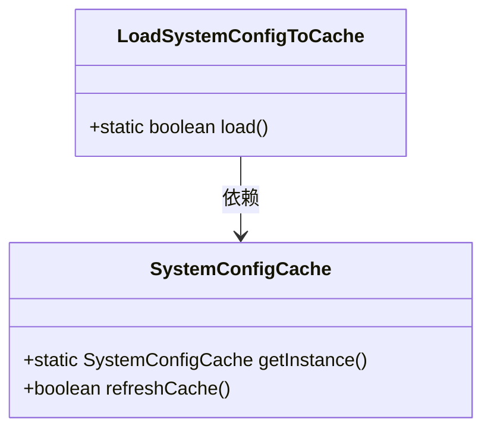
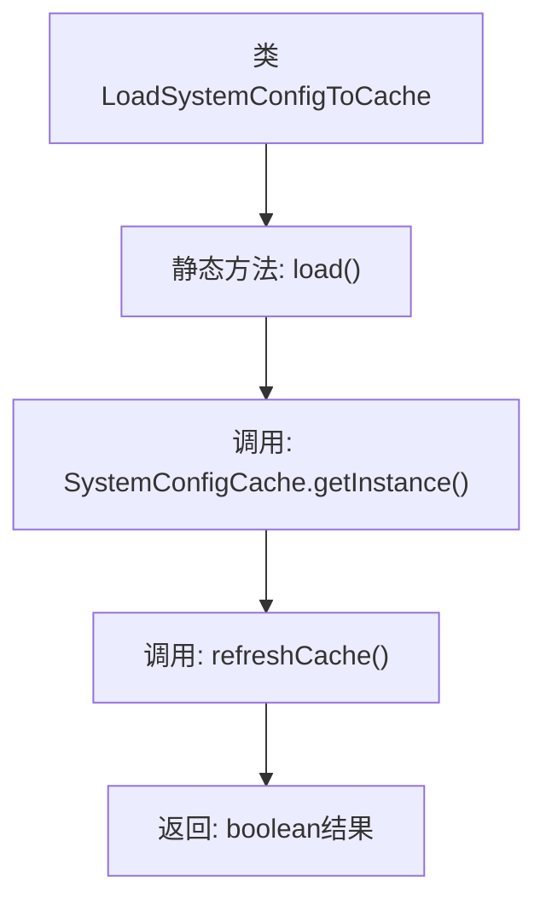

# 基础信息

|      |      |
|------|------|
| 名称 | LoadSystemConfigToCache |
| 编码语言 | .java |
| 代码路径 | WeFe/gateway/src/main/java/com/welab/wefe/gateway/init/LoadSystemConfigToCache.java |
| 包名 | com.welab.wefe.gateway.init |
| 依赖项 | ['com.welab.wefe.gateway.cache.SystemConfigCache'] |
| 概述说明 | 类LoadSystemConfigToCache提供静态方法load，调用SystemConfigCache单例的refreshCache方法刷新缓存并返回结果。 |

# 说明

这是一个名为LoadSystemConfigToCache的公共类，包含一个静态方法load。该方法通过调用SystemConfigCache类的单例实例的refreshCache方法来刷新系统配置缓存，并返回一个布尔值表示操作是否成功。整个类的作用是将系统配置加载到缓存中。

# 类列表 Class Summary

| 名称   | 类型  | 说明 |
|-------|------|-------------|
| LoadSystemConfigToCache | class | 类LoadSystemConfigToCache提供静态方法load，调用SystemConfigCache单例的refreshCache方法刷新缓存并返回结果。 |

## 类 LoadSystemConfigToCache

|      |      |
|------|------|
| 访问范围 | public |
| 类型 | class |
| 名称 | LoadSystemConfigToCache |
| 说明 | 类LoadSystemConfigToCache提供静态方法load，调用SystemConfigCache单例的refreshCache方法刷新缓存并返回结果。 |

### UML类图

这段代码展示了一个简单的配置加载系统，其中`LoadSystemConfigToCache`类通过静态方法`load()`调用`SystemConfigCache`单例的`refreshCache()`方法。类图清晰地表现了这种依赖关系，`LoadSystemConfigToCache`作为调用方依赖于`SystemConfigCache`提供的缓存刷新功能。整个设计遵循单一职责原则，配置加载逻辑与缓存实现分离，便于维护和扩展。

### 内部方法调用关系图

该流程图展示了LoadSystemConfigToCache类的核心逻辑。流程从静态方法load()开始，首先获取SystemConfigCache的单例实例，然后调用其refreshCache()方法更新缓存，最后返回布尔类型的结果。整个过程简洁高效，体现了单例模式与缓存刷新的典型组合，适用于系统配置加载场景。

### 字段列表 Field List

| 名称  | 类型  | 说明 |
|-------|-------|------|

### 方法列表

| 名称  | 类型  | 说明 |
|-------|-------|------|
| load | boolean | 静态方法load调用SystemConfigCache实例的refreshCache方法刷新缓存并返回结果。 |

