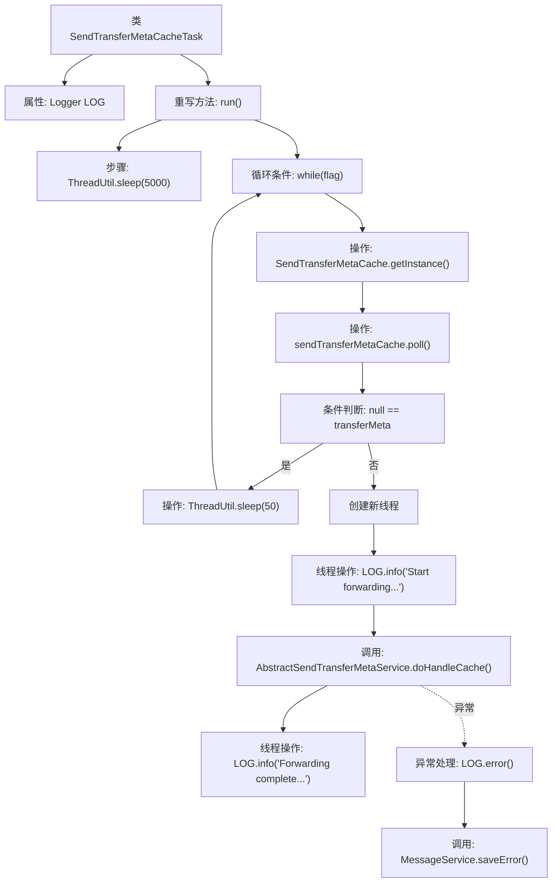

# 基础信息

|      |      |
|------|------|
| 名称 | SendTransferMetaCacheTask |
| 编码语言 | .java |
| 代码路径 | WeFe/gateway/src/main/java/com/welab/wefe/gateway/init/SendTransferMetaCacheTask.java |
| 包名 | com.welab.wefe.gateway.init |
| 依赖项 | ['com.welab.wefe.common.util.ThreadUtil', 'com.welab.wefe.gateway.GatewayServer', 'com.welab.wefe.gateway.api.meta.basic.GatewayMetaProto', 'com.welab.wefe.gateway.cache.SendTransferMetaCache', 'com.welab.wefe.gateway.service.MessageService', 'com.welab.wefe.gateway.service.base.AbstractSendTransferMetaService', 'org.slf4j.Logger', 'org.slf4j.LoggerFactory'] |
| 概述说明 | SendTransferMetaCacheTask是一个线程类，启动后先休眠5秒等待GRPC服务初始化，然后循环检查并转发缓存中的TransferMeta消息，处理失败会记录错误日志。 |

# 说明

SendTransferMetaCacheTask是一个线程类，用于处理缓存中的传输元数据。启动后先休眠5秒以避免GRPC服务未初始化，随后进入循环不断从SendTransferMetaCache实例获取数据。若无数据则休眠50毫秒后继续。获取到数据后启动新线程处理：记录日志并调用AbstractSendTransferMetaService处理缓存数据，完成后再次记录日志。若处理异常则记录错误日志并通过MessageService保存错误信息。整个过程持续运行直到标志位改变。

# 类列表 Class Summary

| 名称   | 类型  | 说明 |
|-------|------|-------------|
| SendTransferMetaCacheTask | class | SendTransferMetaCacheTask线程类，启动后延迟5秒，循环处理缓存中的TransferMeta消息，通过新线程调用服务转发消息并记录日志，异常时保存错误信息。 |


## 类 SendTransferMetaCacheTask

|      |      |
|------|------|
| 访问范围 | public |
| 类型 | class |
| 名称 | SendTransferMetaCacheTask |
| 说明 | SendTransferMetaCacheTask线程类，启动后延迟5秒，循环处理缓存中的TransferMeta消息，通过新线程调用服务转发消息并记录日志，异常时保存错误信息。 |


### UML类图

```mermaid
classDiagram
    class SendTransferMetaCacheTask {
        -Logger LOG
        +run() void
    }

    class ThreadUtil {
        <<static>>
        +sleep(long millis) void
    }

    class SendTransferMetaCache {
        <<static>>
        +getInstance() SendTransferMetaCache
        +poll() GatewayMetaProto$TransferMeta
    }

    class GatewayMetaProto$TransferMeta {
        +getSessionId() String
    }

    class GatewayServer {
        <<static>>
        -CONTEXT: ApplicationContext
    }

    class AbstractSendTransferMetaService {
        <<Interface>>
        +doHandleCache(GatewayMetaProto$TransferMeta transferMeta) void
    }

    class MessageService {
        +saveError(String title, String msg, GatewayMetaProto$TransferMeta meta) void
    }

    SendTransferMetaCacheTask --> ThreadUtil : 调用
    SendTransferMetaCacheTask --> SendTransferMetaCache : 获取实例
    SendTransferMetaCacheTask --> GatewayMetaProto$TransferMeta : 处理消息
    SendTransferMetaCacheTask --> GatewayServer : 获取服务
    GatewayServer --> AbstractSendTransferMetaService : 依赖
    GatewayServer --> MessageService : 依赖
```

这段代码展示了一个消息转发任务线程的实现流程。SendTransferMetaCacheTask继承Thread类，通过轮询方式从SendTransferMetaCache获取待处理消息，使用GRPC服务异步转发消息。核心流程包含5秒初始化延迟、空消息检测、异常处理等机制，涉及静态工具类、单例缓存、接口服务调用等多个组件协作，体现了消息转发系统的健壮性设计。


### 内部方法调用关系图



这段代码描述了一个后台线程任务，主要用于处理缓存的传输元数据。流程图展示了从线程启动后的完整处理流程：初始延迟5秒后进入循环，不断从缓存中获取数据，若无数据则短暂休眠后继续轮询；获取到数据后创建新线程进行异步处理，包括日志记录、调用服务处理数据以及异常捕获和错误保存。整个过程体现了生产者-消费者模式与异步处理的结合。

### 字段列表 Field List

| 名称  | 类型  | 说明 |
|-------|-------|------|
| LOG = LoggerFactory.getLogger(SendTransferMetaCacheTask.class) | Logger | 类SendTransferMetaCacheTask中定义的私有静态日志对象LOG，用于记录日志信息。 |

### 方法列表

| 名称  | 类型  | 说明 |
|-------|-------|------|
| run | void | 方法启动后先休眠5秒确保GRPC服务初始化完成，随后循环检查并处理缓存中的传输元数据。若缓存为空则短暂休眠后继续检查；否则新线程处理元数据，记录日志并捕获异常。 |


