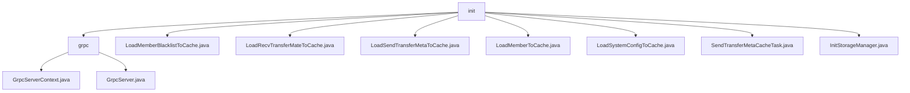

# 基础信息

|      |      |
|------|------|
| 名称 | init |
| 编码语言 | .java |
| 代码路径 | WeFe/gateway/src/main/java/com/welab/wefe/gateway/init |
| 包名 | docs.gateway.src.main.java.com.welab.wefe.gateway.init |
| 概述说明 | 该模块管理gRPC服务器生命周期，支持双通道通信与动态TLS配置，包含启动/停止控制及拦截器管理。关键结构为GrpcServerContext和TLS证书上下文。依赖MemberService和ServerCertService。其他类负责缓存加载（黑名单、成员信息、传输元数据等）和存储初始化（持久化、函数计算）。 |

# 说明

## 概述  
该模块核心职责是管理gRPC服务器生命周期及多类型缓存加载，采用双通道通信隔离与动态TLS配置机制，类似网关代理模式。统一接口规范包括服务器控制（启动/停止/TLS切换）、缓存刷新（黑名单/传输元数据/系统配置）及存储初始化（ClickHouse/云函数）。关键数据结构含GrpcServerContext、各类Cache单例（如MemberBlacklistCache）及TLS证书上下文。外部依赖仅涉及MemberService、ServerCertService及云平台配置。例如通过SendTransferMetaCacheTask实现元数据异步处理。

## 主要业务场景  
典型应用包含双通道gRPC初始化（内部明文/外部动态TLS）与多缓存热加载，类似双防火墙策略配合数据预热。完整流程涵盖端口校验、服务注册、缓存刷新（如LoadMemberToCache加载全量成员数据）及异常回滚（例如启动失败自动终止）。交互模式通过单例控制多实例，支持TLS热更新与缓存异步处理（如SendTransferMetaCacheTask轮询机制）。API类型聚焦生命周期管理（restartExternalServer）与缓存操作（refreshCache），存储服务支持强制重初始化（InitStorageManager.initFC）。

### 包内部结构视图

该流程图展示了WeFe网关初始化模块的层级结构。根节点"init"包含7个直接子节点，其中"grpc"为目录节点，其余为Java文件节点。"grpc"目录下又包含两个具体的实现类文件。所有节点均保持原始路径的末端名称，清晰呈现了初始化模块的文件组织关系。

# 文件列表

| 名称   | 类型  | 说明 |
|-------|------|-------------|
| [LoadMemberBlacklistToCache.java](LoadMemberBlacklistToCache.md) | file | 这是一个Java类，包含静态方法load，用于刷新成员黑名单缓存。方法调用MemberBlacklistCache的单例实例执行缓存刷新操作。 |
| [LoadRecvTransferMateToCache.java](LoadRecvTransferMateToCache.md) | file | 这是一个Java类，包含静态方法load()，用于刷新接收传输元数据缓存，返回操作是否成功。 |
| [LoadSendTransferMetaToCache.java](LoadSendTransferMetaToCache.md) | file | 类LoadSendTransferMetaToCache提供静态方法load，调用SendTransferMetaCache单例的refreshCache方法刷新缓存并返回结果。 |
| [LoadMemberToCache.java](LoadMemberToCache.md) | file | 类LoadMemberToCache提供静态方法load()，用于刷新自身及全部成员信息到缓存，直至完成。 |
| [LoadSystemConfigToCache.java](LoadSystemConfigToCache.md) | file | 类LoadSystemConfigToCache提供静态方法load，调用SystemConfigCache单例的refreshCache方法刷新缓存并返回结果。 |
| [SendTransferMetaCacheTask.java](SendTransferMetaCacheTask.md) | file | SendTransferMetaCacheTask是一个线程类，启动后先休眠5秒等待GRPC服务初始化，然后循环检查并转发缓存中的TransferMeta消息，处理失败会记录错误日志。 |
| [InitStorageManager.java](InitStorageManager.md) | file | InitStorageManager类用于初始化持久化存储和FC存储服务，包含强制重试和配置检查功能，支持阿里云和腾讯云配置。 |
| [grpc](grpc/_module.md) | package | GrpcServerContext是单例类，管理内外gRPC服务器生命周期，检查端口配置，处理TLS设置，支持重启和动态更新TLS。GrpcServer类管理服务器属性及启停，支持TLS加密和拦截器配置，处理异常和状态切换。 |

