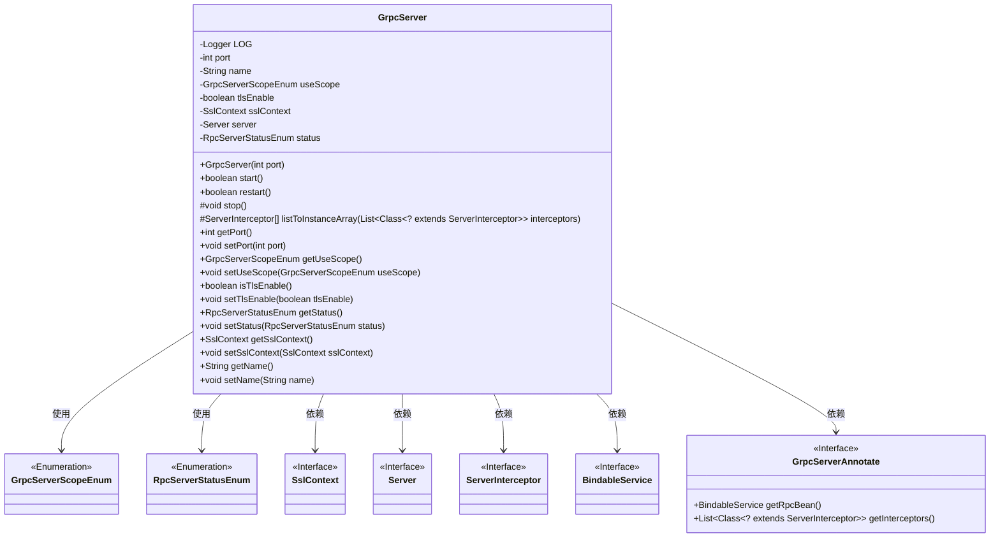

# 基础信息

|      |      |
|------|------|
| 名称 | GrpcServer |
| 编码语言 | .java |
| 代码路径 | WeFe/gateway/src/main/java/com/welab/wefe/gateway/init/grpc/GrpcServer.java |
| 包名 | com.welab.wefe.gateway.init.grpc |
| 依赖项 | ['com.welab.wefe.gateway.base.GrpcServerAnnotate', 'com.welab.wefe.gateway.common.GrpcConstant', 'com.welab.wefe.gateway.common.RpcServerStatusEnum', 'com.welab.wefe.gateway.common.GrpcServerScopeEnum', 'com.welab.wefe.gateway.util.ClassUtil', 'io.grpc', 'io.grpc.netty.NettyServerBuilder', 'io.netty.handler.ssl.SslContext', 'org.apache.commons.collections4.CollectionUtils', 'org.slf4j.Logger', 'org.slf4j.LoggerFactory', 'java.util.List', 'java.util.Map', 'java.util.concurrent.TimeUnit'] |
| 概述说明 | GrpcServer类实现gRPC服务器功能，包含端口、名称、TLS配置、服务状态等属性，提供启动、重启、停止及拦截器处理等方法。 |

# 说明

GrpcServer类是一个用于管理gRPC服务器生命周期的Java类，包含端口、名称、使用范围、TLS启用状态、SSL上下文和服务器状态等属性。提供了启动、重启和停止服务器的方法，支持TLS加密和拦截器配置。启动时会加载指定范围的gRPC服务类，设置最大消息大小和连接参数，并注册关闭钩子。重启和停止方法确保服务器状态正确切换，并处理异常情况。类中还包含属性访问器和工具方法，如将拦截器类列表转换为实例数组。

# 类列表 Class Summary

| 名称   | 类型  | 说明 |
|-------|------|-------------|
| GrpcServer | class | GrpcServer类实现gRPC服务器功能，包含端口、名称、TLS配置等属性，提供启动、重启、停止方法，支持拦截器和SSL加密。 |

## 类 GrpcServer

|      |      |
|------|------|
| 访问范围 | public |
| 类型 | class |
| 名称 | GrpcServer |
| 说明 | GrpcServer类实现gRPC服务器功能，包含端口、名称、TLS配置等属性，提供启动、重启、停止方法，支持拦截器和SSL加密。 |

### UML类图

类图描述：GrpcServer类是一个gRPC服务器实现，包含端口、名称、作用域等配置属性，提供启动、重启和停止服务的方法。它依赖多个接口和枚举类，如SslContext用于TLS加密，ServerInterceptor用于请求拦截，BindableService表示可绑定的gRPC服务。通过GrpcServerAnnotate注解类加载服务实现，支持TLS加密和连接参数配置，是一个完整的gRPC服务管理类。

### 内部方法调用关系图

```mermaid
graph TD
    A["类GrpcServer"]
    B["属性: Logger LOG"]
    C["属性: int port"]
    D["属性: String name"]
    E["属性: GrpcServerScopeEnum useScope"]
    F["属性: boolean tlsEnable"]
    G["属性: SslContext sslContext"]
    H["属性: Server server"]
    I["属性: RpcServerStatusEnum status"]
    J["构造方法: GrpcServer(int port)"]
    K["方法: boolean start()"]
    L["方法: boolean restart()"]
    M["方法: protected void stop()"]
    N["方法: ServerInterceptor[] listToInstanceArray()"]
    O["Getter/Setter方法组"]

    A --> B
    A --> C
    A --> D
    A --> E
    A --> F
    A --> G
    A --> H
    A --> I
    A --> J
    A --> K
    A --> L
    A --> M
    A --> N
    A --> O

    K --> K1["加载RPC类: ClassUtil.loadRpcClassBeans()"]
    K --> K2["配置NettyServerBuilder"]
    K --> K3["添加服务拦截器"]
    K --> K4["设置TLS/SSL"]
    K --> K5["启动服务: server.start()"]
    K --> K6["注册关闭钩子"]

    L --> L1["关闭现有服务: server.shutdown()"]
    L --> L2["调用start()方法"]
    
    M --> M1["优雅关闭服务: server.shutdown()"]
    M --> M2["状态更新为SHUTDOWN"]
```

这段代码实现了一个gRPC服务器管理类，主要功能包括服务器启动(start)、重启(restart)和停止(stop)操作。流程图展示了类结构关系，其中start()方法包含完整的服务初始化流程：加载RPC服务类、配置Netty服务器参数、处理拦截器、设置安全连接等。restart()方法通过先停止后启动的方式实现重启，stop()方法实现优雅关闭。类包含多个配置属性和对应的getter/setter方法，支持端口、名称、作用域等参数配置。

### 字段列表 Field List

| 名称  | 类型  | 说明 |
|-------|-------|------|
| status = RpcServerStatusEnum.SHUTDOWN | RpcServerStatusEnum | 私有变量status初始化为RpcServerStatusEnum.SHUTDOWN，表示RPC服务器状态为关闭。 |
| sslContext | SslContext | 私有SSL上下文变量，用于安全通信配置。 |
| tlsEnable | boolean | 启用TLS加密的布尔标志。 |
| useScope | GrpcServerScopeEnum | GrpcServerScopeEnum类型的私有变量useScope，用于定义gRPC服务器的使用范围。 |
| name | String | 私有字符串变量name |
| port | int | 私有整型端口变量。 |
| server | Server | 私有服务器实例变量。 |
| LOG = LoggerFactory.getLogger(GrpcServer.class) | Logger | GrpcServer类中声明了一个私有的不可变Logger实例，用于记录日志。 |

### 方法列表

| 名称  | 类型  | 说明 |
|-------|-------|------|
| setStatus | void | 设置RPC服务器状态的方法，参数为枚举类型RpcServerStatusEnum。 |
| isTlsEnable | boolean | 该方法返回布尔值，表示TLS是否启用。 |
| listToInstanceArray | ServerInterceptor[] | 将拦截器类列表转换为实例数组，通过反射创建每个类的实例并返回数组。处理异常包括非法访问和实例化失败。 |
| getPort | int | 方法返回端口号。 |
| setTlsEnable | void | 设置TLS启用状态的公共方法，参数为布尔值tlsEnable。 |
| getUseScope | GrpcServerScopeEnum | 获取GrpcServerScopeEnum类型的useScope属性值。 |
| restart | boolean | 该方法用于重启gRPC服务器，先关闭运行中的服务器，然后重新启动。成功返回true，失败记录日志并返回false。 |
| stop | void | 停止gRpc服务器，若运行中则等待10秒关闭，状态设为SHUTDOWN，异常时记录错误日志。 |
| setPort | void | 这是一个Java方法，用于设置端口号，将传入的port参数赋值给类的成员变量port。 |
| setUseScope | void | 定义了一个公共方法setUseScope，用于设置GrpcServerScopeEnum类型的useScope属性值。 |
| start | boolean | 启动gRPC服务器方法：检查可用服务，绑定端口，配置拦截器、消息大小、连接参数及TLS，启动服务并注册关闭钩子。成功返回true，失败记录日志并返回false。 |
| getSslContext | SslContext | 方法返回SSL上下文对象。 |
| setSslContext | void | 设置SSL上下文的方法，将传入的SslContext对象赋值给当前对象的sslContext字段。 |
| getName | String | 这是一个Java方法，返回私有成员变量name的值。 |
| setName | void | 这是一个Java方法，用于设置对象的name属性。方法接收一个字符串参数name，并将其赋值给当前对象的name字段。 |
| getStatus | RpcServerStatusEnum | 获取RpcServer当前状态的方法，返回RpcServerStatusEnum枚举值。 |

