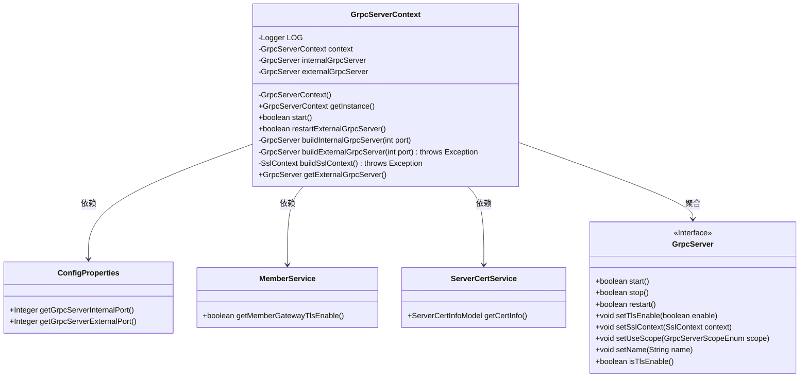
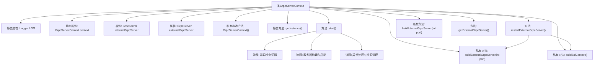

# 基础信息

|      |      |
|------|------|
| 名称 | GrpcServerContext |
| 编码语言 | .java |
| 代码路径 | WeFe/gateway/src/main/java/com/welab/wefe/gateway/init/grpc/GrpcServerContext.java |
| 包名 | com.welab.wefe.gateway.init.grpc |
| 依赖项 | ['java.security.PrivateKey', 'java.security.cert.X509Certificate', 'org.slf4j.Logger', 'org.slf4j.LoggerFactory', 'com.webank.cert.toolkit.utils.CertUtils', 'com.webank.cert.toolkit.utils.KeyUtils', 'com.welab.wefe.common.util.AESUtil', 'com.welab.wefe.common.wefe.dto.global_config.ServerCertInfoModel', 'com.welab.wefe.gateway.GatewayServer', 'com.welab.wefe.gateway.cache.MemberCache', 'com.welab.wefe.gateway.common.GrpcServerScopeEnum', 'com.welab.wefe.gateway.config.ConfigProperties', 'com.welab.wefe.gateway.service.MemberService', 'com.welab.wefe.gateway.service.ServerCertService', 'io.grpc.netty.GrpcSslContexts', 'io.netty.handler.ssl.SslContext', 'io.netty.handler.ssl.SslContextBuilder', 'io.netty.handler.ssl.SslProvider'] |
| 概述说明 | GrpcServerContext类管理gRPC服务器，包含内部和外部服务器实例。启动时检查端口配置，构建并启动服务器。支持重启外部服务器及SSL配置。采用单例模式。 |

# 说明

GrpcServerContext类是一个单例类，用于管理内部和外部gRPC服务器的生命周期。它包含两个GrpcServer实例，分别用于内部和外部通信。启动时检查端口配置，确保端口非空且不相同。内部服务器默认禁用TLS，外部服务器根据MemberService配置决定是否启用TLS。若启动失败会自动停止已启动的服务器。提供重启外部服务器的功能，可动态更新TLS配置。TLS上下文通过ServerCertService获取证书信息构建。

# 类列表 Class Summary

| 名称   | 类型  | 说明 |
|-------|------|-------------|
| GrpcServerContext | class | GrpcServerContext类管理gRPC服务器，包含内部和外部服务器实例。提供启动、重启外部服务器功能，支持TLS配置。启动时检查端口有效性，失败时自动清理资源。内部服务器无TLS，外部服务器根据配置启用TLS并构建SSL上下文。 |

## 类 GrpcServerContext

|      |      |
|------|------|
| 访问范围 | public |
| 类型 | class |
| 名称 | GrpcServerContext |
| 说明 | GrpcServerContext类管理gRPC服务器，包含内部和外部服务器实例。提供启动、重启外部服务器功能，支持TLS配置。启动时检查端口有效性，失败时自动清理资源。内部服务器无TLS，外部服务器根据配置启用TLS并构建SSL上下文。 |

### UML类图

类图描述：GrpcServerContext 是一个单例类，负责管理内部和外部 gRPC 服务器的生命周期。它依赖于 ConfigProperties 获取端口配置，MemberService 获取 TLS 设置，ServerCertService 获取 SSL 证书信息，并通过聚合关系管理 GrpcServer 实例。主要功能包括启动服务器、重启外部服务器以及构建 SSL 上下文。

### 内部方法调用关系图

这段代码实现了一个gRPC服务器上下文管理类，采用单例模式控制内部和外部gRPC服务器的生命周期。核心流程包括：1) 通过start()方法进行端口校验、服务器实例构建和启动；2) 通过restartExternalGrpcServer()实现带TLS配置的外部服务器重启；3) 包含完整的异常处理和资源清理机制。关键特性包括动态SSL证书加载、双服务器隔离管理（INTERNAL/EXTERNAL）、以及通过Spring上下文获取配置信息。所有操作都配有完善的错误日志记录，确保服务可靠性。

### 字段列表 Field List

| 名称  | 类型  | 说明 |
|-------|-------|------|
| LOG = LoggerFactory.getLogger(GrpcServerContext.class) | Logger | GrpcServerContext类中定义了一个受保护的静态日志记录器LOG，用于记录日志信息。 |
| externalGrpcServer | GrpcServer | 私有GrpcServer实例，用于外部通信。 |
| internalGrpcServer | GrpcServer | 私有GrpcServer实例internalGrpcServer。 |
| context = new GrpcServerContext() | GrpcServerContext | 私有静态变量context初始化为GrpcServerContext实例。 |

### 方法列表

| 名称  | 类型  | 说明 |
|-------|-------|------|
| getInstance | GrpcServerContext | 获取GrpcServerContext单例实例。 |
| restartExternalGrpcServer | boolean | 重启外部gRPC服务器方法：检查TLS启用状态，若启用则设置SSL上下文，尝试重启服务器，失败返回false并记录错误日志。 |
| buildExternalGrpcServer | GrpcServer | 构建外部gRPC服务器，设置端口、名称和外部作用域，根据成员服务配置启用TLS并设置SSL上下文。 |
| buildInternalGrpcServer | GrpcServer | 构建内部gRPC服务器，指定端口，禁用TLS，设置名称为INTERNAL，使用范围为内部。 |
| start | boolean | 检查并启动gRPC服务器，验证内外端口非空且不同，成功启动后返回true，失败则清理资源并记录错误。 |
| buildSslContext | SslContext | 构建SSL上下文：获取服务证书信息，解密私钥并转换为X509证书，配置OpenSSL提供程序后返回SSL上下文。若证书无效则抛出异常。 |
| getExternalGrpcServer | GrpcServer | 获取外部gRPC服务器实例的方法。 |

