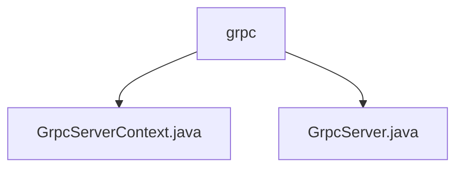

# 基础信息

|      |      |
|------|------|
| 名称 | grpc |
| 编码语言 | .java |
| 代码路径 | WeFe/gateway/src/main/java/com/welab/wefe/gateway/init/grpc |
| 包名 | docs.gateway.src.main.java.com.welab.wefe.gateway.init.grpc |
| 概述说明 | GrpcServerContext是单例类，管理内外gRPC服务器生命周期，检查端口配置，处理TLS设置，支持重启和动态更新TLS。GrpcServer类管理服务器属性及启停，支持TLS加密和拦截器配置，处理异常和状态切换。 |

# 说明

## 概述  
该模块核心职责是管理gRPC服务器的生命周期，支持内外通信隔离与动态TLS配置。接口规范统一为启动/停止控制、TLS状态切换及拦截器管理，类似网关代理模式。关键数据结构包括GrpcServerContext（单例）、GrpcServer（实例化对象）及TLS证书上下文。外部依赖仅涉及MemberService配置和ServerCertService证书服务。例如通过ServerCertService动态构建TLS上下文。

## 主要业务场景  
典型场景包含双通道服务器初始化：内部通道默认禁用TLS，外部通道根据MemberService动态启用TLS，类似双防火墙策略。完整流程涵盖端口校验、服务注册、消息大小调节及异常回滚，例如启动失败时自动终止已启服务。交互模式通过单例上下文控制多实例，支持热更新外部服务器TLS配置。API类型聚焦生命周期管理，如restartExternalServer()方法实现证书热加载。

### 包内部结构视图

该流程图展示了WeFe网关项目中grpc模块的层级结构。根节点为grpc目录，包含两个Java文件：GrpcServerContext.java和GrpcServer.java。这两个文件直接位于grpc目录下，没有更深层级的子目录结构。整个结构简洁明了，反映了grpc模块的基本文件组织方式。

# 文件列表

| 名称   | 类型  | 说明 |
|-------|------|-------------|
| [GrpcServerContext.java](GrpcServerContext.md) | file | GrpcServerContext类管理gRPC服务器，包含内部和外部服务器实例。启动时检查端口配置，构建并启动服务器。支持重启外部服务器及SSL配置。采用单例模式。 |
| [GrpcServer.java](GrpcServer.md) | file | GrpcServer类实现gRPC服务器功能，包含端口、名称、TLS配置、服务状态等属性，提供启动、重启、停止及拦截器处理等方法。 |

