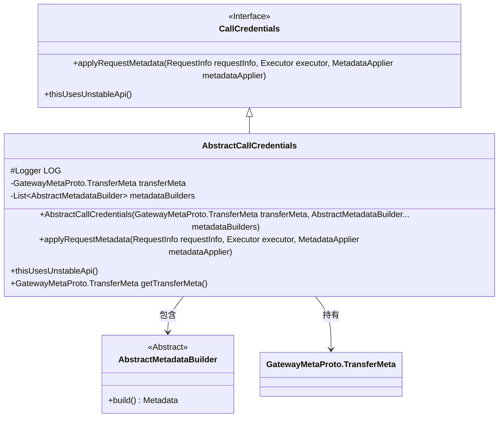
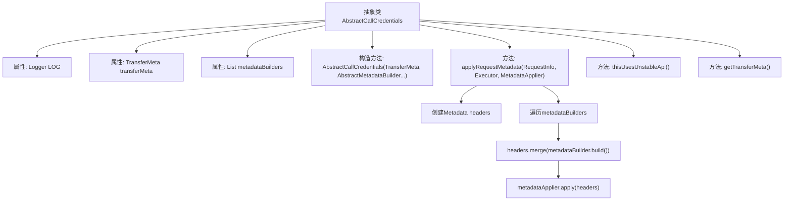

# 基础信息

|      |      |
|------|------|
| 名称 | AbstractCallCredentials |
| 编码语言 | .java |
| 代码路径 | WeFe/gateway/src/main/java/com/welab/wefe/gateway/interceptor/AbstractCallCredentials.java |
| 包名 | com.welab.wefe.gateway.interceptor |
| 依赖项 | ['com.welab.wefe.gateway.api.meta.basic.GatewayMetaProto', 'io.grpc.CallCredentials', 'io.grpc.Metadata', 'org.slf4j.Logger', 'org.slf4j.LoggerFactory', 'java.util.ArrayList', 'java.util.Arrays', 'java.util.List', 'java.util.concurrent.Executor'] |
| 概述说明 | 抽象类AbstractCallCredentials继承CallCredentials，包含传输元数据和元数据构建器列表，提供请求元数据应用方法。 |

# 说明

AbstractCallCredentials是一个抽象类，继承自CallCredentials，用于处理调用凭证相关逻辑。类中包含一个Logger实例用于日志记录，一个TransferMeta类型的transferMeta变量存储传输元数据，以及一个metadataBuilders列表用于存储多个AbstractMetadataBuilder实例。构造函数接收TransferMeta和可变参数metadataBuilders，并将它们初始化到成员变量中。applyRequestMetadata方法遍历metadataBuilders，构建并合并Metadata头部信息，最后通过metadataApplier应用这些头部。类还包含一个空的thisUsesUnstableApi方法实现，以及一个获取transferMeta的getter方法。

# 类列表 Class Summary

| 名称   | 类型  | 说明 |
|-------|------|-------------|
| AbstractCallCredentials | class | 抽象类AbstractCallCredentials继承CallCredentials，包含TransferMeta和metadataBuilders属性，通过构造函数初始化，applyRequestMetadata方法合并构建的元数据并应用。 |

## 类 AbstractCallCredentials

|      |      |
|------|------|
| 访问范围 | public abstract |
| 类型 | class |
| 名称 | AbstractCallCredentials |
| 说明 | 抽象类AbstractCallCredentials继承CallCredentials，包含TransferMeta和metadataBuilders属性，通过构造函数初始化，applyRequestMetadata方法合并构建的元数据并应用。 |

### UML类图

这段代码展示了一个抽象类`AbstractCallCredentials`继承自`CallCredentials`接口，用于处理请求元数据的构建和应用。类中包含日志记录器、传输元数据和元数据构建器列表，通过`applyRequestMetadata`方法将构建的元数据应用到请求中。类图清晰地反映了继承关系、组合关系以及核心方法的交互逻辑。

### 内部方法调用关系图

这段代码展示了一个抽象类AbstractCallCredentials的实现，主要用于处理请求元数据的构建和应用。类中包含核心属性如transferMeta和metadataBuilders，通过构造方法初始化这些属性。最重要的方法是applyRequestMetadata，它会遍历所有metadataBuilder来构建并合并请求头信息，最终通过metadataApplier应用这些元数据。此外还包含空实现的thisUsesUnstableApi方法和获取transferMeta的getter方法。整个流程清晰地展现了请求元数据的处理过程。

### 字段列表 Field List

| 名称  | 类型  | 说明 |
|-------|-------|------|
| metadataBuilders = new ArrayList<>() | List<AbstractMetadataBuilder> | 定义一个私有列表metadataBuilders，用于存储AbstractMetadataBuilder类型的对象，初始化为空ArrayList。 |
| LOG = LoggerFactory.getLogger(this.getClass()) | Logger | 类中定义受保护的日志对象LOG，使用当前类初始化日志记录器。 |
| transferMeta | GatewayMetaProto.TransferMeta | 私有变量transferMeta，类型为GatewayMetaProto.TransferMeta。 |

### 方法列表

| 名称  | 类型  | 说明 |
|-------|-------|------|
| thisUsesUnstableApi | void | 重写方法thisUsesUnstableApi，空实现。 |
| applyRequestMetadata | void | 该方法用于应用请求元数据，合并多个构建器的元数据后通过metadataApplier提交。 |
| getTransferMeta | GatewayMetaProto.TransferMeta | 获取传输元数据的方法，返回transferMeta对象。 |

