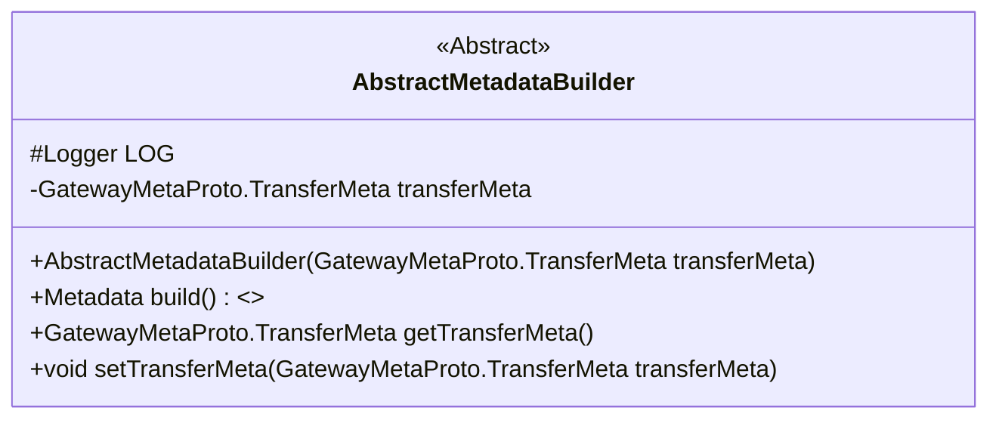
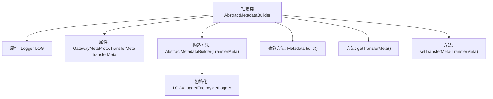

# 基础信息

|      |      |
|------|------|
| 名称 | AbstractMetadataBuilder |
| 编码语言 | .java |
| 代码路径 | WeFe/gateway/src/main/java/com/welab/wefe/gateway/interceptor/AbstractMetadataBuilder.java |
| 包名 | com.welab.wefe.gateway.interceptor |
| 依赖项 | ['com.welab.wefe.gateway.api.meta.basic.GatewayMetaProto', 'io.grpc.Metadata', 'org.slf4j.Logger', 'org.slf4j.LoggerFactory'] |
| 概述说明 | 抽象类AbstractMetadataBuilder，包含TransferMeta属性和构造方法，提供build抽象方法和TransferMeta的getter/setter。 |

# 说明

这是一个名为AbstractMetadataBuilder的抽象类，用于构建元数据。类中包含一个受保护的Logger对象用于日志记录，以及一个私有transferMeta变量存储传输元数据。构造函数接收TransferMeta对象初始化transferMeta。提供了获取和设置transferMeta的方法，并声明了一个抽象方法build用于构建元数据。该类作为基类，具体实现由子类完成。

# 类列表 Class Summary

| 名称   | 类型  | 说明 |
|-------|------|-------------|
| AbstractMetadataBuilder | class | 抽象类AbstractMetadataBuilder，包含TransferMeta属性和构造方法，提供build抽象方法和TransferMeta的getter/setter。 |

## 类 AbstractMetadataBuilder

|      |      |
|------|------|
| 访问范围 | public abstract |
| 类型 | class |
| 名称 | AbstractMetadataBuilder |
| 说明 | 抽象类AbstractMetadataBuilder，包含TransferMeta属性和构造方法，提供build抽象方法和TransferMeta的getter/setter。 |

### UML类图

这段代码定义了一个抽象类 `AbstractMetadataBuilder`，它包含一个受保护的日志记录器 `LOG` 和一个私有的 `transferMeta` 对象。该类提供了构造方法、抽象方法 `build()` 用于构建元数据，以及获取和设置 `transferMeta` 的方法。这个抽象类的主要作用是为构建元数据提供一个基础框架，具体的构建逻辑由子类实现。

### 内部方法调用关系图

这段代码描述了一个抽象类AbstractMetadataBuilder的结构，包含日志记录器初始化、传输元数据属性和相关操作方法。该类通过构造方法接收TransferMeta对象，提供getter/setter方法，并声明了抽象的build方法供子类实现。流程图清晰展示了类成员间的从属关系，特别突出了抽象方法的声明位置和日志初始化时机。

### 字段列表 Field List

| 名称  | 类型  | 说明 |
|-------|-------|------|
| LOG = LoggerFactory.getLogger(this.getClass()) | Logger | 类中定义受保护日志对象LOG，使用当前类初始化日志记录器。 |
| transferMeta | GatewayMetaProto.TransferMeta | 私有变量transferMeta，类型为GatewayMetaProto.TransferMeta。 |

### 方法列表

| 名称  | 类型  | 说明 |
|-------|-------|------|
| getTransferMeta | GatewayMetaProto.TransferMeta | 获取传输元数据的方法，返回类型为GatewayMetaProto.TransferMeta。 |
| setTransferMeta | void | 这是一个Java方法，用于设置transferMeta属性的值，参数类型为GatewayMetaProto.TransferMeta。 |
| build | Metadata | 抽象方法，用于构建并返回元数据对象。 |

