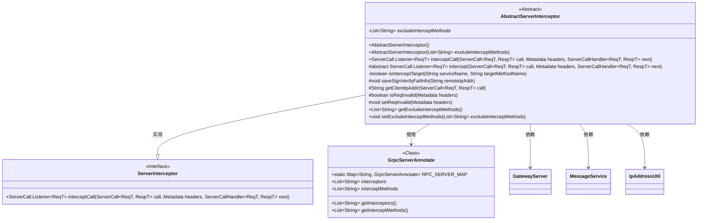
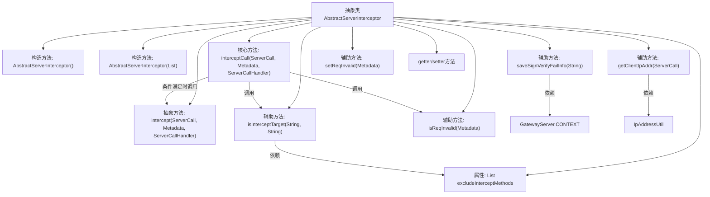

# 基础信息

|      |      |
|------|------|
| 名称 | AbstractServerInterceptor |
| 编码语言 | .java |
| 代码路径 | WeFe/gateway/src/main/java/com/welab/wefe/gateway/interceptor/AbstractServerInterceptor.java |
| 包名 | com.welab.wefe.gateway.interceptor |
| 依赖项 | ['com.welab.wefe.common.util.IpAddressUtil', 'com.welab.wefe.gateway.GatewayServer', 'com.welab.wefe.gateway.base.GrpcServerAnnotate', 'com.welab.wefe.gateway.common.GrpcConstant', 'com.welab.wefe.gateway.service.MessageService', 'io.grpc', 'org.springframework.util.CollectionUtils', 'java.net.InetSocketAddress', 'java.util.ArrayList', 'java.util.List', 'java.util.Map'] |
| 概述说明 | 抽象类AbstractServerInterceptor实现ServerInterceptor接口，提供gRPC服务拦截功能，支持排除方法拦截、请求有效性检查和客户端IP获取。子类需实现具体拦截逻辑。 |

# 说明

AbstractServerInterceptor是一个抽象类，实现了ServerInterceptor接口，用于拦截gRPC服务调用。它包含一个排除拦截方法列表excludeInterceptMethods，可通过构造器或setter方法设置。核心方法interceptCall会检查目标方法是否需要拦截，若不需要则直接进入下一步。拦截逻辑由子类实现的intercept方法完成。类还提供了验证请求有效性、设置请求无效状态、获取客户端IP地址及保存签名验证失败信息等功能。isInterceptTarget方法根据注解配置判断是否拦截目标方法，优先检查排除列表。

# 类列表 Class Summary

| 名称   | 类型  | 说明 |
|-------|------|-------------|
| AbstractServerInterceptor | class | 抽象类AbstractServerInterceptor实现ServerInterceptor接口，提供拦截器基础功能，包括排除方法列表、请求验证、客户端IP获取及拦截逻辑判断。子类需实现具体拦截方法。 |

## 类 AbstractServerInterceptor

|      |      |
|------|------|
| 访问范围 | public abstract |
| 类型 | class |
| 名称 | AbstractServerInterceptor |
| 说明 | 抽象类AbstractServerInterceptor实现ServerInterceptor接口，提供拦截器基础功能，包括排除方法列表、请求验证、客户端IP获取及拦截逻辑判断。子类需实现具体拦截方法。 |

### UML类图

这段代码展示了一个gRPC服务端拦截器的抽象实现类AbstractServerInterceptor，它实现了ServerInterceptor接口。该类通过excludeInterceptMethods管理排除拦截的方法列表，提供了请求验证、客户端IP获取、签名失败记录等核心功能。其核心方法interceptCall实现了拦截逻辑链，通过isInterceptTarget方法判断是否需要拦截当前请求，并委托给子类实现具体的intercept方法。类图中清晰展示了与GrpcServerAnnotate配置类、GatewayServer上下文等组件的依赖关系。

### 内部方法调用关系图

该流程图展示了gRPC服务端拦截器的核心结构。抽象类AbstractServerInterceptor通过interceptCall方法实现拦截逻辑，该方法会先检查目标方法和请求有效性，然后决定是否执行具体拦截操作。类中包含构造方法、核心拦截逻辑、7个辅助方法（包括签名验证、IP获取等功能）以及标准的getter/setter方法。其中isInterceptTarget方法实现了基于注解配置和白名单的双重拦截判断逻辑，体现了灵活的可配置性。整体设计采用模板方法模式，将具体拦截实现留给子类完成。

### 字段列表 Field List

| 名称  | 类型  | 说明 |
|-------|-------|------|
| excludeInterceptMethods = new ArrayList<>() | List<String> | 定义一个私有列表excludeInterceptMethods，用于存储需要排除拦截的方法名称。 |

### 方法列表

| 名称  | 类型  | 说明 |
|-------|-------|------|
| getClientIpAddr | String | 获取gRPC客户端IP地址的方法，通过ServerCall属性提取远程地址并转换为字符串。 |
| saveSignVerifyFailInfo | void | 该方法用于保存签名验证失败信息，记录客户端IP并提示禁止访问。 |
| getExcludeInterceptMethods | List<String> | 获取排除拦截的方法列表。 |
| setReqInvalid | void | 方法setReqInvalid在Metadata头中设置键值对，标记请求无效，键为GrpcConstant.INTERCEPTOR_VERIFIED_REQ_INVALID_HEADER_KEY，值为"true"。 |
| isReqInvalid | boolean | 检查请求头中标记是否为无效请求，若为"true"则返回真。 |
| intercept | ServerCall.Listener<ReqT> | 抽象方法 intercept 用于拦截服务调用，接收 ServerCall、Metadata 和 ServerCallHandler 参数，返回 ServerCall.Listener。 |
| isInterceptTarget | boolean | 方法检查目标服务和方法是否需拦截：若服务无配置或拦截器为空返回false；若方法在排除列表中返回false；若无特定拦截方法配置或方法在拦截列表中返回true。 |
| interceptCall | ServerCall.Listener<ReqT> | 重写gRPC拦截方法，检查服务名和方法名，若无需拦截或请求无效则跳过，否则执行拦截逻辑。 |
| setExcludeInterceptMethods | void | 设置不拦截的方法列表。 |

