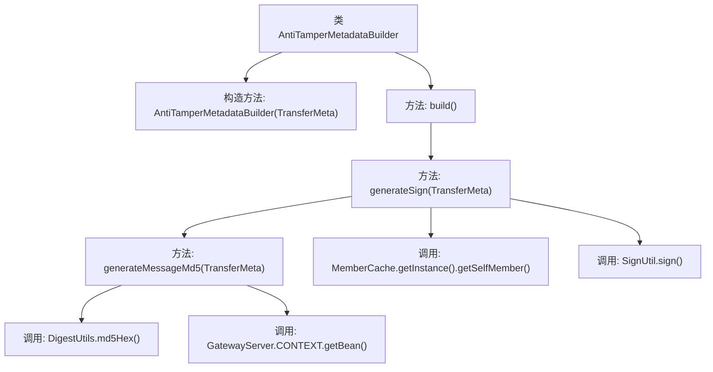
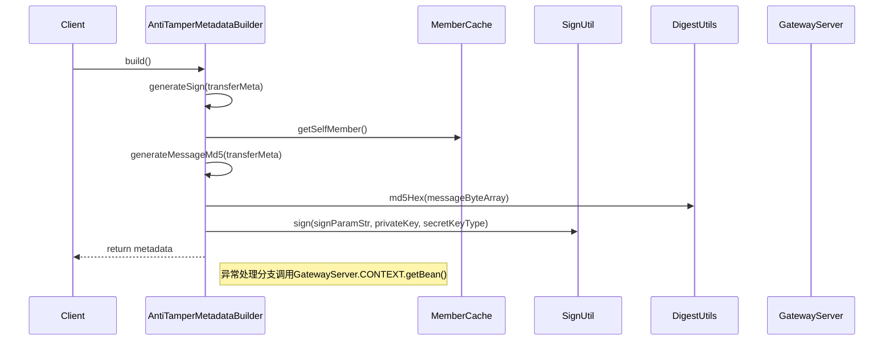

# 基础信息

|      |      |
|------|------|
| 名称 | AntiTamperMetadataBuilder |
| 编码语言 | .java |
| 代码路径 | WeFe/gateway/src/main/java/com/welab/wefe/gateway/interceptor/AntiTamperMetadataBuilder.java |
| 包名 | com.welab.wefe.gateway.interceptor |
| 依赖项 | ['com.welab.wefe.common.util.JObject', 'com.welab.wefe.common.util.SignUtil', 'com.welab.wefe.gateway.GatewayServer', 'com.welab.wefe.gateway.api.meta.basic.GatewayMetaProto', 'com.welab.wefe.gateway.cache.MemberCache', 'com.welab.wefe.gateway.common.GrpcConstant', 'com.welab.wefe.gateway.entity.MemberEntity', 'com.welab.wefe.gateway.service.MessageService', 'com.welab.wefe.gateway.util.GrpcUtil', 'io.grpc.Metadata', 'org.apache.commons.codec.digest.DigestUtils', 'java.math.BigDecimal', 'java.math.RoundingMode', 'java.util.Map', 'java.util.TreeMap'] |
| 概述说明 | AntiTamperMetadataBuilder类用于生成防篡改元数据签名。通过TransferMeta生成MD5哈希，结合成员ID和私钥创建签名，确保数据传输安全。包含异常处理和性能日志。 |

# 说明

AntiTamperMetadataBuilder类继承自AbstractMetadataBuilder，用于构建防篡改元数据。其核心功能是通过build方法创建包含数字签名的Metadata对象。generateSign方法负责生成签名，使用TreeMap存储签名参数（包括消息MD5值和成员ID），并通过私钥对参数进行签名。generateMessageMd5方法计算传输消息的MD5哈希值，记录消息大小及计算耗时。异常情况下会记录错误日志并保存错误信息。整个过程涉及消息序列化、哈希计算和数字签名生成。

# 类列表 Class Summary

| 名称   | 类型  | 说明 |
|-------|------|-------------|
| AntiTamperMetadataBuilder | class | AntiTamperMetadataBuilder类用于构建防篡改元数据，通过生成消息MD5签名确保数据完整性，包含签名参数处理和异常日志记录。 |


## 类 AntiTamperMetadataBuilder

|      |      |
|------|------|
| 访问范围 | public |
| 类型 | class |
| 名称 | AntiTamperMetadataBuilder |
| 说明 | AntiTamperMetadataBuilder类用于构建防篡改元数据，通过生成消息MD5签名确保数据完整性，包含签名参数处理和异常日志记录。 |


### UML类图

```mermaid
classDiagram
    class AbstractMetadataBuilder {
        <<Abstract>>
        +build() Metadata
    }
    
    class AntiTamperMetadataBuilder {
        +AntiTamperMetadataBuilder(GatewayMetaProto$TransferMeta transferMeta)
        +build() Metadata
        -generateSign(GatewayMetaProto$TransferMeta transferMeta) String
        -generateMessageMd5(GatewayMetaProto$TransferMeta transferMeta) String
    }
    
    class GatewayMetaProto$TransferMeta {
        <<Data Class>>
    }
    
    class Metadata {
        +put(Object key, Object value)
    }
    
    class MemberCache {
        +getInstance() MemberCache
        +getSelfMember() MemberEntity
    }
    
    class MemberEntity {
        -String id
        -String privateKey
        -String secretKeyType
        +getId() String
        +getPrivateKey() String
        +getSecretKeyType() String
    }
    
    class SignUtil {
        <<Utility>>
        +sign(String data, String privateKey, String secretKeyType) String
    }
    
    class DigestUtils {
        <<Utility>>
        +md5Hex(byte[] data) String
    }
    
    class GrpcUtil {
        <<Utility>>
        +getMessageProtobufferByte(GatewayMetaProto$TransferMeta meta) byte[]
    }
    
    class JObject {
        +create() JObject
        +create(Map~String,String~ map) JObject
        +append(String key, String value) JObject
        +toString() String
    }
    
    AbstractMetadataBuilder <|-- AntiTamperMetadataBuilder
    AntiTamperMetadataBuilder --> GatewayMetaProto$TransferMeta : 使用
    AntiTamperMetadataBuilder --> Metadata : 生成
    AntiTamperMetadataBuilder --> MemberCache : 获取成员信息
    AntiTamperMetadataBuilder --> SignUtil : 签名
    AntiTamperMetadataBuilder --> DigestUtils : MD5计算
    AntiTamperMetadataBuilder --> GrpcUtil : 字节转换
    AntiTamperMetadataBuilder --> JObject : JSON处理
    MemberCache --> MemberEntity : 返回
```

类图描述：AntiTamperMetadataBuilder继承自AbstractMetadataBuilder，用于构建防篡改元数据。它通过MemberCache获取成员信息，使用SignUtil进行签名，调用DigestUtils生成MD5值，并借助GrpcUtil和JObject处理数据传输和JSON格式转换。整个过程涉及多个工具类和实体类的协作，最终生成包含签名的Metadata对象。


### 内部方法调用关系图





流程图描述：该流程图展示了AntiTamperMetadataBuilder类的核心逻辑，从构造方法开始，通过build()方法触发签名生成流程。主要包含三个关键方法调用链：build()调用generateSign()生成签名，后者又调用generateMessageMd5()计算消息摘要。过程中涉及MemberCache获取成员信息、SignUtil进行签名计算、DigestUtils生成MD5等外部组件交互，并在异常时通过GatewayServer获取MessageService记录错误。时序图则详细描述了方法调用的先后顺序和组件间的交互过程。

### 字段列表 Field List

| 名称  | 类型  | 说明 |
|-------|-------|------|

### 方法列表

| 名称  | 类型  | 说明 |
|-------|-------|------|
| build | Metadata | 该方法重写build()，创建Metadata对象并存入Grpc请求数据哈希签名，签名由transferMeta生成后返回metadata。 |
| generateSign | String | 该方法生成交易元数据的签名：使用成员ID和消息MD5作为参数，通过私钥和密钥类型签名，返回包含签名和数据的JSON字符串。出错时记录日志并返回空字符串。 |
| generateMessageMd5 | String | 生成消息MD5值的方法：计算消息字节数组大小并转换为KB，生成MD5哈希值，记录耗时和日志。异常时保存错误信息。 |


