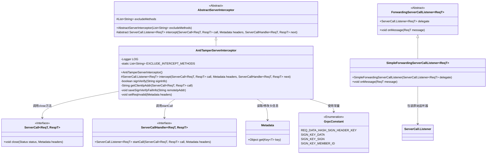
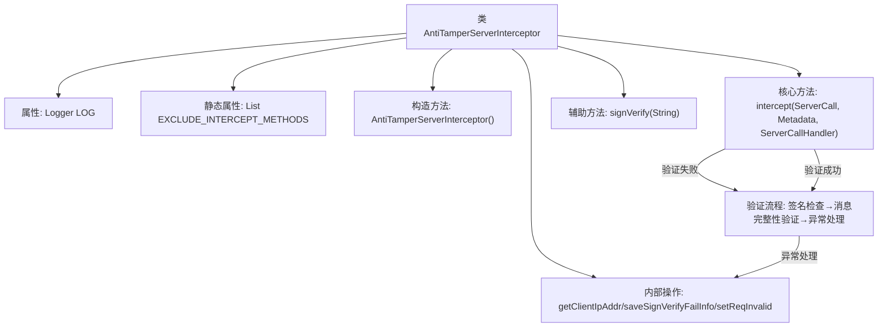
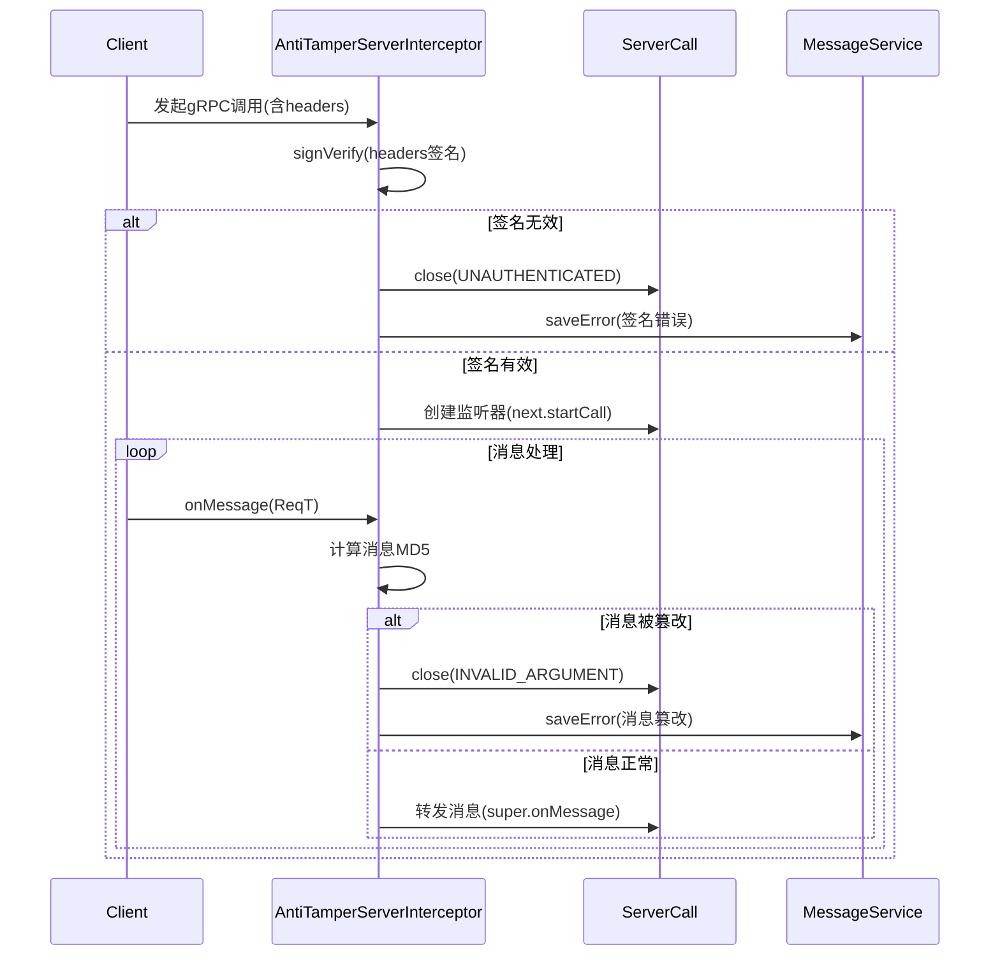

# 基础信息

|      |      |
|------|------|
| 名称 | AntiTamperServerInterceptor |
| 编码语言 | .java |
| 代码路径 | WeFe/gateway/src/main/java/com/welab/wefe/gateway/interceptor/AntiTamperServerInterceptor.java |
| 包名 | com.welab.wefe.gateway.interceptor |
| 依赖项 | ['com.welab.wefe.common.constant.SecretKeyType', 'com.welab.wefe.common.util.JObject', 'com.welab.wefe.common.util.RSAUtil', 'com.welab.wefe.common.util.SignUtil', 'com.welab.wefe.common.util.StringUtil', 'com.welab.wefe.gateway.GatewayServer', 'com.welab.wefe.gateway.api.meta.basic.GatewayMetaProto', 'com.welab.wefe.gateway.cache.MemberCache', 'com.welab.wefe.gateway.common.GrpcConstant', 'com.welab.wefe.gateway.entity.MemberEntity', 'com.welab.wefe.gateway.service.MessageService', 'com.welab.wefe.gateway.util.GrpcUtil', 'io.grpc', 'org.apache.commons.codec.digest.DigestUtils', 'org.slf4j.Logger', 'org.slf4j.LoggerFactory', 'java.math.BigDecimal', 'java.math.RoundingMode', 'java.nio.charset.StandardCharsets', 'java.util.Arrays', 'java.util.List'] |
| 概述说明 | AntiTamperServerInterceptor拦截器验证gRPC请求签名和消息完整性，排除流式方法，失败时关闭连接并记录错误。 |

# 说明

AntiTamperServerInterceptor是一个用于防止数据篡改的gRPC服务端拦截器。它通过验证客户端提交的签名信息来确保请求的完整性。拦截器会检查请求头中的签名数据，并与接收到的消息进行MD5比对。如果签名验证失败或消息被篡改，会记录错误并关闭连接。该拦截器排除了流式接口的拦截，并提供了详细的日志记录和错误处理机制。签名验证过程包括检查签名字段有效性、成员ID和公钥等信息。

# 类列表 Class Summary

| 名称   | 类型  | 说明 |
|-------|------|-------------|
| AntiTamperServerInterceptor | class | AntiTamperServerInterceptor拦截器验证gRPC请求签名和消息完整性，排除流式方法，失败时关闭连接并记录错误。 |

## 类 AntiTamperServerInterceptor

|      |      |
|------|------|
| 访问范围 | public |
| 类型 | class |
| 名称 | AntiTamperServerInterceptor |
| 说明 | AntiTamperServerInterceptor拦截器验证gRPC请求签名和消息完整性，排除流式方法，失败时关闭连接并记录错误。 |

### UML类图

这段类图展示了AntiTamperServerInterceptor的核心结构和关系。作为AbstractServerInterceptor的子类，它通过实现intercept方法实现gRPC服务端拦截逻辑，主要功能包括签名验证(SignVerify)、请求有效性检查(setReqInvalid)和异常处理。类图中清晰地呈现了与gRPC核心组件(ServerCall、ServerCallHandler)的交互，以及使用Metadata处理头信息和GrpcConstant访问常量的依赖关系。拦截器通过ForwardingServerCallListener包装原始监听器实现消息拦截，整体设计体现了责任链模式和装饰器模式的结合应用。

### 内部方法调用关系图

流程图描述：该流程图展示了AntiTamperServerInterceptor的核心处理逻辑，包含签名验证和消息防篡改双重保护机制。当gRPC请求到达时，首先进行客户端签名验证(signVerify)，失败则立即终止连接；验证通过后创建消息监听器，在消息处理阶段通过比对MD5值验证数据完整性，任何篡改尝试都会被记录并阻断请求。整个过程涉及异常处理、审计日志记录和多种验证状态的流转。

时序图描述：时序图清晰呈现了客户端与拦截器的交互过程，重点展示了签名验证阶段和消息处理阶段的两种可能路径。当签名无效时立即终止会话并记录错误；有效时进入消息监听循环，对每个消息进行篡改检测，通过MD5值比对确保数据完整性，异常情况会触发错误上报机制，正常消息则被转发至后续处理器。

### 字段列表 Field List

| 名称  | 类型  | 说明 |
|-------|-------|------|
| LOG = LoggerFactory.getLogger(SystemTimestampVerifyServerInterceptor.class) | Logger | 类SystemTimestampVerifyServerInterceptor中定义了一个私有不可变的日志记录器LOG，用于记录日志信息。 |
| EXCLUDE_INTERCEPT_METHODS = Arrays.asList("pushDataSource") | List<String> | 定义静态常量列表EXCLUDE_INTERCEPT_METHODS，包含不拦截的方法名"pushDataSource"。 |

### 方法列表

| 名称  | 类型  | 说明 |
|-------|-------|------|
| intercept | ServerCall.Listener<ReqT> | 拦截器验证客户端请求签名和消息完整性，失败则记录日志、保存错误信息并关闭连接；成功则检查消息MD5是否匹配，不匹配或异常时标记请求无效并关闭连接，否则继续处理。 |
| signVerify | boolean | 方法验证客户端签名信息。检查签名非空后解析JSON，提取数据、签名和成员ID。验证字段有效性后，通过成员公钥和密钥类型进行签名验证。失败时记录错误并返回false。 |

