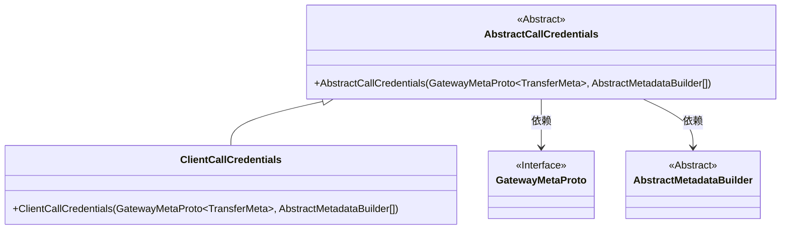
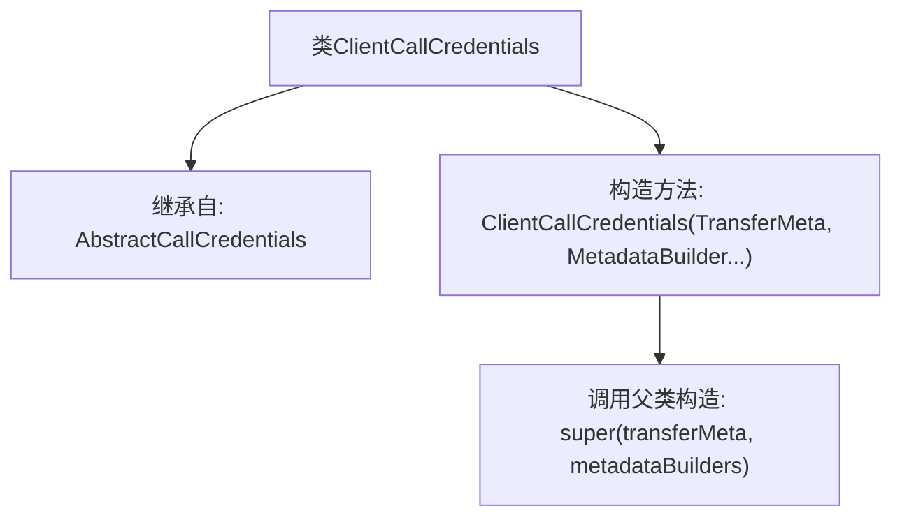

# 基础信息

|      |      |
|------|------|
| 名称 | ClientCallCredentials |
| 编码语言 | .java |
| 代码路径 | WeFe/gateway/src/main/java/com/welab/wefe/gateway/interceptor/ClientCallCredentials.java |
| 包名 | com.welab.wefe.gateway.interceptor |
| 依赖项 | ['com.welab.wefe.gateway.api.meta.basic.GatewayMetaProto'] |
| 概述说明 | ClientCallCredentials类继承AbstractCallCredentials，通过构造方法接收TransferMeta和MetadataBuilder参数。 |

# 说明

ClientCallCredentials类继承自AbstractCallCredentials，用于处理客户端调用的凭证信息。其构造函数接收GatewayMetaProto.TransferMeta类型的transferMeta参数和可变数量的AbstractMetadataBuilder数组metadataBuilders，并将这些参数传递给父类构造函数进行初始化。

# 类列表 Class Summary

| 名称   | 类型  | 说明 |
|-------|------|-------------|
| ClientCallCredentials | class | ClientCallCredentials类继承AbstractCallCredentials，通过构造方法接收TransferMeta和MetadataBuilder数组参数。 |

## 类 ClientCallCredentials

|      |      |
|------|------|
| 访问范围 | public |
| 类型 | class |
| 名称 | ClientCallCredentials |
| 说明 | ClientCallCredentials类继承AbstractCallCredentials，通过构造方法接收TransferMeta和MetadataBuilder数组参数。 |

### UML类图

该类图展示了ClientCallCredentials继承自抽象类AbstractCallCredentials的结构。AbstractCallCredentials依赖于GatewayMetaProto接口中的TransferMeta泛型类型和抽象类AbstractMetadataBuilder。ClientCallCredentials作为具体实现类，通过构造函数初始化父类属性，体现了继承与依赖关系，用于处理客户端调用凭证的元数据构建和传输。

### 内部方法调用关系图

该流程图展示了ClientCallCredentials类的结构，它是一个继承自AbstractCallCredentials的子类。主要包含一个构造方法，该方法接收TransferMeta对象和可变参数的MetadataBuilder数组，并在内部调用父类的构造方法进行初始化。类关系清晰体现了继承层次和构造方法的参数传递逻辑。

### 字段列表 Field List

| 名称  | 类型  | 说明 |
|-------|-------|------|

### 方法列表

| 名称  | 类型  | 说明 |
|-------|-------|------|

