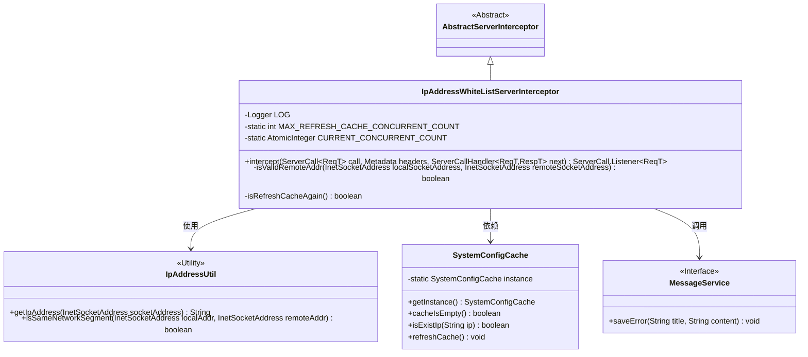
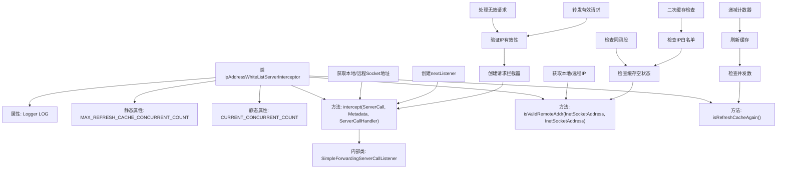
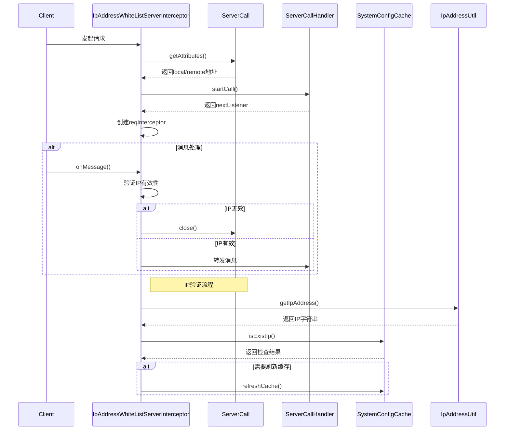

# 基础信息

|      |      |
|------|------|
| 名称 | IpAddressWhiteListServerInterceptor |
| 编码语言 | .java |
| 代码路径 | WeFe/gateway/src/main/java/com/welab/wefe/gateway/interceptor/IpAddressWhiteListServerInterceptor.java |
| 包名 | com.welab.wefe.gateway.interceptor |
| 依赖项 | ['com.welab.wefe.common.util.IpAddressUtil', 'com.welab.wefe.common.wefe.enums.GatewayProcessorType', 'com.welab.wefe.gateway.GatewayServer', 'com.welab.wefe.gateway.api.meta.basic.GatewayMetaProto', 'com.welab.wefe.gateway.cache.SystemConfigCache', 'com.welab.wefe.gateway.service.MessageService', 'io.grpc', 'org.slf4j.Logger', 'org.slf4j.LoggerFactory', 'java.net.InetSocketAddress', 'java.util.concurrent.atomic.AtomicInteger'] |
| 概述说明 | IpAddressWhiteListServerInterceptor拦截器用于检查客户端IP是否在白名单内，若不在则拒绝访问，支持缓存刷新和并发控制。 |

# 说明

IpAddressWhiteListServerInterceptor是一个基于gRPC的服务端拦截器，用于实现IP白名单访问控制。核心功能包括：通过拦截请求消息验证客户端IP是否合法，支持本地同网段访问和配置白名单两种模式。当白名单未配置时，默认仅允许同网段访问；若IP不在白名单且未达最大并发刷新数(3次)，会自动刷新缓存再次检查。拦截过程中会记录非法访问日志和异常信息，并通过MessageService保存错误记录。对于非法请求会返回PERMISSION_DENIED状态并关闭连接，同时处理了缓存刷新时的并发控制。

# 类列表 Class Summary

| 名称   | 类型  | 说明 |
|-------|------|-------------|
| IpAddressWhiteListServerInterceptor | class | Java类IpAddressWhiteListServerInterceptor实现gRPC服务端拦截器，检查客户端IP是否在白名单或同网段，否则拒绝访问。支持缓存刷新，最大并发数3。 |

## 类 IpAddressWhiteListServerInterceptor

|      |      |
|------|------|
| 访问范围 | public |
| 类型 | class |
| 名称 | IpAddressWhiteListServerInterceptor |
| 说明 | Java类IpAddressWhiteListServerInterceptor实现gRPC服务端拦截器，检查客户端IP是否在白名单或同网段，否则拒绝访问。支持缓存刷新，最大并发数3。 |

### UML类图

这段代码实现了一个基于gRPC的IP白名单拦截器，主要功能包括：1) 通过拦截器模式验证客户端IP是否在白名单内；2) 使用SystemConfigCache管理白名单配置；3) 实现缓存刷新限流机制；4) 通过MessageService记录异常日志。核心逻辑在isValidRemoteAddr方法中，会检查客户端IP是否与服务端同网段或存在于白名单缓存中，若未命中则触发缓存刷新重试机制。类图清晰展示了继承关系和关键依赖组件。

### 内部方法调用关系图

该流程图展示了IP白名单拦截器的核心逻辑，主要包含三个关键方法：intercept()处理gRPC调用拦截，isValidRemoteAddr()验证IP合法性，isRefreshCacheAgain()控制缓存刷新频率。时序图则详细描述了从客户端请求到IP验证的完整交互过程，重点突出了IP白名单检查的决策流程和异常处理机制。整个设计通过双重缓存检查机制确保在高并发场景下的稳定性，同时严格遵循白名单访问控制策略。

### 字段列表 Field List

| 名称  | 类型  | 说明 |
|-------|-------|------|
| CURRENT_CONCURRENT_COUNT = new AtomicInteger(0) | AtomicInteger | 定义一个静态原子整型变量CURRENT_CONCURRENT_COUNT，初始值为0，用于线程安全的并发计数。 |
| MAX_REFRESH_CACHE_CONCURRENT_COUNT = 3 | int | 静态常量MAX_REFRESH_CACHE_CONCURRENT_COUNT值为3，限制缓存刷新的最大并发数。 |
| LOG = LoggerFactory.getLogger(IpAddressWhiteListServerInterceptor.class) | Logger | 类IpAddressWhiteListServerInterceptor中定义了一个私有不可变的日志记录器LOG。 |

### 方法列表

| 名称  | 类型  | 说明 |
|-------|-------|------|
| isValidRemoteAddr | boolean | 检查客户端IP是否合法：未设白名单时需同网段；若同服务器IP则允许；否则检查白名单，不在则拒绝并记录错误。 |
| intercept | ServerCall.Listener<ReqT> | 该方法拦截gRPC请求，验证客户端IP是否合法。若IP非法或出现异常，记录日志并关闭连接；否则继续处理请求。 |
| isRefreshCacheAgain | boolean | 方法检查当前并发刷新缓存请求数是否未超限。未超限则刷新缓存并返回成功，否则记录日志并返回失败。 |

