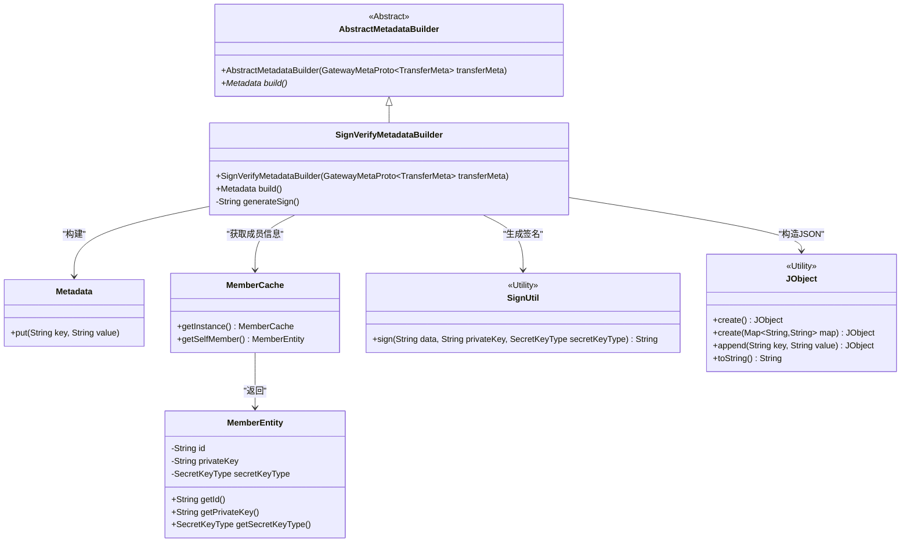
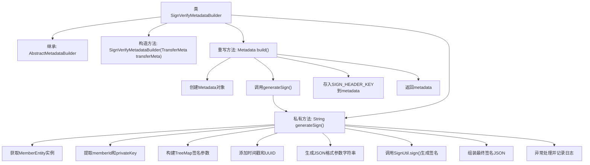

# 基础信息

|      |      |
|------|------|
| 名称 | SignVerifyMetadataBuilder |
| 编码语言 | .java |
| 代码路径 | WeFe/gateway/src/main/java/com/welab/wefe/gateway/interceptor/SignVerifyMetadataBuilder.java |
| 包名 | com.welab.wefe.gateway.interceptor |
| 依赖项 | ['com.welab.wefe.common.constant.SecretKeyType', 'com.welab.wefe.common.util.JObject', 'com.welab.wefe.common.util.SignUtil', 'com.welab.wefe.gateway.api.meta.basic.GatewayMetaProto', 'com.welab.wefe.gateway.cache.MemberCache', 'com.welab.wefe.gateway.common.GrpcConstant', 'com.welab.wefe.gateway.entity.MemberEntity', 'io.grpc.Metadata', 'java.util.Map', 'java.util.TreeMap', 'java.util.UUID'] |
| 概述说明 | SignVerifyMetadataBuilder类继承AbstractMetadataBuilder，通过成员私钥生成签名并构建包含签名的Metadata对象。 |

# 说明

SignVerifyMetadataBuilder是一个继承自AbstractMetadataBuilder的类，用于构建包含签名的元数据。其核心方法build()会生成一个Metadata对象，其中包含通过generateSign()方法创建的签名。generateSign()方法使用成员实体的私钥和当前时间戳、UUID等参数生成签名，并通过SignUtil.sign进行签名计算。若签名失败，会记录错误日志并返回空字符串。

# 类列表 Class Summary

| 名称   | 类型  | 说明 |
|-------|------|-------------|
| SignVerifyMetadataBuilder | class | SignVerifyMetadataBuilder类继承AbstractMetadataBuilder，用于构建包含签名的元数据。通过成员私钥生成签名，包含成员ID、时间戳和UUID，最终返回签名和数据的JSON字符串。 |

## 类 SignVerifyMetadataBuilder

|      |      |
|------|------|
| 访问范围 | public |
| 类型 | class |
| 名称 | SignVerifyMetadataBuilder |
| 说明 | SignVerifyMetadataBuilder类继承AbstractMetadataBuilder，用于构建包含签名的元数据。通过成员私钥生成签名，包含成员ID、时间戳和UUID，最终返回签名和数据的JSON字符串。 |

### UML类图

该类图展示了签名验证元数据构建器的核心结构。SignVerifyMetadataBuilder继承自抽象基类AbstractMetadataBuilder，通过MemberCache获取当前成员信息，使用SignUtil进行签名计算，并借助JObject构建JSON格式的签名数据。整个流程最终生成包含签名信息的Metadata对象，用于gRPC通信的安全验证。

### 内部方法调用关系图

该流程图展示了签名验证元数据构建器的完整工作流程。类继承自AbstractMetadataBuilder，核心是通过build()方法创建包含数字签名的Metadata对象。签名生成过程涉及获取成员信息、构建有序参数映射、添加时间戳和随机数、使用私钥加密等步骤，最终将签名和原始数据封装为JSON格式。异常情况下会记录错误日志并返回空字符串，保证系统容错性。

### 字段列表 Field List

| 名称  | 类型  | 说明 |
|-------|-------|------|

### 方法列表

| 名称  | 类型  | 说明 |
|-------|-------|------|
| generateSign | String | 生成签名方法：获取成员ID和私钥，组合时间戳和UUID参数，使用私钥签名后返回签名及参数。异常时记录错误并返回空。 |
| build | Metadata | 该方法构建Metadata对象，添加签名头信息后返回。签名由generateSign()生成，键为GrpcConstant.SIGN_HEADER_KEY。 |

