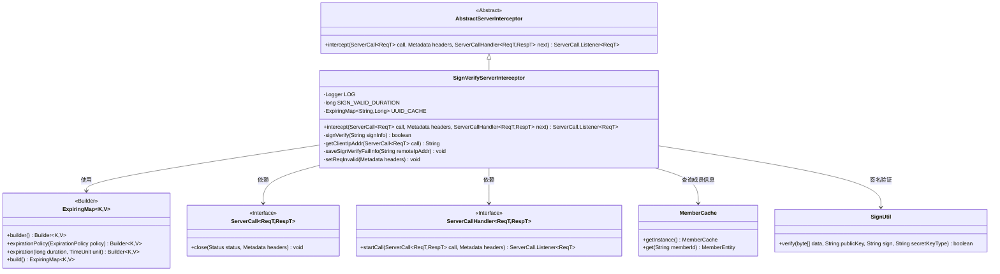
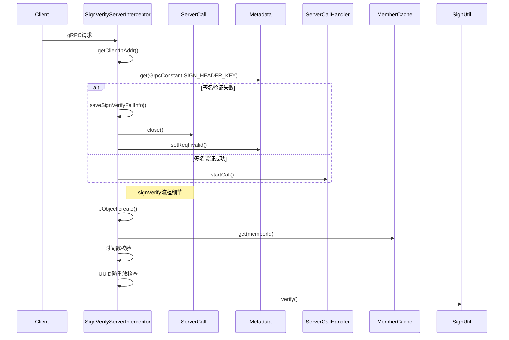

# 基础信息

|      |      |
|------|------|
| 名称 | SignVerifyServerInterceptor |
| 编码语言 | .java |
| 代码路径 | WeFe/gateway/src/main/java/com/welab/wefe/gateway/interceptor/SignVerifyServerInterceptor.java |
| 包名 | com.welab.wefe.gateway.interceptor |
| 依赖项 | ['com.welab.wefe.common.util.JObject', 'com.welab.wefe.common.util.SignUtil', 'com.welab.wefe.common.util.StringUtil', 'com.welab.wefe.gateway.cache.MemberCache', 'com.welab.wefe.gateway.common.GrpcConstant', 'com.welab.wefe.gateway.entity.MemberEntity', 'io.grpc.Metadata', 'io.grpc.ServerCall', 'io.grpc.ServerCallHandler', 'io.grpc.Status', 'net.jodah.expiringmap.ExpirationPolicy', 'net.jodah.expiringmap.ExpiringMap', 'org.apache.commons.lang3.math.NumberUtils', 'org.slf4j.Logger', 'org.slf4j.LoggerFactory', 'java.nio.charset.StandardCharsets', 'java.util.concurrent.TimeUnit'] |
| 概述说明 | SignVerifyServerInterceptor是gRPC服务端拦截器，用于验证客户端签名。检查签名有效期5分钟，防重放攻击，验证失败则关闭连接。 |

# 说明

SignVerifyServerInterceptor是一个gRPC服务端拦截器，用于验证客户端请求签名。它检查签名信息是否有效，包含成员ID、时间戳和UUID，并设置5分钟有效期。使用ExpiringMap缓存防止重放攻击。验证失败时记录日志并关闭连接。签名验证过程包括检查字段完整性、成员有效性、时间戳时效性和UUID唯一性，最后使用成员公钥进行签名验证。

# 类列表 Class Summary

| 名称   | 类型  | 说明 |
|-------|------|-------------|
| SignVerifyServerInterceptor | class | SignVerifyServerInterceptor是gRPC服务端拦截器，用于验证客户端签名，防止重放攻击，签名有效期5分钟，失败则关闭连接。 |


## 类 SignVerifyServerInterceptor

|      |      |
|------|------|
| 访问范围 | public |
| 类型 | class |
| 名称 | SignVerifyServerInterceptor |
| 说明 | SignVerifyServerInterceptor是gRPC服务端拦截器，用于验证客户端签名，防止重放攻击，签名有效期5分钟，失败则关闭连接。 |


### UML类图



该图展示了SignVerifyServerInterceptor的类结构及其关键依赖关系。作为AbstractServerInterceptor的子类，它通过UUID缓存和签名验证机制实现gRPC请求的鉴权拦截。核心功能包括：1) 通过ExpiringMap防止重放攻击；2) 依赖MemberCache获取成员信息；3) 使用SignUtil进行签名验证；4) 实现ServerCall接口的请求拦截逻辑。所有验证失败会记录日志并关闭连接，严格遵循5分钟有效期和防重放机制。


### 内部方法调用关系图

```mermaid
graph TD
    A["SignVerifyServerInterceptor类"]
    B["属性: Logger LOG"]
    C["属性: long SIGN_VALID_DURATION"]
    D["属性: ExpiringMap<String, Long> UUID_CACHE"]
    E["方法: intercept(ServerCall<ReqT, RespT>, Metadata, ServerCallHandler<ReqT, RespT>)"]
    F["方法: signVerify(String)"]
    G["方法: getClientIpAddr(ServerCall)"]
    H["方法: saveSignVerifyFailInfo(String)"]
    I["方法: setReqInvalid(Metadata)"]

    A --> B
    A --> C
    A --> D
    A --> E
    A --> F
    E --> G
    E --> H
    E --> I
    E --> F
    F -->|调用| MemberCache.getInstance()
    F -->|调用| SignUtil.verify()
```



该流程图展示了SignVerifyServerInterceptor的核心结构和调用关系，包含签名验证拦截器和防重放攻击机制。时序图详细描述了从接收gRPC请求到完成签名验证的全过程，包括客户端IP获取、签名头提取、多重验证步骤（JSON解析、会员缓存查询、时间戳校验、UUID防重放）以及最终的数字签名验证。整个流程严格遵循5分钟有效期限制，确保通信安全性和时效性。

### 字段列表 Field List

| 名称  | 类型  | 说明 |
|-------|-------|------|
| SIGN_VALID_DURATION = 5 | long | 定义签名有效时长为5秒的静态常量。 |
| LOG = LoggerFactory.getLogger(SignVerifyServerInterceptor.class) | Logger | 类SignVerifyServerInterceptor中定义了一个私有静态日志对象LOG，用于记录日志信息。 |
| UUID_CACHE = ExpiringMap            .builder()            .expirationPolicy(ExpirationPolicy.ACCESSED)            .expiration(SIGN_VALID_DURATION + 1, TimeUnit.MINUTES)            .build() | ExpiringMap<String, Long> | 创建基于访问时间的缓存，存储字符串和长整型键值对，过期时间为SIGN_VALID_DURATION加1分钟。 |

### 方法列表

| 名称  | 类型  | 说明 |
|-------|-------|------|
| signVerify | boolean | 验证客户端签名信息的方法。检查签名是否存在、格式正确、字段有效、会员ID有效、时间戳未过期、无重复提交，最后使用公钥验证签名。任一条件不满足即返回失败。 |
| intercept | ServerCall.Listener<ReqT> | 这是一个gRPC服务器拦截器方法，用于验证客户端签名。若验证失败，记录日志、保存失败信息并关闭连接；验证通过则继续处理请求。 |


