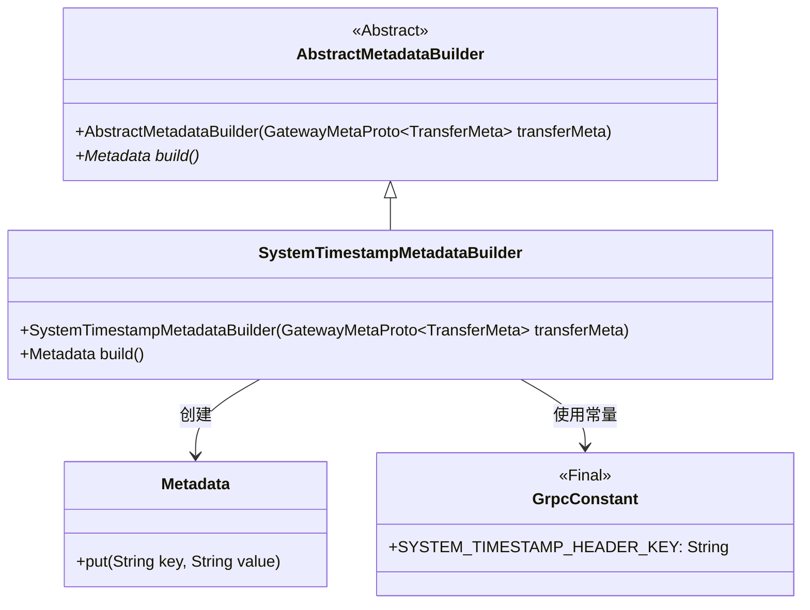
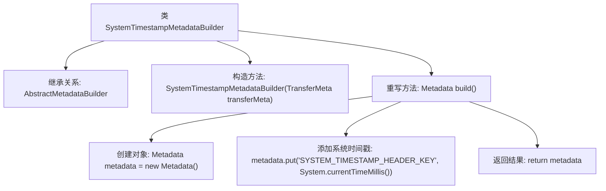

# 基础信息

|      |      |
|------|------|
| 名称 | SystemTimestampMetadataBuilder |
| 编码语言 | .java |
| 代码路径 | WeFe/gateway/src/main/java/com/welab/wefe/gateway/interceptor/SystemTimestampMetadataBuilder.java |
| 包名 | com.welab.wefe.gateway.interceptor |
| 依赖项 | ['com.welab.wefe.gateway.api.meta.basic.GatewayMetaProto', 'com.welab.wefe.gateway.common.GrpcConstant', 'io.grpc.Metadata'] |
| 概述说明 | SystemTimestampMetadataBuilder类继承AbstractMetadataBuilder，通过build方法生成包含系统时间戳的Metadata对象。 |

# 说明

SystemTimestampMetadataBuilder类继承自AbstractMetadataBuilder，用于构建包含系统时间戳的元数据。构造函数接收GatewayMetaProto.TransferMeta对象并调用父类构造方法。build方法创建Metadata实例，将当前系统时间戳以字符串形式存入，键为GrpcConstant.SYSTEM_TIMESTAMP_HEADER_KEY，最后返回该元数据对象。

# 类列表 Class Summary

| 名称   | 类型  | 说明 |
|-------|------|-------------|
| SystemTimestampMetadataBuilder | class | SystemTimestampMetadataBuilder类继承AbstractMetadataBuilder，通过build方法创建包含系统时间戳的Metadata对象。 |

## 类 SystemTimestampMetadataBuilder

|      |      |
|------|------|
| 访问范围 | public |
| 类型 | class |
| 名称 | SystemTimestampMetadataBuilder |
| 说明 | SystemTimestampMetadataBuilder类继承AbstractMetadataBuilder，通过build方法创建包含系统时间戳的Metadata对象。 |

### UML类图

类图描述：SystemTimestampMetadataBuilder继承自抽象类AbstractMetadataBuilder，实现了build()方法用于创建包含系统时间戳的Metadata对象。它依赖GrpcConstant获取常量键名，并通过Metadata的put方法存储时间戳数据。该设计实现了将系统时间作为元数据的功能扩展，符合建造者模式规范。

### 内部方法调用关系图

该流程图描述了SystemTimestampMetadataBuilder类的结构和工作流程。该类继承自AbstractMetadataBuilder，主要功能是通过build()方法创建包含系统时间戳的Metadata对象。流程从构造方法开始，核心是重写的build()方法，该方法创建Metadata实例后，将当前时间戳以字符串形式存入指定键值，最后返回构建好的metadata对象。整个过程简洁高效，实现了元数据构建的标准化处理。

### 字段列表 Field List

| 名称  | 类型  | 说明 |
|-------|-------|------|

### 方法列表

| 名称  | 类型  | 说明 |
|-------|-------|------|
| build | Metadata | 该方法创建Metadata对象，存入当前系统时间戳并返回。 |

