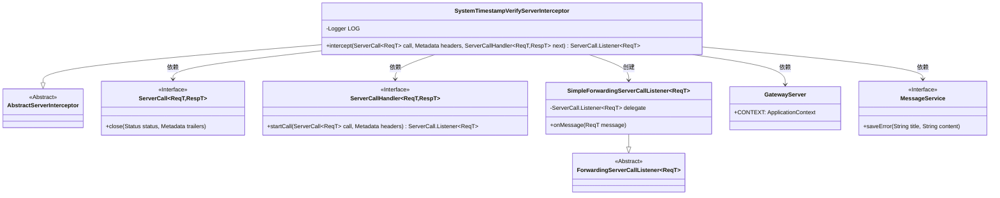
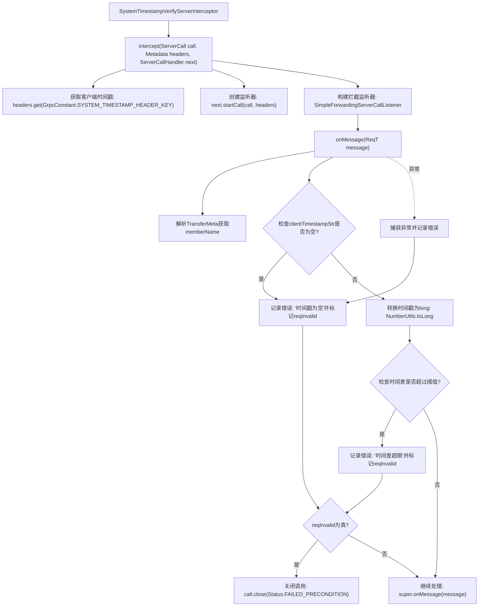

# 基础信息

|      |      |
|------|------|
| 名称 | SystemTimestampVerifyServerInterceptor |
| 编码语言 | .java |
| 代码路径 | WeFe/gateway/src/main/java/com/welab/wefe/gateway/interceptor/SystemTimestampVerifyServerInterceptor.java |
| 包名 | com.welab.wefe.gateway.interceptor |
| 依赖项 | ['com.welab.wefe.common.util.DateUtil', 'com.welab.wefe.common.util.StringUtil', 'com.welab.wefe.gateway.GatewayServer', 'com.welab.wefe.gateway.api.meta.basic.GatewayMetaProto', 'com.welab.wefe.gateway.common.GrpcConstant', 'com.welab.wefe.gateway.service.MessageService', 'io.grpc', 'org.apache.commons.lang3.math.NumberUtils', 'org.slf4j.Logger', 'org.slf4j.LoggerFactory', 'java.util.Date'] |
| 概述说明 | 这是一个gRPC服务端拦截器，用于验证客户端请求的时间戳是否有效。检查时间戳是否为空或与服务器时间差超过阈值，若无效则拒绝请求并记录错误日志。 |

# 说明

SystemTimestampVerifyServerInterceptor是一个gRPC服务端拦截器，用于验证客户端请求中的系统时间戳。它检查请求头中的时间戳是否为空，并比较客户端与服务器时间差是否超过预设最大值（GrpcConstant.MAX_SYSTEM_TIMESTAMP_DIFF）。若验证失败，会记录错误日志并通过MessageService保存错误信息，然后返回FAILED_PRECONDITION状态。该拦截器特别处理了通过nginx转发时可能存在的请求头下划线问题。

# 类列表 Class Summary

| 名称   | 类型  | 说明 |
|-------|------|-------------|
| SystemTimestampVerifyServerInterceptor | class | 这是一个gRPC服务端拦截器，用于验证客户端提交的时间戳是否有效。检查时间戳是否为空或与服务器时间差超过阈值，若无效则拒绝请求并记录错误。 |

## 类 SystemTimestampVerifyServerInterceptor

|      |      |
|------|------|
| 访问范围 | public |
| 类型 | class |
| 名称 | SystemTimestampVerifyServerInterceptor |
| 说明 | 这是一个gRPC服务端拦截器，用于验证客户端提交的时间戳是否有效。检查时间戳是否为空或与服务器时间差超过阈值，若无效则拒绝请求并记录错误。 |

### UML类图

类图描述：该图展示了SystemTimestampVerifyServerInterceptor类的继承关系和依赖关系。它继承自AbstractServerInterceptor，实现了gRPC服务端拦截器功能，主要验证客户端提交的时间戳有效性。依赖ServerCall和ServerCallHandler接口处理gRPC调用，使用SimpleForwardingServerCallListener拦截请求消息，并通过GatewayServer和MessageService记录错误信息。核心逻辑在intercept方法中实现时间戳校验和异常处理。

### 内部方法调用关系图

这段代码实现了一个gRPC服务端拦截器，用于验证客户端请求中的系统时间戳是否合法。主要流程包括：获取客户端时间戳头信息，创建消息监听器，在消息到达时检查时间戳是否为空或与服务器时间差超过阈值（通过GrpcConstant.MAX_SYSTEM_TIMESTAMP_DIFF配置），若验证失败则记录错误信息并终止请求，否则继续后续处理。整个过程包含异常捕获和多种错误场景处理，确保系统时间同步的安全性。

### 字段列表 Field List

| 名称  | 类型  | 说明 |
|-------|-------|------|
| LOG = LoggerFactory.getLogger(SystemTimestampVerifyServerInterceptor.class) | Logger | 类SystemTimestampVerifyServerInterceptor中定义了一个私有静态日志对象LOG，用于记录日志。 |

### 方法列表

| 名称  | 类型  | 说明 |
|-------|-------|------|
| intercept | ServerCall.Listener<ReqT> | gRPC拦截器验证客户端时间戳，检查是否为空或与服务器时间差超限，若无效则拒绝请求并记录错误。 |

