# 基础信息

|      |      |
|------|------|
| 名称 | interceptor |
| 编码语言 | .java |
| 代码路径 | WeFe/gateway/src/main/java/com/welab/wefe/gateway/interceptor |
| 包名 | docs.gateway.src.main.java.com.welab.wefe.gateway.interceptor |
| 概述说明 | SystemTimestampMetadataBuilder构建带时间戳的元数据。AntiTamperServerInterceptor验证签名防篡改。SignVerifyServerInterceptor检查签名有效性。SignVerifyMetadataBuilder生成签名元数据。AbstractServerInterceptor提供拦截基础功能。AbstractCallCredentials处理凭证逻辑。ClientCallCredentials初始化客户端凭证。AbstractMetadataBuilder为元数据构建基类。SystemTimestampVerifyServerInterceptor验证时间戳。AntiTamperMetadataBuilder生成防篡改签名。IpAddressWhiteListServerInterceptor实现IP白名单控制。 |

# 说明

## 概述  
该模块是gRPC网关的安全拦截系统，核心职责为构建安全元数据并验证请求合法性，类似API网关的鉴权中心。接口规范包含三类：元数据构建器（如SystemTimestampMetadataBuilder）、凭证处理器（如AbstractCallCredentials）和服务端拦截器（如AntiTamperServerInterceptor）。关键数据结构包括TransferMeta传输元数据、Metadata头部键值对和ExpiringMap防重放缓存。外部依赖涉及gRPC框架、MD5哈希计算和JWT签名工具。例如AntiTamperMetadataBuilder使用TreeMap排序签名参数，SignVerifyServerInterceptor通过ExpiringMap缓存UUID。

## 主要业务场景  
典型流程为客户端通过CallCredentials添加签名/时间戳元数据，服务端拦截器链依次验证IP白名单、时间戳偏差（例如允许±5分钟）、签名有效性和防篡改MD5。交互模式采用链式处理，类似Servlet过滤器。完整功能覆盖请求准入（IpAddressWhiteListServerInterceptor）、防重放（SignVerifyServerInterceptor）和消息完整性（AntiTamperServerInterceptor）。典型应用包括API调用鉴权，例如SystemTimestampVerifyServerInterceptor处理Nginx转发时的下划线头部问题。API类型涵盖一元RPC和流式接口（排除拦截场景）。

### 包内部结构视图

```mermaid
graph TD
    interceptor --> SystemTimestampMetadataBuilder.java
    interceptor --> AntiTamperServerInterceptor.java
    interceptor --> SignVerifyServerInterceptor.java
    interceptor --> SignVerifyMetadataBuilder.java
    interceptor --> AbstractServerInterceptor.java
    interceptor --> AbstractCallCredentials.java
    interceptor --> ClientCallCredentials.java
    interceptor --> AbstractMetadataBuilder.java
    interceptor --> SystemTimestampVerifyServerInterceptor.java
    interceptor --> AntiTamperMetadataBuilder.java
    interceptor --> IpAddressWhiteListServerInterceptor.java
```

该流程图展示了WeFe网关项目中拦截器模块的文件结构，所有文件均直接位于interceptor目录下。这些文件包括多种拦截器实现类（如AntiTamperServerInterceptor）、元数据构建器（如SignVerifyMetadataBuilder）和凭证抽象类（如AbstractCallCredentials），共同构成了网关的请求拦截处理体系，用于实现签名验证、防篡改、IP白名单等安全功能。

# 文件列表

| 名称   | 类型  | 说明 |
|-------|------|-------------|
| [SystemTimestampMetadataBuilder.java](SystemTimestampMetadataBuilder.md) | file | SystemTimestampMetadataBuilder类继承AbstractMetadataBuilder，通过build方法生成包含系统时间戳的Metadata对象。 |
| [AntiTamperServerInterceptor.java](AntiTamperServerInterceptor.md) | file | AntiTamperServerInterceptor拦截器验证gRPC请求签名和消息完整性，排除流式方法，失败时关闭连接并记录错误。 |
| [SignVerifyServerInterceptor.java](SignVerifyServerInterceptor.md) | file | SignVerifyServerInterceptor是gRPC服务端拦截器，用于验证客户端签名。检查签名有效期5分钟，防重放攻击，验证失败则关闭连接。 |
| [SignVerifyMetadataBuilder.java](SignVerifyMetadataBuilder.md) | file | SignVerifyMetadataBuilder类继承AbstractMetadataBuilder，通过成员私钥生成签名并构建包含签名的Metadata对象。 |
| [AbstractServerInterceptor.java](AbstractServerInterceptor.md) | file | 抽象类AbstractServerInterceptor实现ServerInterceptor接口，提供gRPC服务拦截功能，支持排除方法拦截、请求有效性检查和客户端IP获取。子类需实现具体拦截逻辑。 |
| [AbstractCallCredentials.java](AbstractCallCredentials.md) | file | 抽象类AbstractCallCredentials继承CallCredentials，包含传输元数据和元数据构建器列表，提供请求元数据应用方法。 |
| [ClientCallCredentials.java](ClientCallCredentials.md) | file | ClientCallCredentials类继承AbstractCallCredentials，通过构造方法接收TransferMeta和MetadataBuilder参数。 |
| [AbstractMetadataBuilder.java](AbstractMetadataBuilder.md) | file | 抽象类AbstractMetadataBuilder，包含TransferMeta属性和构造方法，提供build抽象方法和TransferMeta的getter/setter。 |
| [SystemTimestampVerifyServerInterceptor.java](SystemTimestampVerifyServerInterceptor.md) | file | 这是一个gRPC服务端拦截器，用于验证客户端请求的时间戳是否有效。检查时间戳是否为空或与服务器时间差超过阈值，若无效则拒绝请求并记录错误日志。 |
| [AntiTamperMetadataBuilder.java](AntiTamperMetadataBuilder.md) | file | AntiTamperMetadataBuilder类用于生成防篡改元数据签名。通过TransferMeta生成MD5哈希，结合成员ID和私钥创建签名，确保数据传输安全。包含异常处理和性能日志。 |
| [IpAddressWhiteListServerInterceptor.java](IpAddressWhiteListServerInterceptor.md) | file | IpAddressWhiteListServerInterceptor拦截器用于检查客户端IP是否在白名单内，若不在则拒绝访问，支持缓存刷新和并发控制。 |

