# 基础信息

|      |      |
|------|------|
| 名称 | InitListener |
| 编码语言 | .java |
| 代码路径 | WeFe/gateway/src/main/java/com/welab/wefe/gateway/listener/InitListener.java |
| 包名 | com.welab.wefe.gateway.listener |
| 依赖项 | ['com.welab.wefe.gateway.cache.CaCertificateCache', 'com.welab.wefe.gateway.cache.PartnerConfigCache', 'com.welab.wefe.gateway.init', 'com.welab.wefe.gateway.init.grpc.GrpcServerContext', 'org.slf4j.Logger', 'org.slf4j.LoggerFactory', 'org.springframework.boot.context.event.ApplicationStartedEvent', 'org.springframework.context.ApplicationListener', 'org.springframework.stereotype.Component'] |
| 概述说明 | InitListener监听应用启动事件，初始化存储服务，加载各类数据到缓存，启动gRPC服务和消息转发任务。失败时系统退出。 |

# 说明

该代码定义了一个Spring组件InitListener，用于监听应用启动事件。在应用启动时，它会执行一系列初始化操作：初始化存储服务，加载会员信息、IP白名单、接收数据、待转发元数据、会员黑名单、合作伙伴配置和CA证书到缓存。同时启动gRPC服务，若失败则系统退出。还会启动转发消息任务。加载系统配置失败时也会强制退出。所有操作均通过日志记录关键状态。

# 类列表 Class Summary

| 名称   | 类型  | 说明 |
|-------|------|-------------|
| InitListener | class | InitListener监听应用启动事件，初始化存储服务、加载各类数据到缓存（成员、IP白名单、转发元数据等），启动gRPC服务和消息转发任务，失败则系统退出。 |

## 类 InitListener

|      |      |
|------|------|
| 访问范围 | @Component;public |
| 类型 | class |
| 名称 | InitListener |
| 说明 | InitListener监听应用启动事件，初始化存储服务、加载各类数据到缓存（成员、IP白名单、转发元数据等），启动gRPC服务和消息转发任务，失败则系统退出。 |

### UML类图

```mermaid
classDiagram
    class InitListener {
        -Logger LOG
        +onApplicationEvent(ApplicationStartedEvent event) void
        -startGrpcServer() void
        -loadSystemConfigInfo() void
    }
    class ApplicationStartedEvent
    class InitStorageManager {
        +init() void
    }
    class LoadMemberToCache {
        +load() void
    }
    class LoadSystemConfigToCache {
        +load() boolean
    }
    class LoadRecvTransferMateToCache {
        +load() void
    }
    class LoadSendTransferMetaToCache {
        +load() void
    }
    class LoadMemberBlacklistToCache {
        +load() void
    }
    class PartnerConfigCache {
        +getInstance() PartnerConfigCache
        +refreshCache() void
    }
    class CaCertificateCache {
        +getInstance() CaCertificateCache
        +refreshCache() void
    }
    class GrpcServerContext {
        +getInstance() GrpcServerContext
        +start() boolean
    }
    class SendTransferMetaCacheTask {
        +start() void
    }

    InitListener --> ApplicationStartedEvent : 监听
    InitListener --> InitStorageManager : 调用初始化
    InitListener --> LoadMemberToCache : 加载成员信息
    InitListener --> LoadSystemConfigToCache : 加载系统配置
    InitListener --> LoadRecvTransferMateToCache : 加载接收数据
    InitListener --> LoadSendTransferMetaToCache : 加载转发元数据
    InitListener --> LoadMemberBlacklistToCache : 加载黑名单
    InitListener --> PartnerConfigCache : 刷新合作伙伴配置
    InitListener --> CaCertificateCache : 刷新CA证书
    InitListener --> GrpcServerContext : 启动gRPC服务
    InitListener --> SendTransferMetaCacheTask : 启动转发任务
```

这段代码展示了一个Spring Boot应用启动监听器`InitListener`，它在应用启动时执行一系列初始化操作。类图清晰地呈现了监听器与各组件间的调用关系，包括存储初始化、缓存加载（成员信息、系统配置、接收/转发数据、黑名单等）、gRPC服务启动和消息转发任务触发。所有操作通过依赖注入和单例模式协作完成系统预热，若关键步骤失败会强制终止应用。

### 内部方法调用关系图

流程图描述：该流程图展示了InitListener类的完整初始化流程，从监听ApplicationStartedEvent事件开始，依次执行存储初始化、各类缓存加载（成员信息、IP白名单、传输元数据等）、gRPC服务启动和消息转发任务启动。其中包含两个关键错误处理分支：gRPC服务启动失败和系统配置加载失败时，会记录错误日志并强制退出系统。所有步骤均采用严格的条件检查，确保系统依赖服务正确初始化。

### 字段列表 Field List

| 名称  | 类型  | 说明 |
|-------|-------|------|
| LOG = LoggerFactory.getLogger(InitListener.class) | Logger | 定义InitListener类的私有静态日志对象LOG，使用LoggerFactory创建。 |

### 方法列表

| 名称  | 类型  | 说明 |
|-------|-------|------|
| onApplicationEvent | void | 应用启动时初始化存储服务，加载成员、IP白名单、接收数据、转发元数据、黑名单、合作伙伴配置和CA证书到缓存，启动gRPC服务和消息转发任务。 |
| startGrpcServer | void | 启动gRPC服务器，失败则记录错误并退出系统。 |
| loadSystemConfigInfo | void | 加载系统配置信息到缓存，失败则记录错误并退出系统。 |

